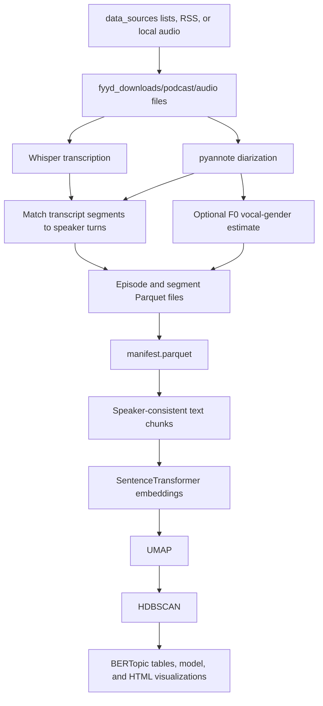

# Podcast Transcription, Speaker Analysis, and BERTopic Pipeline

This repository builds a research corpus from podcast audio:

1. Download podcast episodes or provide local audio files.
2. Transcribe each episode with OpenAI Whisper.
3. Identify speaker turns with pyannote speaker diarization.
4. Match transcript segments to speakers.
5. Optionally estimate perceived vocal gender from median fundamental
   frequency (F0).
6. Merge transcript segments into speaker-consistent text chunks.
7. Discover and describe topics with BERTopic.

The production pipeline is resumable. Stage 2 records every episode in a
Parquet manifest, and Stage 3 maintains a separate chunk-building state file.
Large audio files, Parquet outputs, logs, and trained models are intentionally
excluded from Git.

> This project analyzes an existing podcast corpus. It does not record, edit,
> publish, or host a new podcast.

## Contents

- [Pipeline overview](#pipeline-overview)
- [Requirements](#requirements)
- [Clone and install](#clone-and-install)
- [Environment variables](#environment-variables)
- [Stage 1: acquire audio](#stage-1-acquire-audio)
- [Stage 2: transcribe, diarize, and estimate vocal gender](#stage-2-transcribe-diarize-and-estimate-vocal-gender)
- [Stage 3: build chunks and train BERTopic](#stage-3-build-chunks-and-train-bertopic)
- [Output files](#output-files)
- [Resuming, retrying, and adding audio](#resuming-retrying-and-adding-audio)
- [Troubleshooting](#troubleshooting)
- [Methodological notes](#methodological-notes)
- [Further documentation](#further-documentation)

## Pipeline overview



The main entry points are:

| File | Purpose |
|---|---|
| `acquisition/fyyd_download.py` | Download episodes discovered through the fyyd API. |
| `acquisition/rss_download.py` | Discover RSS feeds and download their episodes. |
| `acquisition/podigee_scrape.py` | Collect Podigee episode URLs into a source CSV. |
| `pipeline/pipeline_core.py` | Whisper, diarization, speaker matching, and F0 analysis. |
| `pipeline/batch_podcast_runner.py` | Resumable Stage 2 batch runner and manifest manager. |
| `pipeline/run_bertopic_from_manifest.py` | Resumable chunk builder and BERTopic trainer. |
| `pipeline/bertopic_typisierung.py` | Shared BERTopic, vectorizer, and stopword helpers. |
| `pipeline/bertopic_extra_stopwords.txt` | Manual conversational, podcast, and name stopwords. |
| `pipeline/reassign_bertopic_outliers*.py` | Optional reassignment of topic `-1` chunks. |
| `pipeline/compare_bertopic_runs.py` | Compare multiple BERTopic experiments. |
| `tools/audit_missing_speaker_gender.py` | Audit outputs for missing speaker or gender data. |
| `tools/report_directory_usage.py` | Report recursive file counts and disk usage. |

The repository separates maintained code, source inputs, and generated data:

```text
acquisition/       podcast discovery and download utilities
data_sources/      tracked spreadsheet and CSV acquisition inputs
pipeline/          transcription, diarization, gender, and BERTopic code
tools/             audit and maintenance utilities
docs/thesis/       methodology and reproducibility helpers
requirements.*     direct dependencies and full environment snapshots
fyyd_downloads/    downloaded audio (ignored)
outputs/           Parquet data and trained topic models (ignored)
logs/              batch and audit logs (ignored)
artifacts/         generated acquisition and binary artifacts (ignored)
dist/              generated PDF and ZIP exports (ignored)
```

## Requirements

### Base system requirements

- Linux is the tested operating system.
- Python 3.12 is recommended. The existing environments were built with
  Python 3.12.3.
- Git.
- FFmpeg available on `PATH`.
- Internet access for podcast downloads and the first model download.
- A Hugging Face account and access token for pyannote.
- Access to the terms of the gated pyannote models used by
  `pyannote/speaker-diarization-3.1`.
- Substantial free disk space for audio, Parquet files, model caches, and
  BERTopic outputs.

A CUDA-capable NVIDIA GPU is strongly recommended for a large corpus, but the
pipeline can use CPU. Whisper automatically selects CUDA when
`torch.cuda.is_available()` is true. pyannote remains on CPU unless
`--diar_gpu` is passed.

The versions observed in this workspace are:

```text
Python:             3.12.3
Stage 2 PyTorch:    2.7.1+cu118 (legacy local environment)
Stage 3 PyTorch:    2.3.1+cu118
BERTopic:           0.17.4
CUDA build:         11.8
```

The legacy Stage 2 environment can run the repository, but `pip check` reports
that `pyannote-audio==4.0.3` requires PyTorch and Torchaudio 2.8.0. A clean
installation should use the dependency-consistent 2.8.0 family shown below
instead of reproducing that mismatch.

### Why two virtual environments?

Use:

- `.venv` for downloading and Stage 2 audio processing.
- `.venv_bertopic` for Stage 3 topic modeling.

Keeping BERTopic separate avoids dependency conflicts between pyannote,
TorchCodec, PyTorch, transformers, and sentence-transformers. The current
all-in-one `.venv` can process audio, but its installed
sentence-transformers/TorchCodec combination fails while importing the
BERTopic runner. The dedicated `.venv_bertopic` is the reliable Stage 3
environment.

`requirements.base.txt` pins the direct Stage 1 and Stage 2 dependencies.
PyTorch is installed separately so its CUDA or CPU wheel can match the target
machine. `requirements.venv.txt` and `requirements.venv_bertopic.txt` preserve
the complete package snapshots from the two working environments for auditing
and diagnostics.

## Clone and install

### 1. Clone the repository

```bash
git clone https://github.com/plasma31/podcast_transcribe.git
cd podcast_transcribe
export PROJECT_ROOT="$PWD"
```

All commands below assume the repository root is the current directory.

### 2. Install FFmpeg

For Ubuntu or Debian:

```bash
sudo apt update
sudo apt install -y ffmpeg
ffmpeg -version
```

If FFmpeg was installed in a user-owned directory, add that directory to
`PATH`. The original machine used:

```bash
export PATH="/home/fdai7991/local/bin:$PATH"
```

Use your own path on another machine, for example:

```bash
export PATH="$HOME/local/bin:$PATH"
command -v ffmpeg
```

### 3. Create the Stage 1 and Stage 2 environment

For a dependency-consistent NVIDIA installation, the PyTorch 2.8.0 wheels are
available for CUDA 12.6, 12.8, and 12.9. This example uses CUDA 12.6:

```bash
python3.12 -m venv .venv
source .venv/bin/activate

python -m pip install --upgrade pip setuptools wheel
python -m pip install \
  torch==2.8.0 torchvision==0.23.0 torchaudio==2.8.0 \
  --index-url https://download.pytorch.org/whl/cu126
python -m pip install -r requirements.base.txt
```

Choose a wheel compatible with the machine's NVIDIA driver. See the official
[PyTorch previous-version commands](https://pytorch.org/get-started/previous-versions/)
for the CUDA 12.8 and 12.9 alternatives.

For CPU-only installation, install the CPU PyTorch wheels instead of the CUDA
wheels:

```bash
python -m pip install \
  torch==2.8.0 torchvision==0.23.0 torchaudio==2.8.0 \
  --index-url https://download.pytorch.org/whl/cpu
```

Verify the important imports:

```bash
python - <<'PY'
import librosa
import pandas
import pyarrow
import torch
import whisper
from pyannote.audio import Pipeline

print("torch:", torch.__version__)
print("CUDA available:", torch.cuda.is_available())
print("Stage 2 imports: OK")
PY

python -m pip check
```

### 4. Create the Stage 3 BERTopic environment

```bash
deactivate
python3.12 -m venv .venv_bertopic
source .venv_bertopic/bin/activate

python -m pip install --upgrade pip setuptools wheel
python -m pip install \
  torch==2.3.1 torchvision==0.18.1 torchaudio==2.3.1 \
  --index-url https://download.pytorch.org/whl/cu118
python -m pip install \
  bertopic==0.17.4 \
  hdbscan==0.8.42 \
  names-dataset==3.3.1 \
  pandas \
  plotly==6.7.0 \
  pyarrow \
  pycountry \
  safetensors \
  sentence-transformers==3.4.1 \
  stopwordsiso==0.6.1 \
  umap-learn==0.5.12
```

For CPU-only use, replace the CUDA PyTorch command with:

```bash
python -m pip install \
  torch==2.3.1 torchvision==0.18.1 torchaudio==2.3.1 \
  --index-url https://download.pytorch.org/whl/cpu
```

Verify Stage 3:

```bash
python pipeline/run_bertopic_from_manifest.py --help
```

The committed `requirements.venv.txt` and
`requirements.venv_bertopic.txt` files are full `pip freeze` snapshots. They
are useful for exact diagnostics; the installation commands above are safer
for a new machine because GPU wheels must match its driver and CUDA runtime.

## Environment variables

### Required for Stage 2

Create a Hugging Face read token and export it before running the audio
pipeline:

```bash
export PYANNOTE_TOKEN="hf_your_token_here"
```

The batch runner checks these names in order:

1. `PYANNOTE_TOKEN`
2. `HF_TOKEN`
3. `HUGGINGFACE_TOKEN`

Only one is required. `PYANNOTE_TOKEN` is recommended because its purpose is
clear.

Never commit the token. `.env` and `.envrc` are ignored by Git, but the scripts
do not automatically load either file. If a local `.env` is used, export it
through your shell before starting Python.

### PATH

`PATH` must include the FFmpeg executable:

```bash
export PATH="$HOME/local/bin:$PATH"
command -v ffmpeg
```

If FFmpeg was installed with the operating system package manager, no custom
`PATH` is normally needed.

### Set internally by the pipeline

Both production pipeline modules set:

```text
HF_HUB_DISABLE_SYMLINKS=1
```

This improves compatibility with mounted or restricted filesystems. It can
also be exported manually, but that is not required.

### Not required

- The fyyd downloader does not require an API key.
- BERTopic does not require `PYANNOTE_TOKEN` when all Stage 2 outputs already
  exist.
- No database server, web server, or cloud storage credentials are used.

## Stage 1: acquire audio

Stage 2 expects one directory per podcast:

```text
fyyd_downloads/
|-- Podcast A/
|   |-- episode-001.mp3
|   `-- episode-002.mp3
`-- Podcast B/
    `-- interview.wav
```

Supported extensions are:

```text
.mp3 .wav .m4a .flac .ogg .aac
```

You may use the scripts in `acquisition/` or manually place audio in this
layout.

### Option A: fyyd downloader

`acquisition/fyyd_download.py` reads `data_sources/list.xlsx`, searches fyyd
by podcast name, selects the first search result, fetches up to 1,000 episodes,
and downloads every episode enclosure into `fyyd_downloads/<podcast name>/`.
It processes every spreadsheet row.

Its repository-relative paths are constants at the top of the file:

```python
EXCEL_PATH = ROOT / "data_sources" / "list.xlsx"
OUTPUT_DIR = ROOT / "fyyd_downloads"
RESULTS_JSON = ROOT / "artifacts" / "acquisition" / "fyyd_results.json"
```

The input spreadsheet must contain either a `Podcast Name` column or a `name`
column. The committed `data_sources/list.xlsx` uses `Podcast Name`.

```bash
source .venv/bin/activate
python acquisition/fyyd_download.py
```

For a detached run:

```bash
mkdir -p logs/batch
nohup python acquisition/fyyd_download.py \
  > logs/batch/fyyd_download.log 2>&1 &
echo $! > logs/batch/fyyd_download.pid
```

Results are recorded in `artifacts/acquisition/fyyd_results.json`. Review the
selected podcasts because fyyd search currently uses the first result rather
than an exact-match scorer.

### Option B: manually supplied audio

The simplest and most predictable way to process your own corpus is:

```bash
mkdir -p "fyyd_downloads/My Podcast"
cp /path/to/episodes/*.mp3 "fyyd_downloads/My Podcast/"
```

The directory does not have to be named `fyyd_downloads`; pass any root folder
to `--downloads`. It must contain podcast subdirectories rather than audio
files directly at its top level.

### Option C: RSS downloader

`acquisition/rss_download.py` can discover RSS feeds and download episodes
from `data_sources/redownload_list.xlsx`:

```bash
source .venv/bin/activate
python acquisition/rss_download.py \
  --xlsx data_sources/redownload_list.xlsx \
  --output-dir fyyd_downloads \
  --workers 3
```

Use `--dry-run` first to inspect discovery without downloading:

```bash
python acquisition/rss_download.py \
  --xlsx data_sources/redownload_list.xlsx \
  --output-dir fyyd_downloads \
  --dry-run
```

Keep the number of workers low to avoid overloading podcast hosts. The run log
is written to `artifacts/acquisition/rss_download.log`.

### Option D: Podigee URL inventory

`acquisition/podigee_scrape.py` probes its configured Podigee hosts and writes
episode metadata and enclosure URLs to `data_sources/podigee_episodes.csv`:

```bash
source .venv/bin/activate
python acquisition/podigee_scrape.py
```

This utility creates an inventory; it does not download the audio files.

## Stage 2: transcribe, diarize, and estimate vocal gender

Activate the Stage 2 environment and export the pyannote token:

```bash
export PATH="$HOME/local/bin:$PATH"
source .venv/bin/activate
export PYANNOTE_TOKEN="hf_your_token_here"
```

### First batch

This command scans the downloads tree, creates or refreshes the manifest, and
processes at most 250 episodes:

```bash
python pipeline/batch_podcast_runner.py \
  --downloads "$PROJECT_ROOT/fyyd_downloads" \
  --out_root "$PROJECT_ROOT/outputs" \
  --state_dir "$PROJECT_ROOT/outputs/state" \
  --whisper_model small \
  --limit 250 \
  --gender \
  --diar_gpu \
  --rebuild_manifest
```

If `PROJECT_ROOT` was not exported, use absolute paths or paths relative to the
repository root.

### Long-running background batch

```bash
mkdir -p logs/batch
nohup python pipeline/batch_podcast_runner.py \
  --downloads "$PROJECT_ROOT/fyyd_downloads" \
  --out_root "$PROJECT_ROOT/outputs" \
  --state_dir "$PROJECT_ROOT/outputs/state" \
  --whisper_model small \
  --limit 250 \
  --gender \
  --diar_gpu \
  > logs/batch/output10.log 2>&1 &

echo $! > logs/batch/output10.pid
```

Monitor it with:

```bash
tail -f logs/batch/output10.log
ps -fp "$(cat logs/batch/output10.pid)"
```

The important Stage 2 options are:

| Option | Meaning |
|---|---|
| `--downloads` | Root containing one subdirectory per podcast. |
| `--out_root` | Root for episode Parquet, segment Parquet, and debug JSON. |
| `--state_dir` | Directory for `manifest.parquet` and `failures.parquet`. |
| `--whisper_model` | Whisper model name, default `small`. |
| `--limit` | Maximum episodes selected in this invocation, default 500. |
| `--rebuild_manifest` | Rescan the downloads tree and merge new audio into the manifest. |
| `--retry_failed` | Include failed rows as well as pending and interrupted rows. |
| `--skip_existing_outputs` | Mark rows done when both expected Parquet outputs already exist. |
| `--diar_gpu` | Attempt to run pyannote diarization on CUDA. |
| `--gender` | Enable F0-based perceived vocal-gender estimation. |
| `--max_speaker_sec` | Maximum audio used per speaker for F0 analysis, default 90 seconds. |
| `--min_turn_sec` | Ignore shorter turns during F0 analysis, default 1 second. |

Whisper uses the selected model for automatic transcription and language
detection. pyannote identifies anonymous speakers such as `SPEAKER_00` and
`SPEAKER_01`. Each Whisper segment is assigned to the diarized speaker with
the greatest temporal overlap.

### Retry failed or interrupted episodes

```bash
nohup python pipeline/batch_podcast_runner.py \
  --downloads "$PROJECT_ROOT/fyyd_downloads" \
  --out_root "$PROJECT_ROOT/outputs" \
  --state_dir "$PROJECT_ROOT/outputs/state" \
  --whisper_model small \
  --limit 250 \
  --gender \
  --diar_gpu \
  --retry_failed \
  > logs/batch/failed_retry.log 2>&1 &
```

`--retry_failed` does not mean "failed only." The current selector includes
`pending`, `running`, and `failed` rows, sorts them by podcast and episode path,
and then applies `--limit`. A row left as `running` after a terminated process
is automatically eligible on the next run.

Do not run multiple Stage 2 workers against the same `state_dir` at the same
time. They can select the same episode and overwrite the shared manifest.

### Inspect Stage 2 progress

```bash
source .venv/bin/activate
python - <<'PY'
import pandas as pd

manifest = pd.read_parquet("outputs/state/manifest.parquet")
print(manifest["status"].value_counts(dropna=False))

failed = manifest[manifest["status"] == "failed"]
if not failed.empty:
    print(failed[["episode_path", "attempt_count", "last_error"]].tail(20))
PY
```

## Stage 3: build chunks and train BERTopic

Activate the dedicated environment:

```bash
source .venv_bertopic/bin/activate
```

Stage 3 reads only manifest rows whose status is `done` by default. It builds
speaker-consistent chunks from the segment Parquet files and then trains:

```text
SentenceTransformer -> UMAP -> HDBSCAN -> c-TF-IDF topic representation
```

The default embedding model is:

```text
sentence-transformers/paraphrase-multilingual-MiniLM-L12-v2
```

### Fresh full-corpus run

Use a new output directory for each experiment. On a fresh directory, omit
`--chunk-episode-limit` to process every eligible episode:

```bash
python pipeline/run_bertopic_from_manifest.py \
  --manifest "$PROJECT_ROOT/outputs/state/manifest.parquet" \
  --output-dir "$PROJECT_ROOT/outputs/bertopic_minilm_n100_t200" \
  --embedding-model "sentence-transformers/paraphrase-multilingual-MiniLM-L12-v2" \
  --embedding-device cuda \
  --train \
  --no-use-names-dataset \
  --name-stopwords-file "$PROJECT_ROOT/pipeline/bertopic_extra_stopwords.txt" \
  --umap-n-neighbors 100 \
  --umap-n-components 5 \
  --umap-min-dist 0.0 \
  --hdbscan-min-cluster-size 50 \
  --hdbscan-min-samples 1 \
  --vectorizer-ngram-min 1 \
  --vectorizer-ngram-max 3 \
  --vectorizer-min-df 10 \
  --vectorizer-max-df 0.95 \
  --nr-topics 200
```

Add `--force-train` when intentionally replacing an already completed model in
the same output directory.

### Reproduce the two supplied MiniLM experiments

The first experiment uses the more conservative
`hdbscan-min-samples=5`:

```bash
python pipeline/run_bertopic_from_manifest.py \
  --manifest "$PROJECT_ROOT/outputs/state/manifest.parquet" \
  --output-dir "$PROJECT_ROOT/outputs/bertopic_minilm_n100_t200_ms5" \
  --embedding-model "sentence-transformers/paraphrase-multilingual-MiniLM-L12-v2" \
  --embedding-device cuda \
  --train \
  --force-train \
  --no-use-names-dataset \
  --name-stopwords-file "$PROJECT_ROOT/pipeline/bertopic_extra_stopwords.txt" \
  --umap-n-neighbors 100 \
  --umap-n-components 5 \
  --umap-min-dist 0.0 \
  --hdbscan-min-cluster-size 50 \
  --hdbscan-min-samples 5 \
  --vectorizer-ngram-min 1 \
  --vectorizer-ngram-max 3 \
  --vectorizer-min-df 10 \
  --vectorizer-max-df 0.95 \
  --nr-topics 200
```

The second experiment uses the default
`hdbscan-min-samples=1`:

```bash
python pipeline/run_bertopic_from_manifest.py \
  --manifest "$PROJECT_ROOT/outputs/state/manifest.parquet" \
  --output-dir "$PROJECT_ROOT/outputs/bertopic_minilm_n100_t200" \
  --embedding-model "sentence-transformers/paraphrase-multilingual-MiniLM-L12-v2" \
  --embedding-device cuda \
  --train \
  --force-train \
  --no-use-names-dataset \
  --name-stopwords-file "$PROJECT_ROOT/pipeline/bertopic_extra_stopwords.txt" \
  --umap-n-neighbors 100 \
  --umap-n-components 5 \
  --umap-min-dist 0.0 \
  --hdbscan-min-cluster-size 50 \
  --hdbscan-min-samples 1 \
  --vectorizer-ngram-min 1 \
  --vectorizer-ngram-max 3 \
  --vectorizer-min-df 10 \
  --vectorizer-max-df 0.95 \
  --nr-topics 200
```

The original commands used `--chunk-episode-limit 0`. In the current
implementation, `0` means that zero not-yet-chunked episodes are selected. It
does not mean unlimited. Omit the option for all episodes, or pass a positive
batch size.

### Incremental chunk building

Build chunks for up to 600 new episodes without training:

```bash
python pipeline/run_bertopic_from_manifest.py \
  --manifest "$PROJECT_ROOT/outputs/state/manifest.parquet" \
  --output-dir "$PROJECT_ROOT/outputs/bertopic_minilm_n100_t200" \
  --chunk-episode-limit 600 \
  --no-train
```

Repeat until all eligible episodes are chunked, then run the full modeling
command with `--train`. Existing episode IDs in
`chunk_build_state.parquet` are skipped.

### Long-running BERTopic job

```bash
mkdir -p logs/batch
nohup .venv_bertopic/bin/python \
  pipeline/run_bertopic_from_manifest.py \
  --manifest "$PROJECT_ROOT/outputs/state/manifest.parquet" \
  --output-dir "$PROJECT_ROOT/outputs/bertopic_minilm_n100_t200" \
  --embedding-device cuda \
  --train \
  > logs/batch/bertopic_minilm.log 2>&1 &

echo $! > logs/batch/bertopic_minilm.pid
```

### Important BERTopic options

| Option | Default | Meaning |
|---|---:|---|
| `--status` | `done` | Manifest status to include; use `all` only with care. |
| `--chunk-episode-limit` | unlimited | Positive maximum number of new episodes to chunk. |
| `--rebuild-chunks` | off | Delete chunk input/state and rebuild from source Parquet files. |
| `--train` / `--no-train` | train | Train after chunk building or stop after chunking. |
| `--force-train` | off | Ignore an existing completion marker and retrain. |
| `--chunk-target-words` | 220 | Flush a chunk after reaching approximately this size. |
| `--chunk-max-words` | 320 | Start a new chunk before exceeding this size. |
| `--min-segment-words` | 2 | Exclude very short transcript segments. |
| `--min-doc-words` | 20 | Exclude short completed chunks. |
| `--speaker-consistent` | on | Flush a chunk when the speaker changes. |
| `--embedding-device` | `auto` | Select `auto`, `cpu`, or `cuda`. |
| `--stopwords` | `de` | Use German stopwords or no built-in stopwords. |
| `--use-names-dataset` | on | Add person names from `names-dataset`. |
| `--name-stopwords-file` | none | Add one stopword per line from a local file. |
| `--nr-topics` | none | Optionally reduce discovered topics to a target count. |
| `--save-probs` | off | Save the potentially very large document-topic matrix. |

`--chunk-min-words` is accepted by the current argument parser but is not used
by the chunk-building implementation. `--min-doc-words` is the active minimum
chunk-length control.

### Stopword strategies

There are two common approaches:

1. Use the built-in German list plus `names-dataset`:

   ```bash
   --stopwords de \
   --use-names-dataset \
   --names-dataset-mode top \
   --names-dataset-top-n 20000
   ```

2. Disable `names-dataset` and use the curated local file:

   ```bash
   --stopwords de \
   --no-use-names-dataset \
   --name-stopwords-file pipeline/bertopic_extra_stopwords.txt
   ```

The supplied experiments use the second approach. Edit the stopword file for
the language, host names, recurring guests, and conversational fillers in your
own corpus.

## Output files

The generated layout is:

```text
outputs/
|-- parquet/
|   |-- episodes/<episode_id>.parquet
|   `-- segments/<episode_id>.parquet
|-- json_debug/<episode_id>.json
|-- state/
|   |-- manifest.parquet
|   `-- failures.parquet
`-- bertopic_minilm_n100_t200/
    |-- chunks_input.parquet
    |-- chunks_input.csv
    |-- chunk_build_state.parquet
    |-- chunk_build_failures.parquet
    `-- podcast_chunks_sw-de/
        |-- chunks_with_topics.parquet
        |-- doc_topics.parquet
        |-- topic_info.parquet
        |-- topic_words.parquet
        |-- representative_docs.parquet
        |-- bertopic_model/
        |-- run_config.json
        |-- _TRAINING_COMPLETE.json
        |-- topics_overview.html
        |-- topics_barchart.html
        `-- topics_hierarchy.html
```

CSV copies are also written for the main BERTopic tables.

### Episode Parquet

One row per episode, including:

- detected Whisper language;
- complete transcript;
- runtime;
- number of transcript and diarization segments;
- speaker count;
- per-speaker vocal-gender measurements as JSON.

### Segment Parquet

One row per Whisper segment, including:

- start and end time;
- assigned anonymous speaker;
- transcript text;
- vocal-gender label and confidence;
- median F0, voiced ratio, and F0 interquartile range.

### Manifest

`outputs/state/manifest.parquet` is the Stage 2 job ledger. Each row has a
status of `pending`, `running`, `done`, or `failed`, plus attempt count, last
error, timestamps, and paths to generated artifacts.

### BERTopic tables

- `chunks_input.parquet`: speaker-consistent documents passed to BERTopic.
- `doc_topics.parquet`: every chunk and its assigned topic.
- `topic_info.parquet`: topic ID, count, name, and representation.
- `topic_words.parquet`: top c-TF-IDF terms and scores.
- `representative_docs.parquet`: example chunks for each topic.
- Topic `-1`: HDBSCAN outliers that were not confidently assigned to a topic.

## Resuming, retrying, and adding audio

### Resume Stage 2

Run the same batch command again. Completed episodes are not selected. Rows
left as `running` after interruption are selected again.

### Add new audio

1. Place new files under the appropriate podcast subdirectories.
2. Refresh the Stage 2 manifest with `--rebuild_manifest`.
3. Run Stage 2 until the new rows are `done`.
4. Run Stage 3 again to append chunks for newly completed episode IDs.
5. Add `--force-train` if the BERTopic output directory already contains
   `_TRAINING_COMPLETE.json` and the trained model must include the new chunks.

### Recover outputs after a lost manifest

If episode and segment Parquet files still exist:

```bash
python pipeline/batch_podcast_runner.py \
  --downloads "$PROJECT_ROOT/fyyd_downloads" \
  --out_root "$PROJECT_ROOT/outputs" \
  --state_dir "$PROJECT_ROOT/outputs/state" \
  --limit 1 \
  --rebuild_manifest \
  --skip_existing_outputs
```

Check the resulting status counts before launching more processing.

### Episode identity

`episode_id` is the SHA-1 hash of the resolved absolute audio path. It is
stable while the file remains at the same absolute path. Moving the repository
or audio tree changes the ID even when the audio content is unchanged.

## Troubleshooting

### `Missing Hugging Face token. Export PYANNOTE_TOKEN.`

```bash
export PYANNOTE_TOKEN="hf_your_token_here"
```

Confirm that the token is visible in the same shell that launches Python.

### pyannote returns an authorization or model-access error

Log into Hugging Face, accept the terms for the gated pyannote model and its
required dependencies, and use a token from the same account.

### `ffmpeg not found`, decoding failure, or unsupported audio

```bash
command -v ffmpeg
ffmpeg -version
ffmpeg -v error -i path/to/episode.mp3 -f null -
```

Corrupt or truncated audio should appear as `failed` in the manifest. Replace
the file, refresh the manifest if its path changed, and retry.

### TorchCodec warning during Stage 2

pyannote may warn that TorchCodec cannot load FFmpeg shared libraries. The
production diarization code loads audio through librosa and passes an in-memory
waveform to pyannote, so this warning can be non-fatal. Confirm by processing a
small batch before launching the full corpus.

### BERTopic fails while importing TorchCodec

Use `.venv_bertopic`, not the combined `.venv`:

```bash
source .venv_bertopic/bin/activate
python pipeline/run_bertopic_from_manifest.py --help
```


### CUDA out-of-memory during Stage 2

- Omit `--diar_gpu` so pyannote stays on CPU.
- Use a smaller Whisper model such as `base` or `tiny`.
- Process one batch runner at a time.

### CUDA error during BERTopic embeddings

Retry with:

```bash
--embedding-device cpu
```

This is slower but avoids CUDA kernel and memory compatibility problems.

### `No audio files found in downloads root`

Ensure the structure is:

```text
downloads-root/podcast-folder/episode.mp3
```

Audio files directly inside `downloads-root/` are not discovered.

### `No chunks available`

Common causes:

- no manifest rows have status `done`;
- Stage 2 output paths in the manifest are missing;
- `--chunk-episode-limit 0` selected zero new episodes;
- every segment or chunk was below the configured word minimum;
- a fresh BERTopic output directory has no existing `chunks_input.parquet`.

### BERTopic says the model is already completed

The completion marker prevents accidental retraining. Use a new output
directory for a new experiment, or deliberately pass:

```bash
--force-train
```

## Methodological notes

### Vocal-gender labels

The `--gender` option does not infer identity or self-described gender. It
estimates perceived vocal pitch from median F0 for each diarized speaker:

```text
median F0 < 155 Hz   -> male
median F0 > 185 Hz   -> female
155 Hz to 185 Hz     -> borderline
insufficient voicing -> unknown
```

These labels are an acoustic proxy with important limitations. Preserve the
`borderline`, `unknown`, confidence, F0, and voiced-ratio fields when reporting
results.

### Diarization labels

Labels such as `SPEAKER_00` are local to an episode. They do not identify the
same person across episodes and should not be treated as names.

### Topic outliers

HDBSCAN assigns topic `-1` to low-density chunks. A high outlier rate is not
automatically a processing error. Conversational transitions, greetings, and
short off-topic exchanges often lack a stable corpus-level topic.

Optional scripts can reassign outliers, but reassignment trades topic coverage
against topic purity. Keep original and reassigned tables separate.

### Rights, privacy, and research ethics

Before downloading or processing a podcast corpus:

- confirm that collection and analysis are permitted by applicable law,
  licenses, platform terms, and institutional research rules;
- avoid redistributing copyrighted audio or full transcripts without
  permission;
- protect access tokens and potentially sensitive transcripts;
- document sampling, failed episodes, model versions, and parameter choices;
- report the limitations of transcription, diarization, vocal-gender
  estimation, and unsupervised topic modeling.

## Further documentation

The thesis documentation contains the detailed methodology, data dictionaries,
corpus statistics, topic-model rationale, and experiment comparisons:

- [`docs/thesis/README.md`](docs/thesis/README.md)
- [`docs/thesis/01_pipeline_and_data.md`](docs/thesis/01_pipeline_and_data.md)
- [`docs/thesis/02_topic_modeling.md`](docs/thesis/02_topic_modeling.md)
- [`docs/thesis/03_results_and_figures.md`](docs/thesis/03_results_and_figures.md)

Show all current CLI options with:

```bash
source .venv/bin/activate
python pipeline/batch_podcast_runner.py --help

source .venv_bertopic/bin/activate
python pipeline/run_bertopic_from_manifest.py --help
```

Maintenance and thesis-export commands:

```bash
python tools/audit_missing_speaker_gender.py \
  --manifest outputs/state/manifest.parquet

python tools/report_directory_usage.py outputs

python -m pip install Markdown==3.10.2 fpdf2==2.8.7
python docs/thesis/_build_pdf.py
```

The generated thesis PDF is written to `dist/thesis_documentation.pdf`. The
full `requirements.venv.txt` snapshot already contains the PDF dependencies.
