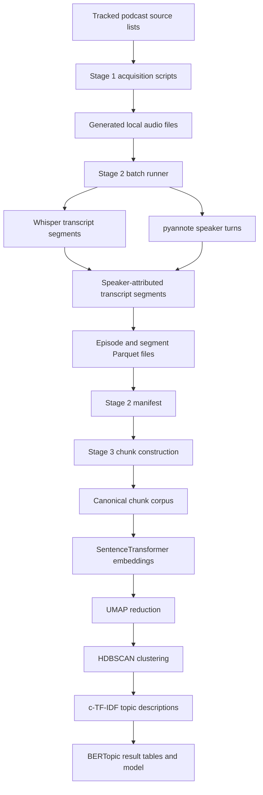

# Podcast Transcription and Topic-Modelling Pipeline

This repository contains the code used to build a structured research corpus from podcast audio and to analyse that corpus with BERTopic.

The repository is organised around a three-stage data flow:

1. **Acquire podcast audio.**
2. **Transcribe the audio and attach speaker information.**
3. **Convert transcript segments into document-sized chunks and model their topics.**

The central rule for reading this repository is:

> GitHub contains the code, configuration, source lists, and documentation. The large audio files, Parquet tables, embedding matrices, trained models, logs, and visualisations are generated during execution and are intentionally not committed.

This distinction is important because many paths shown in the documentation, such as `outputs/parquet/`, `outputs/common_chunks/`, and `outputs/bertopic*/`, do not appear in a fresh Git clone. They are runtime directories created on the machine where the pipeline is executed.

## Reader guide

Use this section before reading individual scripts.

| Question | File or location to inspect |
|---|---|
| Which podcasts are selected? | `data_sources/list.xlsx` and the other tracked source lists |
| Where are downloaded audio files stored? | Generated locally under `fyyd_downloads/<podcast>/` |
| Where is Stage 2 progress recorded? | Generated locally in `outputs/state/manifest.parquet` |
| Where are transcript segments stored? | Generated locally in `outputs/parquet/segments/<episode_id>.parquet` |
| What is the direct input to the embedding model and BERTopic? | The `chunk_text` column in `outputs/common_chunks/chunks_input.parquet` |
| Which file should another application consume before topic modelling? | `outputs/common_chunks/chunks_input.parquet` |
| Which file should another application consume after topic modelling? | `doc_topics.parquet`, together with `topic_info.parquet` and `topic_words.parquet`, from the selected model run |
| Are the S3 paths created automatically? | No. The documented S3 layout is a recommended manual or deployment-level mirror of local outputs |

Detailed thesis-oriented documentation is in [`docs/thesis/`](docs/thesis/README.md).

## 1. What is tracked and what is generated?

### 1.1 Files committed to GitHub

```text
acquisition/        podcast discovery and download scripts
pipeline/           transcription, diarization, chunking, BERTopic, and grid-search code
data_sources/       tracked spreadsheet and CSV source lists
docs/thesis/        methodological documentation and reproducibility notes
tools/              audit and directory-report utilities
requirements.*      dependency definitions and environment snapshots
README.md            repository entry point
```

These files are small enough to version and are required to understand or reproduce the workflow.

### 1.2 Files generated during execution

```text
fyyd_downloads/     downloaded podcast audio
outputs/            manifests, transcripts, chunks, embeddings, and model outputs
logs/               console logs and process logs
artifacts/           acquisition reports and other generated support files
dist/               generated PDF and archive exports
```

These directories are ignored by Git because they can be large, machine-specific, or contain derived research data. Their absence from GitHub does not mean that the pipeline step is missing. It means that the step must be run, or that the resulting files must be obtained from the project storage location, or you can access it from the S3 storage where all the output is being stored for reuse.

### 1.3 Local paths versus S3 paths

The current Python scripts write to local or mounted filesystem paths. They do not upload to S3.
The S3 storage in this project is only used for data transfer purposes. 
The only files uploaded on the S3 storage (MinIO) are the runtime generated output when delevoping this pipeline, so another reasearcher who continues on this research has all outputs readily available.
When this documentation shows an S3 path, it describes a proposed handoff layout for shared storage. 
Therefore:

- `outputs/common_chunks/chunks_input.parquet` is an actual local pipeline artefact present in the S3 bucket not in this github repository, that has generated chunks which can be used as input to Bertopic.
- the S3 copy does not exist unless somebody explicitly creates it manually, there is no automated code to copy output files to S3 storage. It is a manual process.
- Manually MinIO AIStor Command Line (CLI) client was used to transfer files to S3 storage. Further documentation about the client is here (https://docs.min.io/aistor/reference/cli/)
- The exact command used to copy files from local server to S3 server is below  
- The exact command used to copy the Parquet and JSON output files from the local server to the S3 server is shown below:

```bash
BUCKET="podcast-project"
PREFIX="outputs"

cd /home/fdai7991/podcast_projekt

find outputs -type f \( -name "*.parquet" -o -name "*.json" \) -print0 |
while IFS= read -r -d '' file; do
  ~/tools/mc cp "$file" "bigdata-s3/$BUCKET/$PREFIX/$file"
done
```

## 2. Pipeline overview



The main entry points are:

| File | Responsibility |
|---|---|
| `acquisition/fyyd_download.py` | Search fyyd for each selected podcast and download episode audio |
| `acquisition/rss_download.py` | Resolve RSS feeds and download episode audio |
| `acquisition/podigee_scrape.py` | Collect Podigee episode and enclosure metadata |
| `pipeline/pipeline_core.py` | Process one episode with Whisper, pyannote, segment matching, and optional F0 analysis |
| `pipeline/batch_podcast_runner.py` | Run Stage 2 over many episodes and maintain the manifest |
| `pipeline/run_bertopic_from_manifest.py` | Build chunks from Stage 2 outputs and optionally train BERTopic |
| `pipeline/greedy_grid_search_bertopic_from_chunks.py` | Evaluate BERTopic parameter combinations using an existing chunk corpus |
| `pipeline/rerun_best_bertopic_from_grid.py` | Run the selected grid-search configuration through the main Stage 3 runner |

## 3. Stage 1: acquire podcast audio

Stage 1 creates the audio corpus that Stage 2 processes. Stage 2 does not require a particular download source. It only requires one directory per podcast and one or more supported audio files inside that directory.

Expected generated layout:

```text
fyyd_downloads/
├── Podcast A/
│   ├── episode-001.mp3
│   └── episode-002.mp3
└── Podcast B/
    └── interview.wav
```

Supported extensions are `.mp3`, `.wav`, `.m4a`, `.flac`, `.ogg`, and `.aac`.

### 3.1 How `acquisition/fyyd_download.py` works

The fyyd downloader exists because fyyd exposes a public API that can be queried by podcast name and podcast identifier. It was useful for the source list because a substantial share of the selected podcasts could be found there without writing a separate scraper for every hosting platform.

The script follows this sequence:

1. Read `data_sources/list.xlsx` with pandas.
2. Extract the podcast name from the `Podcast Name` column, or from `name` as a fallback.
3. Call `fyyd_search_podcast()` with the full podcast name.
4. Select the first search result returned by the API.
5. Use that result's podcast identifier in `fyyd_get_episodes()`.
6. Read each episode's audio URL from the `enclosure` field.
7. Construct a local filename from the episode title and episode number.
8. Download the audio into `fyyd_downloads/<podcast name>/`.
9. Record successful and failed episodes in `artifacts/acquisition/fyyd_results.json`.

The current implementation takes the first fyyd search result because the query uses the full podcast name and the first result was treated as the most likely match. This is a practical shortcut, not a guarantee of identity. The result file must therefore be reviewed. A future robustness improvement would normalise names and score every returned candidate before selecting one.

Downloads use `stream=True`. The response body is written incrementally in 256 KiB blocks instead of loading an entire episode into memory. The selected block size is an engineering trade-off: it keeps memory usage small while avoiding an excessive number of tiny disk writes. It is a project setting, not a format requirement.

`download_with_retries()` performs up to three attempts. This was introduced because podcast hosting servers can time out or temporarily refuse a request even when the episode URL is valid. A two-second pause is used between attempts so that a brief hosting failure does not immediately become a permanent corpus failure.

The script keeps two episode lists for each podcast:

- `downloaded`: episodes that were written successfully;
- `failed_ep`: episodes that could not be downloaded after all attempts.

This audit information supports later recovery with the RSS or Podigee acquisition routes.

Run the downloader from the repository root:

```bash
source .venv/bin/activate
python acquisition/fyyd_download.py
```

### 3.2 Other acquisition routes

RSS download:

```bash
python acquisition/rss_download.py \
  --xlsx data_sources/redownload_list.xlsx \
  --output-dir fyyd_downloads \
  --workers 3
```

Podigee inventory:

```bash
python acquisition/podigee_scrape.py
```

The Podigee script creates an enclosure inventory. It does not perform Stage 2 processing.

## 4. Stage 2: transcribe, diarize, and attach speaker metadata

Stage 2 is driven by `pipeline/batch_podcast_runner.py`. It scans the audio tree, records every episode in a manifest, and processes eligible episodes one by one.

A typical command is:

```bash
export PYANNOTE_TOKEN="hf_your_token_here"
source .venv/bin/activate

python pipeline/batch_podcast_runner.py \
  --downloads "$PROJECT_ROOT/fyyd_downloads" \
  --out_root "$PROJECT_ROOT/outputs" \
  --state_dir "$PROJECT_ROOT/outputs/state" \
  --whisper_model small \
  --limit 250 \
  --gender \
  --diar_gpu \
  --rebuild_manifest
```

### 4.1 What Stage 2 reads

Stage 2 reads audio files under the directory passed to `--downloads`.

It also reads an existing `outputs/state/manifest.parquet` when one is present. This allows the runner to preserve completed work and select only pending, interrupted, or explicitly retried episodes.

### 4.2 What Stage 2 does

For each selected episode:

1. Whisper produces timestamped transcript segments and a detected language code.
2. pyannote produces anonymous speaker turns such as `SPEAKER_00` and `SPEAKER_01`.
3. Each Whisper segment is assigned to the diarized speaker with the greatest temporal overlap.
4. Optional F0 analysis estimates a perceived vocal-pitch category for each diarized speaker.
5. Episode-level and segment-level tables are written.
6. The manifest row is changed to `done` or `failed`.

A Whisper segment is an ASR output unit with start time, end time, and text. It is not the same as a grammatical sentence and it is not yet the document used for BERTopic.

### 4.3 What Stage 2 writes

```text
outputs/
├── state/
│   ├── manifest.parquet
│   └── failures.parquet
├── parquet/
│   ├── episodes/<episode_id>.parquet
│   └── segments/<episode_id>.parquet
└── json_debug/<episode_id>.json
```

`manifest.parquet` is the authoritative index. Each successful row points to the episode and segment files through `output_episode_parquet` and `output_segments_parquet`.

The segment Parquet is the direct Stage 3 source. Each row contains the episode identifier, timestamp, speaker label, vocal-pitch label, and transcript text for one matched Whisper segment.

## 5. Stage 3: construct BERTopic input documents

Stage 3 is the point that caused the most naming confusion, so the distinction is explicit here.

### 5.1 What is the Stage 3 input?

The input to chunk construction is **not** a single directory guessed by the runner. It is:

1. `outputs/state/manifest.parquet`;
2. only rows whose `status` is `done` by default;
3. the `output_segments_parquet` and `output_episode_parquet` paths stored in each selected row.

The runner therefore follows the manifest to the actual Stage 2 files.

### 5.2 What comes out of chunk construction?

The main output is a table named `chunks_input.parquet`.

The filename means **input to the embedding and topic-modelling stage**. It does not mean input to the entire podcast pipeline.

A clearer conceptual name is:

```text
BERTopic document input corpus
```

The physical filename remains `chunks_input.parquet` because the scripts already use it.

The exact model input is the `chunk_text` column. Every row is one document passed to SentenceTransformer and then to BERTopic.

### 5.3 How a chunk is constructed

`build_chunks_resumable()` processes one completed episode at a time:

1. Load the episode's segment Parquet.
2. Join episode-level metadata when available.
3. Sort segments by timestamp.
4. Normalise whitespace.
5. Remove segments shorter than `--min-segment-words`.
6. Add consecutive segments to the current chunk.
7. Finish the current chunk when the speaker changes, the target size has already been reached, or the next segment would exceed the maximum size.
8. Discard completed chunks shorter than `--min-doc-words`.
9. Assign a stable `chunk_id`.
10. Append the rows to the accumulated chunk table.

Default controls are:

| Option | Default | Effect |
|---|---:|---|
| `--chunk-target-words` | 220 | Prefer to close a chunk after approximately this size |
| `--chunk-max-words` | 320 | Close before adding a segment that would exceed this limit |
| `--min-segment-words` | 2 | Remove near-empty ASR segments before construction |
| `--min-doc-words` | 20 | Remove completed chunks that are too short for modelling |
| `--speaker-consistent` | true | Close the chunk when the diarized speaker changes |

The target is not always reached. Speaker changes can close a chunk earlier, which is why the observed mean chunk length is below the target.

### 5.4 Where Stage 3 writes its first output

The main runner writes to the directory supplied through `--output-dir`:

```text
<output-dir>/
├── chunks_input.parquet
├── chunks_input.csv
├── chunk_build_state.parquet
└── chunk_build_failures.parquet
```

For example, with:

```bash
--output-dir "$PROJECT_ROOT/outputs/bertopic_minilm_n100_t200"
```

the chunk files are written to:

```text
outputs/bertopic_minilm_n100_t200/
```

These paths are generated locally and are ignored by Git.

### 5.5 Why does `chunks_input.parquet` appear more than once?

There are two roles:

1. **Runner-local chunk file**  
   `<output-dir>/chunks_input.parquet` is created by `run_bertopic_from_manifest.py` because that runner combines chunk construction and model training.

2. **Canonical shared chunk file**  
   `outputs/common_chunks/chunks_input.parquet` is the agreed exchange copy reused by grid search, final model runs, search systems, and other applications.

The contents may be identical, but the roles are different. The canonical shared copy prevents every model experiment from rebuilding or redefining the document corpus.

The grid-search script can copy a completed runner-local file into `outputs/common_chunks/`. It writes `COMMON_CHUNKS_MANIFEST.json` when it performs that copy so that the source path and checksum can be audited.

### 5.6 Recommended Stage 3 commands

Build chunks without training:

```bash
source .venv_bertopic/bin/activate

python pipeline/run_bertopic_from_manifest.py \
  --manifest "$PROJECT_ROOT/outputs/state/manifest.parquet" \
  --output-dir "$PROJECT_ROOT/outputs/bertopic_chunk_build" \
  --chunk-episode-limit 600 \
  --no-train
```

Repeat until all completed episodes are represented. To process all remaining episodes in one invocation, omit `--chunk-episode-limit`.

Do not use `--chunk-episode-limit 0` to mean unlimited. In the current implementation it selects zero new episodes.

Copy or seed the canonical shared corpus through the grid-search input resolver:

```bash
python pipeline/greedy_grid_search_bertopic_from_chunks.py \
  --source-run-dir "$PROJECT_ROOT/outputs/bertopic_chunk_build" \
  --common-chunks-dir "$PROJECT_ROOT/outputs/common_chunks" \
  --output-dir "$PROJECT_ROOT/outputs/bertopic_gridsearch" \
  --max-docs 50000
```

After the common copy exists, later runs should point directly to:

```text
outputs/common_chunks/chunks_input.parquet
```

## 6. What is passed to BERTopic?

BERTopic receives a list of strings taken from `chunk_text`.

The processing sequence is:

```text
chunk_text
  -> SentenceTransformer embedding vector
  -> UMAP reduced vector
  -> HDBSCAN topic cluster or outlier label -1
  -> CountVectorizer and c-TF-IDF topic words
```

The embedding model is not given the Stage 2 manifest, raw audio, or whole Parquet row. It receives the text of one chunk at a time. Metadata such as `episode_id`, `speaker`, `gender`, `start`, and `end` is retained beside the text so that results can later be traced back to the source.

Default embedding model:

```text
sentence-transformers/paraphrase-multilingual-MiniLM-L12-v2
```

## 7. BERTopic outputs

A trained run writes model-specific results under:

```text
<output-dir>/podcast_chunks_sw-de/
```

Important files are:

| File | Meaning | Primary consumer |
|---|---|---|
| `doc_topics.parquet` | One row per chunk with its assigned topic | Applications and thesis analyses |
| `chunks_with_topics.parquet` | Full chunk table plus topic assignment | Detailed analysis and debugging |
| `topic_info.parquet` | Topic identifiers, sizes, names, and representations | Topic inventory and labelling |
| `topic_words.parquet` | Top c-TF-IDF words and scores for each topic | Interpretation and reporting |
| `representative_docs.parquet` | Example chunks for each topic | Manual validation |
| `bertopic_model/` | Saved model | Reloading and further transformation |
| `run_config.json` | Exact parameters and result counts | Reproducibility |
| `topics_*.html` | Interactive visualisations | Inspection and figure preparation |

Topic `-1` is the HDBSCAN outlier class. It means that the chunk was not assigned confidently to a dense topic cluster.

## 8. Downstream handoff contracts

Consumers should choose one level and not mix files from different levels without an explicit join.

| Handoff level | Canonical files | Use this when |
|---|---|---|
| Raw transcript level | `outputs/state/manifest.parquet` and `outputs/parquet/segments/*.parquet` | The consumer needs timestamps, speaker turns, or custom chunking |
| Pre-model document level | `outputs/common_chunks/chunks_input.parquet` | The consumer needs stable text documents for search, embeddings, or independent modelling |
| Topic-result level | `doc_topics.parquet`, `topic_info.parquet`, `topic_words.parquet` | The consumer needs the selected model's assignments and labels |

The recommended handoff before BERTopic is:

```text
outputs/common_chunks/chunks_input.parquet
```

The recommended handoff after BERTopic is the selected run's:

```text
podcast_chunks_sw-de/
```

## 9. Optional S3 mirror

S3 is a storage and collaboration concern, not a pipeline stage implemented by the current scripts.

A clear mirror is:

```text
s3://<bucket>/podcast_project/
├── stage2_transcripts/
│   ├── state/manifest.parquet
│   └── parquet/
│       ├── episodes/
│       └── segments/
├── common_chunks/
│   ├── chunks_input.parquet
│   └── COMMON_CHUNKS_MANIFEST.json
└── bertopic_runs/
    └── <run_id>/
        ├── run_config.json
        └── podcast_chunks_sw-de/
```

The documentation must not say that a local file is in S3 unless the project has actually copied it and recorded the bucket path. A deployment note should record:

- the exact source file;
- the exact destination URI;
- the file checksum;
- the number of rows;
- the cleaning or filtering variant;
- the date of transfer.

## 10. Resuming and auditing

Stage 2 resumability is controlled by `outputs/state/manifest.parquet`.

Stage 3 chunk resumability is controlled by `<output-dir>/chunk_build_state.parquet`.

BERTopic training is corpus-level. `_TRAINING_COMPLETE.json` prevents accidental retraining in a completed run directory. Use a new output directory for a new experiment, or use `--force-train` deliberately.

Useful checks:

```bash
python tools/audit_missing_speaker_gender.py \
  --manifest outputs/state/manifest.parquet

python tools/report_directory_usage.py outputs
```

## 11. Environment setup

The project uses separate environments because the audio stack and BERTopic stack have different dependency constraints.

- `.venv`: acquisition and Stage 2 audio processing;
- `.venv_bertopic`: Stage 3 chunking, embeddings, grid search, and BERTopic.

System requirements:

- Linux;
- Python 3.12;
- FFmpeg on `PATH`;
- a Hugging Face token with access to the pyannote models;
- sufficient local or mounted storage;
- an NVIDIA GPU for practical large-corpus execution, although CPU execution is possible.

See the command help for the complete current interface:

```bash
source .venv/bin/activate
python pipeline/batch_podcast_runner.py --help

source .venv_bertopic/bin/activate
python pipeline/run_bertopic_from_manifest.py --help
python pipeline/greedy_grid_search_bertopic_from_chunks.py --help
```

## 12. Methodological cautions

- Whisper segments are ASR units, not guaranteed sentences.
- pyannote speaker labels are anonymous and local to one episode.
- F0 categories are acoustic estimates, not self-identified gender.
- A chunk is a constructed document unit, not a naturally occurring paragraph.
- Topic count and outlier rate depend on embedding, UMAP, HDBSCAN, vectorizer, and chunking decisions.
- Lower outlier rate is not automatically better if it is achieved by forcing unrelated text into broad topics.
- All reported corpus counts and model results should be tied to a manifest, chunk checksum, and run configuration.
