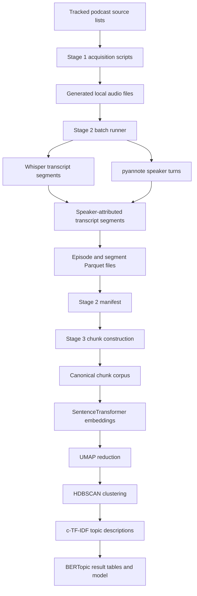

# Podcast Transcription and Topic-Modelling Pipeline

This repository contains the code used to build a structured research corpus from podcast audio and to analyse that corpus with BERTopic.

The repository is organised around a three-stage data flow:

1. **Acquire podcast audio.**
2. **Transcribe the audio and attach speaker information.**
3. **Convert transcript segments into document-sized chunks and model their topics.**

The central rule for reading this repository is:

> GitHub contains the code, configuration, source lists, and documentation. The large audio files, Parquet tables, embedding matrices, trained models, logs, and visualisations are generated during execution and are intentionally not committed.

This distinction is important because many paths shown in the documentation, such as `outputs/parquet/`, `outputs/common_chunks/`, and `outputs/bertopic*/`, do not appear in a fresh Git clone. They are runtime directories created on the machine where the pipeline is executed.

## Reader guide

Use this section before reading individual scripts.

| Question                                                              | File or location to inspect                                                                                                                                                                                   |
| --------------------------------------------------------------------- | ------------------------------------------------------------------------------------------------------------------------------------------------------------------------------------------------------------- |
| Which podcasts are selected?                                          | `data_sources/list.xlsx` and the other tracked source lists                                                                                                                                                   |
| Where are downloaded audio files stored?                              | Generated locally under `fyyd_downloads/<podcast>/`                                                                                                                                                           |
| Where is Stage 2 progress recorded?                                   | Server: `/home/fdai7991/podcast_projekt/outputs/state/manifest.parquet`; code: `StateStore` in [`pipeline/batch_podcast_runner.py`](pipeline/batch_podcast_runner.py)                                         |
| Where are transcript segments stored?                                 | Server: `/home/fdai7991/podcast_projekt/outputs/parquet/segments/<episode_id>.parquet`                                                                                                                        |
| Where is the Stage 3 chunking code?                                   | [`pipeline/run_bertopic_from_manifest.py`](pipeline/run_bertopic_from_manifest.py), especially `load_manifest()`, `join_episode_and_segments()`, `build_chunks_for_episode()`, and `build_chunks_resumable()` |
| What is the direct input to the embedding model and BERTopic?         | The `chunk_text` column in `/home/fdai7991/podcast_projekt/outputs/common_chunks/chunks_input.parquet`                                                                                                        |
| Which file should another application consume before topic modelling? | `/home/fdai7991/podcast_projekt/outputs/common_chunks/chunks_input.parquet`                                                                                                                                   |
| Which file should another application consume after topic modelling?  | `doc_topics.parquet`, together with `topic_info.parquet` and `topic_words.parquet`, from the selected model run                                                                                               |
| Are generated outputs in GitHub?                                      | No. The repository's `.gitignore` excludes `outputs/`; GitHub contains the scripts, not the generated Parquet files                                                                                           |
| Where is the manually uploaded MinIO copy?                            | Under the `bigdata-s3` alias, bucket `podcast-project`, prefix `outputs/outputs/`; see Section 1.3 for exact object paths and verification commands                                                           |

Detailed thesis-oriented documentation is in [`docs/thesis/`](docs/thesis/README.md).

## 1. What is tracked and what is generated?

### 1.1 Files committed to GitHub

```text
acquisition/        podcast discovery and download scripts
pipeline/           transcription, diarization, chunking, BERTopic, and grid-search code
data_sources/       tracked spreadsheet and CSV source lists
docs/thesis/        methodological documentation and reproducibility notes
tools/              audit and directory-report utilities
requirements.*      dependency definitions and environment snapshots
README.md            repository entry point
```

These files are small enough to version and are required to understand or reproduce the workflow.

### 1.2 Files generated during execution

```text
fyyd_downloads/     downloaded podcast audio
outputs/            manifests, transcripts, chunks, embeddings, and model outputs
logs/               console logs and process logs
artifacts/           acquisition reports and other generated support files
dist/               generated PDF and archive exports
```

These directories are ignored by Git because they can be large, machine-specific, or contain derived research data. Their absence from GitHub does not mean that the pipeline step is missing. It means that the step must be run, or that the resulting files must be obtained from the project storage location, or you can access it from the S3 storage where all the output is being stored for reuse.

### 1.3 Local paths versus S3 paths

The Python scripts write to the server filesystem. They do not contain S3 upload logic. In the documented server run, the two relevant roots are:

```text
code repository:  /home/fdai7991/podcast_transcribe
generated data:   /home/fdai7991/podcast_projekt/outputs
```

The generated `outputs/` tree is excluded from GitHub by [`.gitignore`](.gitignore). It was copied manually to the college MinIO service with the `mc` client so that another researcher can retrieve the runtime artefacts.

The exact upload command used was:

```bash
BUCKET="podcast-project"
PREFIX="outputs"

cd /home/fdai7991/podcast_projekt

find outputs -type f \( -name "*.parquet" -o -name "*.json" \) -print0 |
while IFS= read -r -d '' file; do
  ~/tools/mc cp "$file" "bigdata-s3/$BUCKET/$PREFIX/$file"
done
```

Because `file` already starts with `outputs/` and `PREFIX` is also `outputs`, this command creates an object-key prefix of **`outputs/outputs/`**. The exact mapping is therefore:

| Artefact         | Server path                                                                    | MinIO CLI path                                                                     | S3-style URI                                                                 |
| ---------------- | ------------------------------------------------------------------------------ | ---------------------------------------------------------------------------------- | ---------------------------------------------------------------------------- |
| Stage 2 manifest | `/home/fdai7991/podcast_projekt/outputs/state/manifest.parquet`                | `bigdata-s3/podcast-project/outputs/outputs/state/manifest.parquet`                | `s3://podcast-project/outputs/outputs/state/manifest.parquet`                |
| Episode table    | `/home/fdai7991/podcast_projekt/outputs/parquet/episodes/<episode_id>.parquet` | `bigdata-s3/podcast-project/outputs/outputs/parquet/episodes/<episode_id>.parquet` | `s3://podcast-project/outputs/outputs/parquet/episodes/<episode_id>.parquet` |
| Segment table    | `/home/fdai7991/podcast_projekt/outputs/parquet/segments/<episode_id>.parquet` | `bigdata-s3/podcast-project/outputs/outputs/parquet/segments/<episode_id>.parquet` | `s3://podcast-project/outputs/outputs/parquet/segments/<episode_id>.parquet` |
| Canonical chunks | `/home/fdai7991/podcast_projekt/outputs/common_chunks/chunks_input.parquet`    | `bigdata-s3/podcast-project/outputs/outputs/common_chunks/chunks_input.parquet`    | `s3://podcast-project/outputs/outputs/common_chunks/chunks_input.parquet`    |

Check the actual objects instead of assuming that an upload completed:

```bash
~/tools/mc stat bigdata-s3/podcast-project/outputs/outputs/state/manifest.parquet
~/tools/mc stat bigdata-s3/podcast-project/outputs/outputs/common_chunks/chunks_input.parquet
~/tools/mc ls bigdata-s3/podcast-project/outputs/outputs/parquet/segments/
```

The manifest stores the absolute server paths that existed when Stage 2 ran. Copying the manifest to S3 does not convert those values into S3 URIs. On another machine, either restore the files under `/home/fdai7991/podcast_projekt/outputs/` or update the two manifest path columns to the new local root before running Stage 3.

## 2. Pipeline overview



The main entry points are:

| File                                                  | Responsibility                                                                         |
| ----------------------------------------------------- | -------------------------------------------------------------------------------------- |
| `acquisition/fyyd_download.py`                        | Search fyyd for each selected podcast and download episode audio                       |
| `acquisition/rss_download.py`                         | Resolve RSS feeds and download episode audio                                           |
| `acquisition/podigee_scrape.py`                       | Collect Podigee episode and enclosure metadata                                         |
| `pipeline/pipeline_core.py`                           | Process one episode with Whisper, pyannote, segment matching, and optional F0 analysis |
| `pipeline/batch_podcast_runner.py`                    | Run Stage 2 over many episodes and maintain the manifest                               |
| `pipeline/run_bertopic_from_manifest.py`              | Build chunks from Stage 2 outputs and optionally train BERTopic                        |
| `pipeline/greedy_grid_search_bertopic_from_chunks.py` | Evaluate BERTopic parameter combinations using an existing chunk corpus                |
| `pipeline/rerun_best_bertopic_from_grid.py`           | Run the selected grid-search configuration through the main Stage 3 runner             |

## 3. Stage 1: acquire podcast audio

Stage 1 creates the audio corpus that Stage 2 processes. Stage 2 does not require a particular download source. It only requires one directory per podcast and one or more supported audio files inside that directory.

Expected generated layout:

```text
fyyd_downloads/
├── Podcast A/
│   ├── episode-001.mp3
│   └── episode-002.mp3
└── Podcast B/
    └── interview.wav
```

Supported extensions are `.mp3`, `.wav`, `.m4a`, `.flac`, `.ogg`, and `.aac`.

### 3.1 How `acquisition/fyyd_download.py` works

The fyyd downloader exists because fyyd exposes a public API that can be queried by podcast name and podcast identifier. It was useful for the source list because a substantial share of the selected podcasts could be found there without writing a separate scraper for every hosting platform.

The script follows this sequence:

1. Read `data_sources/list.xlsx` with pandas.
2. Extract the podcast name from the `Podcast Name` column, or from `name` as a fallback.
3. Call `fyyd_search_podcast()` with the full podcast name.
4. Select the first search result returned by the API.
5. Use that result's podcast identifier in `fyyd_get_episodes()`.
6. Read each episode's audio URL from the `enclosure` field.
7. Construct a local filename from the episode title and episode number.
8. Download the audio into `fyyd_downloads/<podcast name>/`.
9. Record successful and failed episodes in `artifacts/acquisition/fyyd_results.json`.

The current implementation takes the first fyyd search result because the query uses the full podcast name and the first result was treated as the most likely match. This is a practical shortcut, not a guarantee of identity. The result file must therefore be reviewed. A future robustness improvement would normalise names and score every returned candidate before selecting one.

Downloads use `stream=True`. The response body is written incrementally in 256 KiB blocks instead of loading an entire episode into memory. The selected block size is an engineering trade-off: it keeps memory usage small while avoiding an excessive number of tiny disk writes. It is a project setting, not a format requirement.

`download_with_retries()` performs up to three attempts. This was introduced because podcast hosting servers can time out or temporarily refuse a request even when the episode URL is valid. A two-second pause is used between attempts so that a brief hosting failure does not immediately become a permanent corpus failure.

The script keeps two episode lists for each podcast:

- `downloaded`: episodes that were written successfully;
- `failed_ep`: episodes that could not be downloaded after all attempts.

This audit information supports later recovery with the RSS or Podigee acquisition routes.

Run the downloader from the repository root:

```bash
source .venv/bin/activate
python acquisition/fyyd_download.py
```

### 3.2 Other acquisition routes

RSS download:

```bash
python acquisition/rss_download.py \
  --xlsx data_sources/redownload_list.xlsx \
  --output-dir fyyd_downloads \
  --workers 3
```

Podigee inventory:

```bash
python acquisition/podigee_scrape.py
```

The Podigee script creates an enclosure inventory. It does not perform Stage 2 processing.

## 4. Stage 2: transcribe, diarize, and attach speaker metadata

Stage 2 is driven by `pipeline/batch_podcast_runner.py`. It scans the audio tree, records every episode in a manifest, and processes eligible episodes one by one.

A typical command is:

```bash
export PYANNOTE_TOKEN="hf_your_token_here"
source .venv/bin/activate

python pipeline/batch_podcast_runner.py \
  --downloads "$PROJECT_ROOT/fyyd_downloads" \
  --out_root "$PROJECT_ROOT/outputs" \
  --state_dir "$PROJECT_ROOT/outputs/state" \
  --whisper_model small \
  --limit 250 \
  --gender \
  --diar_gpu \
  --rebuild_manifest
```

### 4.1 What Stage 2 reads

Stage 2 reads audio files under the directory passed to `--downloads`.

It also reads an existing `outputs/state/manifest.parquet` when one is present. This allows the runner to preserve completed work and select only pending, interrupted, or explicitly retried episodes.

### 4.2 What Stage 2 does

For each selected episode:

1. Whisper produces timestamped transcript segments and a detected language code.
2. pyannote produces anonymous speaker turns such as `SPEAKER_00` and `SPEAKER_01`.
3. Each Whisper segment is assigned to the diarized speaker with the greatest temporal overlap.
4. Optional F0 analysis estimates a perceived vocal-pitch category for each diarized speaker.
5. Episode-level and segment-level tables are written.
6. The manifest row is changed to `done` or `failed`.

A Whisper segment is an ASR output unit with start time, end time, and text. It is not the same as a grammatical sentence and it is not yet the document used for BERTopic.

### 4.3 What Stage 2 writes

```text
outputs/
├── state/
│   ├── manifest.parquet
│   └── failures.parquet
├── parquet/
│   ├── episodes/<episode_id>.parquet
│   └── segments/<episode_id>.parquet
└── json_debug/<episode_id>.json
```

`manifest.parquet` is the authoritative index. Each successful row points to the episode and segment files through `output_episode_parquet` and `output_segments_parquet`.

The segment Parquet is the direct Stage 3 source. Each row contains the episode identifier, timestamp, speaker label, vocal-pitch label, and transcript text for one matched Whisper segment.

## 5. Stage 3: construct BERTopic input documents

Stage 3 is the point that caused the most naming confusion, so the distinction is explicit here.

### 5.1 What is the Stage 3 input?

The runner does not scan a Stage 2 output directory. The caller gives it one exact manifest path through `--manifest`. For the documented server run, that file is:

```text
/home/fdai7991/podcast_projekt/outputs/state/manifest.parquet
```

It is generated by `StateStore.save_manifest()` in [`pipeline/batch_podcast_runner.py`](pipeline/batch_podcast_runner.py), not stored in GitHub. The manually uploaded copy produced by the command in Section 1.3 is:

```text
bigdata-s3/podcast-project/outputs/outputs/state/manifest.parquet
```

`load_manifest()` in [`pipeline/run_bertopic_from_manifest.py`](pipeline/run_bertopic_from_manifest.py) reads that single table and applies these rules:

1. require the columns `episode_id`, `output_episode_parquet`, and `output_segments_parquet`;
2. keep rows whose `status` equals the `--status` value, which is `done` by default;
3. keep rows where both output-path columns are non-null;
4. if an `episode_id` occurs more than once, retain its last row.

The `status` value and both output paths are columns in the **same manifest row**. They are not files inside the `state/` directory. A schematic completed row is:

| Manifest column           | Example value                                                                  |
| ------------------------- | ------------------------------------------------------------------------------ |
| `episode_id`              | `<40-character episode_id>`                                                    |
| `status`                  | `done`                                                                         |
| `output_segments_parquet` | `/home/fdai7991/podcast_projekt/outputs/parquet/segments/<episode_id>.parquet` |
| `output_episode_parquet`  | `/home/fdai7991/podcast_projekt/outputs/parquet/episodes/<episode_id>.parquet` |

For every selected row, Stage 3 opens the exact file named by `output_segments_parquet`. It also opens `output_episode_parquet` when episode metadata is available. This is what “manifest-driven” means in this repository.

### 5.2 What comes out of chunk construction?

The main output is physically named `chunks_input.parquet`; conceptually, it is the **BERTopic document input corpus**. With the recommended chunk-only command in Section 5.6, its first location is:

```text
/home/fdai7991/podcast_projekt/outputs/bertopic_chunk_build/chunks_input.parquet
```

The grid-search input resolver can then copy it to the stable handoff location:

```text
/home/fdai7991/podcast_projekt/outputs/common_chunks/chunks_input.parquet
```

The corresponding manually uploaded MinIO object is expected at the following path if `mc stat` confirms that it was transferred:

```text
bigdata-s3/podcast-project/outputs/outputs/common_chunks/chunks_input.parquet
```

This file is not in GitHub. GitHub contains the code that creates it.

Every row is one **constructed chunk**, and that chunk is treated as one document by SentenceTransformer and BERTopic. It is not necessarily one original Whisper segment. A chunk contains one or more consecutive segments; `source_segment_count` records how many. The runner passes only `chunks["chunk_text"].tolist()` to `model.fit_transform()`, while retaining the other columns for traceability.

The exact output schema created by `flush_chunk()` is:

| Column                 | Meaning                                                                                      |
| ---------------------- | -------------------------------------------------------------------------------------------- |
| `chunk_id`             | Stable SHA-1 identifier for the constructed chunk                                            |
| `episode_id`           | Identifier of the source episode                                                             |
| `podcast_folder`       | Source podcast directory name                                                                |
| `episode_path`         | Path of the source audio episode                                                             |
| `speaker`              | One diarized speaker label, or `mixed` if the chunk contains multiple labels                 |
| `gender`               | One acoustic gender category, or `mixed` if the chunk contains multiple categories           |
| `start`                | Start time of the first source segment, in seconds                                           |
| `end`                  | End time of the last source segment, in seconds                                              |
| `chunk_text`           | Chronologically concatenated and whitespace-normalised segment text; this is the model input |
| `word_count`           | Number of whitespace-separated tokens in `chunk_text`                                        |
| `source_segment_count` | Number of Stage 2 segment rows combined into the chunk                                       |

The same rows are also written as `chunks_input.csv` for inspection. Parquet is the canonical pipeline format.

### 5.3 How a chunk is constructed

All chunk construction code is in [`pipeline/run_bertopic_from_manifest.py`](pipeline/run_bertopic_from_manifest.py). The relevant functions are:

| Function                      | Responsibility                                                                     |
| ----------------------------- | ---------------------------------------------------------------------------------- |
| `load_manifest()`             | Select completed Stage 2 rows and their exact Parquet paths                        |
| `join_episode_and_segments()` | Load one segment table and add non-duplicating episode metadata                    |
| `build_chunks_for_episode()`  | Order, filter, and group the episode's segments                                    |
| `flush_chunk()`               | Convert the current segment group into one chunk row                               |
| `stable_chunk_id()`           | Calculate the deterministic chunk identifier                                       |
| `build_chunks_resumable()`    | Skip completed episodes, checkpoint progress, and save the accumulated chunk table |

The implementation processes one completed episode as follows:

1. **Load the Stage 2 segments.** `join_episode_and_segments()` reads the path in the manifest row's `output_segments_parquet` column. This is correctly called the episode's **segment Parquet** because every input row is one speaker-attributed Whisper segment.

2. **Add episode-level metadata without replacing segment fields.** The function reads `output_episode_parquet`, ensures that both tables contain `episode_id`, selects `episode_id` plus only those episode columns that are absent from the segment table, keeps one episode row, and performs a left join on `episode_id`. Consequently, every segment is retained, segment-level values remain authoritative, and episode-only metadata is repeated beside the episode's segments. If the episode table is absent or unreadable, chunking continues with the segment and manifest fields.

3. **Restore chronological order.** `build_chunks_for_episode()` sorts by whichever of `episode_id`, `start`, `end`, and `segment_idx` exist. This is necessary because row order is not a reliable storage contract. The sort ensures that concatenated text follows the spoken timeline and that a chunk's `start` and `end` refer to its first and last chronological segments.

4. **Normalise whitespace.** `clean_text()` replaces both escaped and actual carriage returns, newlines, and tabs with spaces. It then uses `text.split()` and joins the parts with one space, which collapses repeated spaces and trims leading or trailing whitespace.

5. **Remove near-empty segments.** The code calculates a whitespace-based word count for every segment and keeps only rows with at least `--min-segment-words` words; the default is 2.

6. **Accumulate consecutive segments.** The function iterates through the sorted rows while maintaining `current_rows`, `current_words`, and `current_speaker`. If no boundary condition is met, it appends the next segment row and adds its word count. The segments therefore remain consecutive and are never reordered across the episode.

7. **Close the current chunk at a boundary.** Before adding the next segment, `flush_chunk()` is called when any of these conditions is true:
   - `--speaker-consistent` is enabled and the next segment has a different speaker;
   - the current chunk already contains at least `--chunk-target-words` words;
   - adding the next segment would exceed `--chunk-max-words`.

   `flush_chunk()` joins the selected segment texts with spaces, uses the first segment's `start`, the last segment's `end`, and records the number of combined rows in `source_segment_count`.

8. **Remove very short documents.** After all candidate chunks for the episode are built, the function retains only chunks with at least `--min-doc-words` words; the default is 20.

9. **Assign the stable `chunk_id`.** The ID is the SHA-1 hexadecimal digest of the episode ID, chunk start and end rounded to three decimal places, zero-based chunk index, and first 200 characters of the normalised chunk text:

   ```python
   payload = f"{episode_id}|{start or 0:.3f}|{end or 0:.3f}|{idx}|{text[:200]}"
   chunk_id = hashlib.sha1(payload.encode("utf-8")).hexdigest()
   ```

   The same episode data and chunking parameters therefore produce the same ID. Changing a boundary or the beginning of the chunk text can produce a different ID.

10. **Append and save the accumulated chunk table.** The episode's chunk DataFrame is appended to `new_chunk_frames`. It is concatenated with any existing `<output-dir>/chunks_input.parquet`, deduplicated by `chunk_id`, and written back to:

    ```text
    <output-dir>/chunks_input.parquet
    <output-dir>/chunks_input.csv
    ```

    The runner checkpoints after every 25 processed episodes and saves again at the end. `<output-dir>/chunk_build_state.parquet` is the episode-level resume ledger; it is not the chunk corpus. `<output-dir>/chunk_build_failures.parquet` records chunking failures.

Default controls are:

| Option                 | Default | Effect                                                                                                          |
| ---------------------- | ------: | --------------------------------------------------------------------------------------------------------------- |
| `--chunk-target-words` |     220 | Prefer to close a chunk after approximately this size                                                           |
| `--chunk-min-words`    |      80 | Declared by the CLI but not referenced by the current chunk-building implementation; it presently has no effect |
| `--chunk-max-words`    |     320 | Close before adding a segment that would exceed this limit                                                      |
| `--min-segment-words`  |       2 | Remove near-empty ASR segments before construction                                                              |
| `--min-doc-words`      |      20 | Remove completed chunks that are too short for modelling                                                        |
| `--speaker-consistent` |    true | Close the chunk when the diarized speaker changes                                                               |

The target is not a minimum. Speaker changes can close a chunk before 220 words, while `--min-doc-words` is the effective final lower bound.

### 5.4 Where Stage 3 writes its first output

The main runner writes to the directory supplied through `--output-dir`:

```text
<output-dir>/
├── chunks_input.parquet
├── chunks_input.csv
├── chunk_build_state.parquet
└── chunk_build_failures.parquet
```

For the recommended server run:

```bash
--output-dir "/home/fdai7991/podcast_projekt/outputs/bertopic_chunk_build"
```

the chunk files are written to:

```text
/home/fdai7991/podcast_projekt/outputs/bertopic_chunk_build/
```

These paths are generated locally and are ignored by Git.

### 5.5 Why does `chunks_input.parquet` appear more than once?

There are two roles:

1. **Runner-local chunk file**  
   `<output-dir>/chunks_input.parquet` is created by `run_bertopic_from_manifest.py` because that runner combines chunk construction and model training.

2. **Canonical shared chunk file**  
   `outputs/common_chunks/chunks_input.parquet` is the agreed exchange copy reused by grid search, final model runs, search systems, and other applications.

The contents may be identical, but the roles are different. The canonical shared copy prevents every model experiment from rebuilding or redefining the document corpus.

The grid-search script can copy a completed runner-local file into `outputs/common_chunks/`. It writes `COMMON_CHUNKS_MANIFEST.json` containing `created_at`, `source`, `copied_to`, and a note. The current implementation does **not** calculate a checksum; a checksum must be recorded separately if required for the research handoff.

### 5.6 Recommended Stage 3 commands

From the code repository on the server, build all remaining chunks without training:

```bash
REPOSITORY_ROOT="/home/fdai7991/podcast_transcribe"
PROJECT_ROOT="/home/fdai7991/podcast_projekt"

cd "$REPOSITORY_ROOT"
source .venv_bertopic/bin/activate

test -f "$PROJECT_ROOT/outputs/state/manifest.parquet"

python pipeline/run_bertopic_from_manifest.py \
  --manifest "$PROJECT_ROOT/outputs/state/manifest.parquet" \
  --output-dir "$PROJECT_ROOT/outputs/bertopic_chunk_build" \
  --no-train
```

To limit one invocation to 600 not-yet-chunked episodes, add `--chunk-episode-limit 600` and repeat the command. Omit that option, as above, to process all remaining completed episodes.

Do not use `--chunk-episode-limit 0` to mean unlimited. In the current implementation it selects zero new episodes.

Copy or seed the canonical shared corpus through the grid-search input resolver:

```bash
python pipeline/greedy_grid_search_bertopic_from_chunks.py \
  --source-run-dir "$PROJECT_ROOT/outputs/bertopic_chunk_build" \
  --common-chunks-dir "$PROJECT_ROOT/outputs/common_chunks" \
  --output-dir "$PROJECT_ROOT/outputs/bertopic_gridsearch" \
  --max-docs 50000
```

After the common copy exists, later runs should point directly to:

```text
/home/fdai7991/podcast_projekt/outputs/common_chunks/chunks_input.parquet
```

Verify the result and schema without opening the full dataset manually:

```bash
python - <<'PY'
import pandas as pd

path = "/home/fdai7991/podcast_projekt/outputs/common_chunks/chunks_input.parquet"
df = pd.read_parquet(path)
print("path:", path)
print("rows:", len(df))
print("columns:", df.columns.tolist())
print(df[["chunk_id", "episode_id", "start", "end", "word_count", "source_segment_count"]].head())
PY
```

## 6. What is passed to BERTopic?

BERTopic receives a list of strings taken from `chunk_text`.

The processing sequence is:

```text
chunk_text
  -> SentenceTransformer embedding vector
  -> UMAP reduced vector
  -> HDBSCAN topic cluster or outlier label -1
  -> CountVectorizer and c-TF-IDF topic words
```

The embedding model is not given the Stage 2 manifest, raw audio, or whole Parquet row. It receives the text of one chunk at a time. Metadata such as `episode_id`, `speaker`, `gender`, `start`, and `end` is retained beside the text so that results can later be traced back to the source.

Default embedding model:

```text
sentence-transformers/paraphrase-multilingual-MiniLM-L12-v2
```

## 7. BERTopic outputs

A trained run writes model-specific results under:

```text
<output-dir>/podcast_chunks_sw-de/
```

Important files are:

| File                          | Meaning                                              | Primary consumer                     |
| ----------------------------- | ---------------------------------------------------- | ------------------------------------ |
| `doc_topics.parquet`          | One row per chunk with its assigned topic            | Applications and thesis analyses     |
| `chunks_with_topics.parquet`  | Full chunk table plus topic assignment               | Detailed analysis and debugging      |
| `topic_info.parquet`          | Topic identifiers, sizes, names, and representations | Topic inventory and labelling        |
| `topic_words.parquet`         | Top c-TF-IDF words and scores for each topic         | Interpretation and reporting         |
| `representative_docs.parquet` | Example chunks for each topic                        | Manual validation                    |
| `bertopic_model/`             | Saved model                                          | Reloading and further transformation |
| `run_config.json`             | Exact parameters and result counts                   | Reproducibility                      |
| `topics_*.html`               | Interactive visualisations                           | Inspection and figure preparation    |

Topic `-1` is the HDBSCAN outlier class. It means that the chunk was not assigned confidently to a dense topic cluster.

## 8. Downstream handoff contracts

Consumers should choose one level and not mix files from different levels without an explicit join.

| Handoff level            | Canonical files                                                           | Use this when                                                                             |
| ------------------------ | ------------------------------------------------------------------------- | ----------------------------------------------------------------------------------------- |
| Raw transcript level     | `outputs/state/manifest.parquet` and `outputs/parquet/segments/*.parquet` | The consumer needs timestamps, speaker turns, or custom chunking                          |
| Pre-model document level | `outputs/common_chunks/chunks_input.parquet`                              | The consumer needs stable text documents for search, embeddings, or independent modelling |
| Topic-result level       | `doc_topics.parquet`, `topic_info.parquet`, `topic_words.parquet`         | The consumer needs the selected model's assignments and labels                            |

The recommended handoff before BERTopic is:

```text
outputs/common_chunks/chunks_input.parquet
```

The recommended handoff after BERTopic is the selected run's:

```text
podcast_chunks_sw-de/
```

## 9. MinIO/S3 handoff

MinIO is a manual storage handoff, not a pipeline stage. Under the upload command documented in Section 1.3, the actual object layout is:

```text
s3://podcast-project/outputs/outputs/
├── state/
│   ├── manifest.parquet
│   └── failures.parquet
├── parquet/
│   ├── episodes/<episode_id>.parquet
│   └── segments/<episode_id>.parquet
├── common_chunks/
│   ├── chunks_input.parquet
│   └── COMMON_CHUNKS_MANIFEST.json
└── <individual BERTopic run directories>/
```

For the next researcher, the file to use depends on the next task:

| Task                                                      | Retrieve this object                                                                                                                           |
| --------------------------------------------------------- | ---------------------------------------------------------------------------------------------------------------------------------------------- |
| Rebuild chunks from Stage 2 segments                      | `s3://podcast-project/outputs/outputs/state/manifest.parquet` plus `outputs/outputs/parquet/episodes/` and `outputs/outputs/parquet/segments/` |
| Run embeddings, BERTopic, or another document-level model | `s3://podcast-project/outputs/outputs/common_chunks/chunks_input.parquet`                                                                      |
| Analyse an existing topic model                           | The chosen run's `doc_topics.parquet`, `topic_info.parquet`, and `topic_words.parquet`                                                         |

An S3 object should be described as available only after `mc stat` confirms it. A handoff record should contain:

- the exact source file;
- the exact destination URI;
- the file checksum;
- the number of rows;
- the cleaning or filtering variant;
- the date of transfer.

## 10. Resuming and auditing

Stage 2 resumability is controlled by `outputs/state/manifest.parquet`.

Stage 3 chunk resumability is controlled by `<output-dir>/chunk_build_state.parquet`.

BERTopic training is corpus-level. `_TRAINING_COMPLETE.json` prevents accidental retraining in a completed run directory. Use a new output directory for a new experiment, or use `--force-train` deliberately.

Useful checks:

```bash
python tools/audit_missing_speaker_gender.py \
  --manifest outputs/state/manifest.parquet

python tools/report_directory_usage.py outputs
```

## 11. Installation Guide

### 11.1 System requirements

- Linux is the tested operating system.
- Python 3.12 is recommended; the recorded project environments used Python 3.12.3.
- Git is required to clone the code.
- FFmpeg must be available on `PATH` for audio decoding.
- Internet access is needed for initial package and model downloads.
- Stage 2 requires a Hugging Face account, accepted pyannote model conditions, and a read token.
- The full corpus requires substantial disk space for audio, Parquet tables, caches, embeddings, and models.
- An NVIDIA GPU is strongly recommended for full-corpus execution, but CPU execution is supported.

The project deliberately uses two Python environments:

| Environment      | Used for                                                                  | Dependency source                                                                      |
| ---------------- | ------------------------------------------------------------------------- | -------------------------------------------------------------------------------------- |
| `.venv`          | Acquisition, Whisper transcription, pyannote diarization, and F0 analysis | `requirements.base.txt`, after installing a suitable PyTorch 2.8.0 build               |
| `.venv_bertopic` | Chunking, SentenceTransformer embeddings, grid search, and BERTopic       | Minimal commands below; `requirements.venv_bertopic.txt` is the recorded full snapshot |

`requirements.venv.txt` and `requirements.venv_bertopic.txt` are machine-specific `pip freeze` snapshots. They are useful for auditing an existing environment, but they are not the preferred clean-install entry points because their CUDA packages reflect the machine on which they were captured.

### 11.2 Clone the code and define the data root

The documented server separates the Git repository from generated research data:

```text
code:  /home/fdai7991/podcast_transcribe
data:  /home/fdai7991/podcast_projekt
```

For a new user, the equivalent setup is:

```bash
cd "$HOME"
git clone https://github.com/plasma31/podcast_transcribe.git

export REPOSITORY_ROOT="$HOME/podcast_transcribe"
export PROJECT_ROOT="$HOME/podcast_projekt"

mkdir -p "$PROJECT_ROOT"
cd "$REPOSITORY_ROOT"
```

All Python commands below are run from `$REPOSITORY_ROOT`. Audio and generated outputs are placed under `$PROJECT_ROOT` by passing absolute paths to the runners.

### 11.3 Install and verify FFmpeg

On Ubuntu or Debian with administrator access:

```bash
sudo apt update
sudo apt install -y ffmpeg
command -v ffmpeg
ffmpeg -version
```

On the original server, FFmpeg was installed without administrator access under the user's home directory. If another user-owned installation is used, add its `bin` directory to `PATH`:

```bash
export PATH="$HOME/local/bin:$PATH"
command -v ffmpeg
ffmpeg -version
```

Add that `export PATH=...` line to the shell profile if it must persist across logins.

### 11.4 Create the Stage 1 and Stage 2 environment

Create the environment:

```bash
cd "$REPOSITORY_ROOT"
python3.12 -m venv .venv
source .venv/bin/activate
python -m pip install --upgrade pip setuptools wheel
```

The project dependency file requires the PyTorch 2.8.0 family to be installed first. For the CUDA 12.8 configuration recorded in the earlier environment commit:

```bash
python -m pip install \
  torch==2.8.0 torchvision==0.23.0 torchaudio==2.8.0 \
  --index-url https://download.pytorch.org/whl/cu128

python -m pip install -r requirements.base.txt
```

For a CPU-only installation, use:

```bash
python -m pip install \
  torch==2.8.0 torchvision==0.23.0 torchaudio==2.8.0 \
  --index-url https://download.pytorch.org/whl/cpu

python -m pip install -r requirements.base.txt
```

For a different GPU or driver, choose a supported PyTorch 2.8.0 wheel from the official [PyTorch previous-version installation table](https://pytorch.org/get-started/previous-versions/) rather than changing only the local CUDA toolkit.

Verify the Stage 2 environment:

```bash
python - <<'PY'
import librosa
import pandas
import pyarrow
import torch
import whisper
from pyannote.audio import Pipeline

print("torch:", torch.__version__)
print("torchaudio:", __import__("torchaudio").__version__)
print("CUDA available:", torch.cuda.is_available())
print("Stage 2 imports: OK")
PY

python -m pip check
python pipeline/batch_podcast_runner.py --help
```

`requirements.base.txt` currently pins the direct acquisition and Stage 2 packages, including `openai-whisper==20250625`, `pyannote-audio==4.0.3`, `librosa==0.11.0`, `pandas==2.3.3`, and `pyarrow==23.0.1`.

### 11.5 Configure pyannote model access

The current pipeline loads `pyannote/speaker-diarization-3.1`. Before the first Stage 2 run:

1. sign in to Hugging Face;
2. accept the conditions for [`pyannote/segmentation-3.0`](https://huggingface.co/pyannote/segmentation-3.0);
3. accept the conditions for [`pyannote/speaker-diarization-3.1`](https://huggingface.co/pyannote/speaker-diarization-3.1);
4. create a Hugging Face read token;
5. export the token in the shell that starts the runner.

```bash
export PYANNOTE_TOKEN="hf_your_token_here"
```

The batch runner checks `PYANNOTE_TOKEN`, then `HF_TOKEN`, then `HUGGINGFACE_TOKEN`. Only one is needed; `PYANNOTE_TOKEN` is recommended for clarity.

Never hard-code or commit the token. Earlier repository history includes a token-removal commit; any token ever committed should be revoked and replaced rather than reused from Git history.

### 11.6 Create the Stage 3 BERTopic environment

The Stage 3 environment is separate because its recorded, working combination uses a different PyTorch and SentenceTransformer stack:

```bash
deactivate
cd "$REPOSITORY_ROOT"
python3.12 -m venv .venv_bertopic
source .venv_bertopic/bin/activate
python -m pip install --upgrade pip setuptools wheel
```

Install the CUDA 11.8 PyTorch family recorded in `requirements.venv_bertopic.txt`:

```bash
python -m pip install \
  torch==2.3.1 torchvision==0.18.1 torchaudio==2.3.1 \
  --index-url https://download.pytorch.org/whl/cu118

python -m pip install \
  bertopic==0.17.4 \
  hdbscan==0.8.42 \
  names-dataset==3.3.1 \
  pandas \
  plotly==6.7.0 \
  pyarrow \
  pycountry \
  safetensors \
  sentence-transformers==3.4.1 \
  stopwordsiso==0.6.1 \
  umap-learn==0.5.12
```

For CPU-only Stage 3 execution, replace only the PyTorch command with:

```bash
python -m pip install \
  torch==2.3.1 torchvision==0.18.1 torchaudio==2.3.1 \
  --index-url https://download.pytorch.org/whl/cpu
```

Verify Stage 3:

```bash
python - <<'PY'
import bertopic
import hdbscan
import pandas
import pyarrow
import sentence_transformers
import torch
import umap

print("torch:", torch.__version__)
print("CUDA available:", torch.cuda.is_available())
print("BERTopic:", bertopic.__version__)
print("SentenceTransformer:", sentence_transformers.__version__)
print("Stage 3 imports: OK")
PY

python -m pip check
python pipeline/run_bertopic_from_manifest.py --help
python pipeline/greedy_grid_search_bertopic_from_chunks.py --help
```

### 11.7 Prepare input data

For a fresh run, Stage 2 expects one directory per podcast under the chosen downloads root:

```text
$PROJECT_ROOT/fyyd_downloads/
├── Podcast A/
│   ├── episode-001.mp3
│   └── episode-002.mp3
└── Podcast B/
    └── interview.wav
```

Create the root before using an acquisition script or copying audio:

```bash
mkdir -p "$PROJECT_ROOT/fyyd_downloads"
```

The acquisition scripts default to paths inside the repository, so for a strict code/data separation either move their completed downloads to `$PROJECT_ROOT/fyyd_downloads` or use the RSS downloader's `--output-dir` option. Stage 2 itself accepts any downloads root through `--downloads`.

To continue from the existing MinIO handoff, first verify the required objects described in Section 9. Stage 3 cannot read S3 objects directly: the manifest, episode tables, and segment tables must exist on a local or mounted filesystem. Because the existing manifest contains absolute paths under `/home/fdai7991/podcast_projekt/`, a researcher using a different data root must update `output_episode_parquet` and `output_segments_parquet` in their local manifest copy before chunking.

### 11.8 Run a one-episode Stage 2 smoke test

After placing at least one supported audio file in a podcast subdirectory:

```bash
cd "$REPOSITORY_ROOT"
source .venv/bin/activate
export PATH="$HOME/local/bin:$PATH"
export PYANNOTE_TOKEN="hf_your_token_here"

python pipeline/batch_podcast_runner.py \
  --downloads "$PROJECT_ROOT/fyyd_downloads" \
  --out_root "$PROJECT_ROOT/outputs" \
  --state_dir "$PROJECT_ROOT/outputs/state" \
  --whisper_model small \
  --limit 1 \
  --gender \
  --rebuild_manifest
```

The smoke test intentionally omits `--diar_gpu`; pyannote therefore stays on CPU while Whisper uses CUDA when available. After it succeeds, inspect the manifest:

```bash
python - <<PY
import pandas as pd

path = "$PROJECT_ROOT/outputs/state/manifest.parquet"
manifest = pd.read_parquet(path)
print("manifest:", path)
print(manifest["status"].value_counts(dropna=False))
print(manifest[["episode_id", "status", "output_episode_parquet", "output_segments_parquet"]].head())
PY
```

Once at least one row is `done`, activate `.venv_bertopic` and use the Stage 3 command in Section 5.6.

### 11.9 Installation troubleshooting

| Problem                                                   | Check or correction                                                                                            |
| --------------------------------------------------------- | -------------------------------------------------------------------------------------------------------------- |
| `ffmpeg` is not found                                     | Run `command -v ffmpeg`; install it or add its user-owned `bin` directory to `PATH`                            |
| `Missing Hugging Face token`                              | Export `PYANNOTE_TOKEN` in the same shell that starts Stage 2                                                  |
| pyannote returns `401`, `403`, or gated-repository errors | Confirm that both model conditions were accepted by the same Hugging Face account that issued the token        |
| `torch.cuda.is_available()` is `False`                    | Confirm the NVIDIA driver with `nvidia-smi` and install the appropriate official PyTorch wheel for that driver |
| Stage 2 imports conflict with BERTopic packages           | Use `.venv` only for Stages 1–2 and `.venv_bertopic` for Stage 3                                               |
| BERTopic reports a CUDA kernel or memory error            | Re-run with `--embedding-device cpu`                                                                           |
| `No audio files found in downloads root`                  | Put files inside podcast subdirectories, not directly in the downloads root                                    |
| Stage 3 reports missing Parquet files after an S3 restore | Restore the complete Stage 2 tree and correct the absolute paths stored in the local manifest copy             |

## 12. Methodological cautions

- Whisper segments are ASR units, not guaranteed sentences.
- pyannote speaker labels are anonymous and local to one episode.
- F0 categories are acoustic estimates, not self-identified gender.
- A chunk is a constructed document unit, not a naturally occurring paragraph.
- Topic count and outlier rate depend on embedding, UMAP, HDBSCAN, vectorizer, and chunking decisions.
- Lower outlier rate is not automatically better if it is achieved by forcing unrelated text into broad topics.
- All reported corpus counts and model results should be tied to a manifest, chunk checksum, and run configuration.
