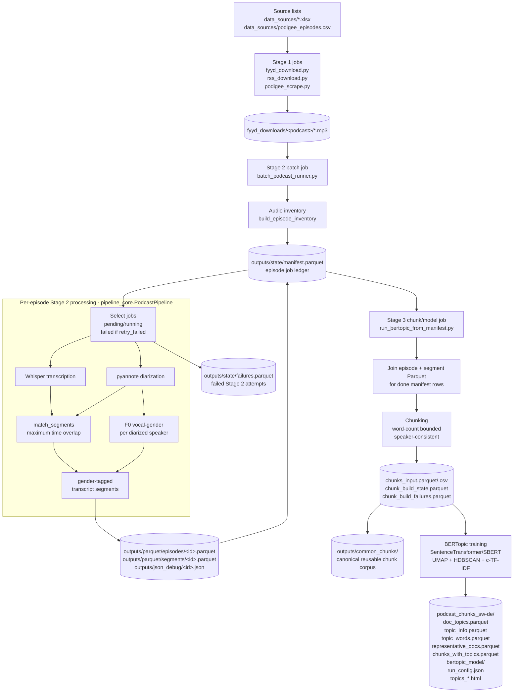
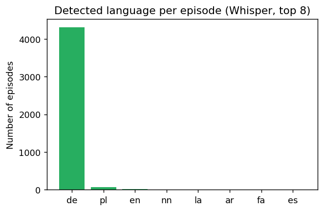
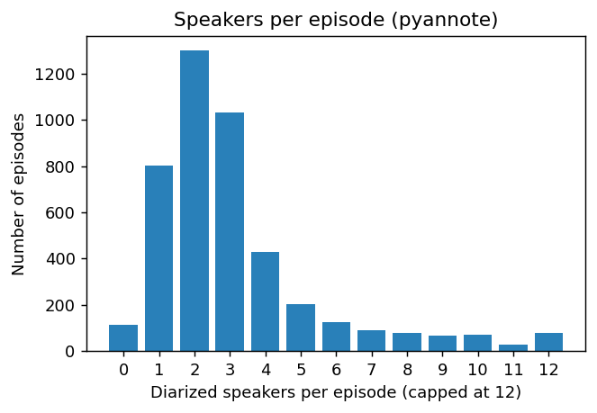
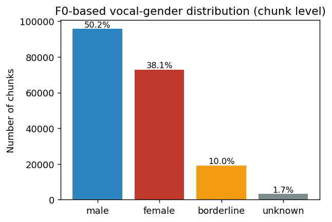

# Chapter: Data Pipeline and Corpus

> Methodological documentation of the data-processing pipeline and the resulting
> corpus. All figures and counts in this chapter are reproducible from the
> committed pipeline outputs via `docs/thesis/_make_stats_and_figures.py`; the
> exact numbers are persisted in `docs/thesis/corpus_stats.json`.

## 1. Overview

The empirical material of this thesis is a corpus of German-language podcasts.
Raw audio is transformed into structured, analysable data by a three-stage
pipeline: (i) **acquisition** of episode audio, (ii) **transcription,
speaker diarization, and vocal-gender estimation**, and (iii) **topic modelling**
of the resulting transcripts. Each stage is implemented as a resumable
command-line batch job and writes its output to disk as columnar Parquet files,
so that later stages consume the persisted output of earlier ones rather than
re-processing audio.



The corpus as processed for this thesis comprises **84 podcasts** and **4,530
episodes** registered in the job ledger, of which **4,416 (97.5 %)** were
processed successfully and **114 (2.5 %)** failed (e.g. corrupt or truncated
audio). Stage 2 consumed approximately **272.5 GPU/CPU compute-hours**
(mean 222 s per episode). The transcripts contain **2,039,935 transcript
segments** in total (mean 462 per episode). For topic modelling these segments
were merged into **191,183 chunks** drawn from 4,400 episodes.

## 2. Directory and output layout

The repository versions code, acquisition source lists, dependency manifests,
and documentation. Audio, Parquet, model artefacts, logs, and exports are
intentionally untracked. The working layout is:

```
podcast_projekt/
├── acquisition/                            # Stage 1 download and discovery utilities
├── data_sources/                           # tracked acquisition spreadsheets and CSV files
├── tools/                                  # audit and directory-report utilities
├── docs/thesis/                            # methodology, figures, and export helpers
├── requirements.base.txt                   # direct Stage 1-2 dependencies
├── requirements.venv*.txt                  # full environment snapshots
├── fyyd_downloads/<podcast_name>/*.mp3      # ignored Stage 1 audio
├── pipeline/                                # canonical pipeline code
│   ├── pipeline_core.py                     #   transcribe + diarize + gender per episode
│   ├── batch_podcast_runner.py              #   Stage 2 resumable batch driver
│   ├── run_bertopic_from_manifest.py        #   Stage 3 chunk build + BERTopic runner
│   ├── bertopic_typisierung.py              #   shared BERTopic model/stopword helpers
│   ├── greedy_grid_search_bertopic_from_chunks.py
│   ├── rerun_best_bertopic_from_grid.py
│   ├── reassign_bertopic_outliers.py
│   ├── reassign_bertopic_outliers_embeddings.py
│   └── compare_bertopic_runs.py
├── outputs/                                 # ignored generated analysis data
│   ├── parquet/                             # Stage 2 transcript corpus
│   │   ├── episodes/<episode_id>.parquet     # one row per episode
│   │   └── segments/<episode_id>.parquet     # one row per transcript segment
│   ├── json_debug/<episode_id>.json          # raw model/debug payload per episode
│   ├── state/                               # Stage 2 ledgers
│   │   ├── manifest.parquet                  # current job state and output paths
│   │   ├── failures.parquet                  # append-only failed-attempt log
│   │   └── audit_missing_speaker_gender.parquet
│   ├── common_chunks/                       # canonical reusable Stage 3 input corpus
│   │   ├── chunks_input.parquet              # universal chunked documents
│   │   ├── chunks_input.csv                  # CSV copy of the same corpus
│   │   ├── chunks_input_clean.parquet        # optional filtered corpus variant
│   │   ├── chunks_excluded_noise.parquet     # chunks excluded by later filtering
│   │   ├── chunks_cleaning_stats.csv         # reasons/counts for filtered chunks
│   │   └── embedding_cache/                  # reusable embedding matrices for experiments
│   └── bertopic*/                            # per-model/per-parameter experiment runs
│       ├── chunks_input.parquet              # runner-local copy/link of chunk corpus
│       ├── chunks_input.csv
│       ├── chunk_build_state.parquet         # Stage 3 chunk resumability ledger
│       ├── chunk_build_failures.parquet      # Stage 3 chunking failed-attempt log
│       └── podcast_chunks_sw-de/
│           ├── doc_topics.parquet/.csv
│           ├── topic_info.parquet/.csv
│           ├── topic_words.parquet/.csv
│           ├── representative_docs.parquet/.csv
│           ├── chunks_with_topics.parquet/.csv
│           ├── doc_topic_probs.parquet       # optional; only when --save-probs
│           ├── doc_topics_reassigned*.parquet # optional outlier reassignment outputs
│           ├── bertopic_model/
│           ├── run_config.json
│           ├── _TRAINING_COMPLETE.json
│           └── topics_*.html
├── logs/                                    # ignored batch and audit logs
├── artifacts/                               # ignored acquisition results and binaries
└── dist/                                    # ignored PDF and ZIP exports
```

The `outputs/bertopic*` directories are **parallel experiments**: the suffix of
each folder encodes the embedding model and the parameters that distinguish it
from the others (e.g. `bertopic_e5_mcs50_ms1` = the *e5-large* embedding with
HDBSCAN `min_cluster_size = 50`, `min_samples = 1`). The unsuffixed
`outputs/bertopic/` directory is the reference (baseline) run used throughout
Chapter "Topic Modelling". The top-level `chunks_input.parquet` files inside
these experiment folders are runner-local copies of the same chunk corpus for
full runs; the exchange location for other tooling is `outputs/common_chunks/`.

### Identity and resumability

Every episode is keyed by a content-stable identifier
`episode_id = SHA-1(absolute audio path)`. Because the id is derived from the
path, re-running the pipeline over the same files is idempotent: outputs
overwrite deterministically and the manifest can be merged across runs without
duplicating episodes. The same principle keys chunks:
`chunk_id = SHA-1(episode_id | start | end | index | text[:200])`.

### Operational IO map

This table is the compact contract between the code, local directories, and
external consumers. "Job" means the command-line script that is run; all paths
are relative to the project root unless stated otherwise.

| Stage | Job / code path | Reads | Writes | Downstream consumer |
|---|---|---|---|---|
| Source selection | manual list maintenance | `data_sources/list.xlsx`, `data_sources/redownload_list.xlsx`, known feed URLs | tracked source lists | Stage 1 download jobs |
| Stage 1 acquisition | `acquisition/fyyd_download.py`, `acquisition/rss_download.py`, `acquisition/podigee_scrape.py` | source lists, fyyd/RSS/Podigee metadata | `fyyd_downloads/<podcast>/*.mp3`, acquisition logs/snapshots under `artifacts/acquisition/` | Stage 2 inventory scan |
| Stage 2 inventory | `batch_podcast_runner.py` -> `build_episode_inventory()` | `fyyd_downloads/<podcast>/*.{mp3,wav,m4a,...}` | merged `outputs/state/manifest.parquet` rows with `pending` status for new audio | Stage 2 job selector |
| Stage 2 episode processing | `PodcastPipeline.process_episode()` | one audio file plus its manifest row | `outputs/parquet/episodes/<id>.parquet`, `outputs/parquet/segments/<id>.parquet`, `outputs/json_debug/<id>.json` | transcript analysis, chunk building, debugging |
| Stage 2 state update | `StateStore.save_manifest()` / `append_failure()` | current manifest, per-episode success/failure | updated `outputs/state/manifest.parquet`; append-only `outputs/state/failures.parquet` on failure | resumability, audit, retry decisions |
| Stage 3 chunk build | `run_bertopic_from_manifest.py` -> `build_chunks_resumable()` | `manifest.parquet` rows with `status == done`, each row's episode/segment Parquet paths | `chunks_input.parquet/.csv`, `chunk_build_state.parquet`, `chunk_build_failures.parquet` | BERTopic and Samuel-style app/document consumers |
| Common chunk cache | `greedy_grid_search_bertopic_from_chunks.py` / manual copy | a finished run's `chunks_input.parquet` | `outputs/common_chunks/chunks_input.parquet`, optional clean/filter outputs and embedding cache | grid search, final model runs, S3 handoff |
| BERTopic model run | `run_bertopic_from_manifest.py` -> `run_bertopic()` | `chunks_input.parquet`; stopword files; embedding model | `doc_topics`, `topic_info`, `topic_words`, `representative_docs`, `chunks_with_topics`, saved model, run config, HTML diagrams | thesis results, app/topic browsing, run comparison |
| Optional reassignment | `reassign_bertopic_outliers*.py` | a trained run's `doc_topics.parquet`, model, chunk text | `doc_topics_reassigned*.parquet`, diagnostics | coverage/purity comparison; never overwrites original topics |

## 3. Stage 1 — Acquisition

Audio is acquired into `fyyd_downloads/<podcast_name>/` from tracked
spreadsheet/CSV source lists. The fyyd and RSS utilities download enclosures;
the Podigee utility creates an enclosure-URL inventory for subsequent retrieval:

| Script | Source | Discovery mechanism |
|---|---|---|
| `acquisition/fyyd_download.py` | fyyd API | search podcast by name → fetch episode list → stream-download each enclosure |
| `acquisition/rss_download.py` | RSS / fyyd / iTunes | use known feeds or discover a feed, then stream-download its enclosures |
| `acquisition/podigee_scrape.py` | Podigee | collect episode enclosure URLs into `data_sources/podigee_episodes.csv` |

The downloaders stream to disk in fixed-size chunks with timeouts and bounded
retries. `acquisition/podigee_scrape.py` writes metadata only and does not
retrieve audio. Generated acquisition logs and result snapshots are written
under the ignored `artifacts/acquisition/` directory. Audio is stored under
`fyyd_downloads/<podcast_name>/`, primarily as MP3.

## 4. Stage 2 — Transcription, diarization, and vocal gender

Stage 2 is implemented in `pipeline/pipeline_core.py` (class `PodcastPipeline`)
and driven over the corpus by `pipeline/batch_podcast_runner.py`. For each
episode the pipeline performs four steps.

**(a) Transcription.** OpenAI **Whisper** (default model size `small`)
transcribes the episode into time-stamped text segments and detects the spoken
language. Decoding runs with `fp16=False` for numerical stability. Audio for
downstream steps is loaded as mono 16 kHz via librosa.

**(b) Speaker diarization.** **pyannote** (`pyannote/speaker-diarization-3.1`)
partitions the audio into speaker turns (`SPEAKER_00`, `SPEAKER_01`, …).
Diarization runs on CPU by default and on GPU when `--diar_gpu` is passed.

**(c) Segment–speaker matching.** `match_segments()` assigns each Whisper
segment to the diarized speaker with the **maximum temporal overlap**, yielding
a transcript where every text segment carries a speaker label.

**(d) Vocal-gender estimation.** For each speaker, up to 90 s of that speaker's
turns are concatenated and the **median fundamental frequency (F0)** is
estimated with `librosa.pyin`. A label is assigned by threshold on the median
F0: **< 155 Hz → male**, **> 185 Hz → female**, and the 155–185 Hz overlap band
→ **borderline**; speakers with too little voiced audio → **unknown**.

> **Methodological note (important for interpretation).** The gender label is a
> measure of **perceived vocal pitch**, not self-identified or social gender.
> It is derived from a single acoustic feature (median F0) with fixed
> thresholds, not from a trained classifier. The production pipeline
> deliberately uses this transparent, inspectable F0 method. Each label is
> stored together with its `f0_median_hz`, `voiced_ratio`,
> and an interquartile range, so the underlying measurement is auditable and the
> thresholds can be revisited. The `borderline` and `unknown` categories
> (≈ 10 % and ≈ 2 % of chunks respectively) are retained rather than forced into
> a binary, which is the honest representation of an inherently uncertain
> acoustic estimate.

The pipeline returns an `EpisodeArtifacts` object (episode record + segment
records + a debug payload), which the batch runner writes to the three output
files described below.

### 4.1 Stage 2 per-episode processing contract

The following table expands the processing box in the flow chart. Every row is
run once per selected manifest episode.

| Step | Code path | Inputs | Main action | Outputs added to artifacts |
|---|---|---|---|---|
| Load job | `batch_podcast_runner.select_jobs()` | `outputs/state/manifest.parquet` | Select `pending`, stale `running`, and optionally `failed` rows up to `--limit` | manifest row set to `running`; `attempt_count` incremented |
| Transcription | `PodcastPipeline.transcribe()` | `episode_path` audio | Whisper model (`--whisper_model`, default `small`) creates timestamped text segments and language code | raw Whisper segments; `whisper_language`; `whisper_text_full`; `n_whisper_segments` |
| Audio loading | `load_audio_mono_16k()` | same audio file | Load mono 16 kHz waveform for diarization and F0 analysis | waveform used internally; not persisted by default |
| Diarization | `PodcastPipeline.diarize()` | mono waveform and sample rate | pyannote `speaker-diarization-3.1` returns speaker turns | raw diarized turns; `n_diarized_segments`; `n_speakers`; `speakers_json` |
| Segment-speaker match | `match_segments()` | Whisper segments + diarized turns | Assign each Whisper segment to the diarized speaker with maximum temporal overlap | final segment records with `segment_idx`, `start`, `end`, `speaker`, `text` |
| Vocal-gender estimate | `estimate_speaker_gender()` | diarized speaker turns + audio waveform | Concatenate up to 90 seconds per speaker and estimate median F0 with `librosa.pyin` | per-speaker JSON and per-segment `gender`, `gender_confidence`, `f0_median_hz`, `voiced_ratio`, `f0_iqr_hz` |
| Write success | `write_artifacts()` | `EpisodeArtifacts` | Persist episode, segment, and debug payloads | one episode Parquet, one segment Parquet, one debug JSON; manifest row set to `done` with output paths |
| Write failure | `StateStore.append_failure()` | caught exception | Preserve the error without stopping the batch | manifest row set to `failed`; attempt row appended to `outputs/state/failures.parquet` |

### 4.2 Resumability via the manifest

`batch_podcast_runner.py` is designed to be interrupted and re-run safely. It
maintains `state/manifest.parquet`, a ledger with one row per episode and a
`status` that transitions `pending → running → done` (or `failed`). On each run
it (i) rescans `fyyd_downloads/` into an inventory and merges it with the
existing manifest, preserving prior status by `episode_id`; (ii) optionally
marks episodes `done` if their Parquet outputs already exist
(`--skip_existing_outputs`); (iii) selects `pending` episodes (plus `failed`
with `--retry_failed`) up to `--limit`; and (iv) **saves the manifest after
every episode**, so an interruption loses at most one episode. Failures are also
appended to `state/failures.parquet` with the exception text and attempt count.

### 4.3 Data dictionary — episode record (`parquet/episodes/<id>.parquet`)

One row per episode.

| Column | Type | Definition |
|---|---|---|
| `episode_id` | str | SHA-1 of the absolute audio path; primary key. |
| `podcast_folder` | str | Name of the source podcast folder. |
| `episode_path` | str | Absolute path to the source audio file. |
| `episode_name` | str | Audio file stem (filename without extension). |
| `whisper_language` | str | ISO language code detected by Whisper (`de`, `en`, …). |
| `whisper_text_full` | str | Full transcript (all segment texts concatenated). |
| `runtime_sec` | float | Wall-clock processing time for the episode. |
| `n_whisper_segments` | int | Number of raw Whisper segments. |
| `n_diarized_segments` | int | Number of pyannote speaker turns. |
| `n_segments` | int | Number of final matched segments. |
| `n_speakers` | int | Number of distinct diarized speakers. |
| `speakers_json` | str (JSON) | Sorted list of speaker labels. |
| `speaker_gender_json` | str (JSON) | Per-speaker gender result: `{label, confidence, f0_median_hz, voiced_ratio, f0_iqr_hz, seconds_used}`. |

### 4.4 Data dictionary — segment record (`parquet/segments/<id>.parquet`)

One row per transcript segment (the analytical unit before chunking).

| Column | Type | Definition |
|---|---|---|
| `episode_id` | str | Foreign key to the episode record. |
| `podcast_folder`, `episode_path`, `episode_name` | str | Episode provenance (denormalised for standalone use). |
| `whisper_language` | str | Detected language of the episode. |
| `segment_idx` | int | Zero-based segment index within the episode (preserves order). |
| `start`, `end` | float | Segment start/end time in seconds. |
| `speaker` | str | Diarized speaker label, or `Unknown` if no overlap. |
| `gender` | str | `male` / `female` / `borderline` / `unknown` for the segment's speaker. |
| `gender_confidence` | float | Distance-from-threshold confidence of the gender label. |
| `f0_median_hz` | float \| null | Median fundamental frequency used for the label. |
| `voiced_ratio` | float \| null | Fraction of frames with detectable pitch. |
| `f0_iqr_hz` | float \| null | Interquartile range of voiced F0. |
| `text` | str | Transcribed text of the segment. |

The `json_debug/<id>.json` file additionally stores the raw Whisper segments,
the raw diarized turns, and the matched segments, for auditing and re-analysis
without re-running the models.

### 4.5 Data dictionary — manifest (`state/manifest.parquet`)

The job ledger. Beyond the inventory columns (`episode_id`, `podcast_folder`,
`podcast_dir`, `episode_path`, `episode_name`, `audio_ext`, `file_size_bytes`,
`mtime_ns`) it tracks execution state:

| Column | Type | Definition |
|---|---|---|
| `status` | str | `pending` / `running` / `done` / `failed`. |
| `attempt_count` | int | Number of processing attempts. |
| `last_error` | str \| null | Last exception (`Type: message`) if failed. |
| `last_run_started_at`, `last_run_finished_at` | str (ISO) | Timestamps of the last attempt. |
| `runtime_sec` | float \| null | Processing time of the successful run. |
| `output_episode_parquet`, `output_segments_parquet`, `output_debug_json` | str \| null | Paths to the written artefacts. |

### 4.6 Data dictionary — Stage 2 failure log (`state/failures.parquet`)

Append-only record of failed processing attempts. It is intentionally historical:
an episode can appear here and later be `done` in the manifest after a successful
retry. The current corpus contains 343 failed-attempt rows for 115 unique
episodes; 114 episodes remain failed in the manifest.

| Column | Type | Definition |
|---|---|---|
| `episode_id` | str | Episode identifier of the failed attempt. |
| `episode_path` | str | Source audio path attempted. |
| `podcast_folder` | str | Source podcast folder. |
| `attempt_count` | int | Attempt number at which the failure was logged. |
| `error` | str | Exception class and message. |
| `logged_at` | str (ISO) | Timestamp at which the failure was appended. |

## 5. Stage 3 — Chunking and topic-model artefacts

Stage 3 is implemented by `pipeline/run_bertopic_from_manifest.py`. Its first
responsibility is **chunk construction**; its second responsibility is optional
BERTopic training. This distinction matters for reuse: chunking is universal for
the corpus, while BERTopic outputs are specific to a model/parameter run.

### 5.1 Chunk construction

The runner reads only manifest rows whose `status` matches `--status` (default:
`done`) and whose `output_episode_parquet` and `output_segments_parquet` paths
are present. For each episode it reads the segment Parquet, joins any useful
episode-level metadata, sorts segments by time, drops near-empty text segments,
and merges consecutive segments into chunks. Defaults are `--chunk-target-words 220`, `--chunk-max-words 320`,
`--min-segment-words 2`, `--min-doc-words 20`, and `--speaker-consistent`
enabled.

The output `chunks_input.parquet` is the document table fed into BERTopic. Full
model runs in this project use the same 191,183-row chunk corpus from 4,400
episodes. Therefore the recommended exchange location is
`outputs/common_chunks/chunks_input.parquet`; duplicated `chunks_input.parquet`
files inside `outputs/bertopic*/` are compatibility copies used by the runner.
Small `outputs/bertopic_test*` folders are partial test runs and should not be
used as corpus handoff artefacts.

### 5.2 Chunk-build ledgers

`chunk_build_state.parquet` is the Stage 3 equivalent of the Stage 2 manifest,
scoped to chunk construction rather than audio processing.

| Column | Type | Definition |
|---|---|---|
| `episode_id` | str | Episode processed for chunking. |
| `status` | str | `done` or `failed` for chunk construction. |
| `n_chunks` | int | Number of chunks emitted for the episode. |
| `n_segments` | int | Number of non-empty transcript segments read before chunking filters. |
| `error` | str \| null | Failure text if chunking failed. |
| `processed_at` | str (ISO) | Timestamp of the chunking attempt. |
| `runtime_sec` | float | Chunking runtime for the episode. |
| `output_episode_parquet`, `output_segments_parquet` | str | Source Stage 2 artefact paths used. |

`chunk_build_failures.parquet` is append-only and records failed chunking
attempts.

| Column | Type | Definition |
|---|---|---|
| `episode_id` | str | Episode whose Stage 3 chunk build failed. |
| `error` | str | Exception class and message. |
| `logged_at` | str (ISO) | Time at which the failure was appended. |
| `output_episode_parquet`, `output_segments_parquet` | str | Source paths attempted. |

### 5.3 BERTopic run outputs

Each trained run writes into `<output-dir>/podcast_chunks_sw-de/` when German
stopwords are active. The suffix `sw-de` is part of the run identity because it
records the vectorizer stopword regime.

| Artefact | Contents | Main consumer |
|---|---|---|
| `doc_topics.parquet/.csv` | One row per chunk/document with assigned topic and all handoff metadata. | Samuel/app topic browsing; thesis analyses. |
| `chunks_with_topics.parquet/.csv` | Same chunk rows with the `topic` column added; retained as a full model-output table. | Debugging and model comparison. |
| `topic_info.parquet/.csv` | BERTopic topic summary: `Topic`, `Count`, `Name`, `Representation`, `Representative_Docs`. | Topic labelling and run summaries. |
| `topic_words.parquet/.csv` | Topic id, comma-separated top words, and JSON word-score list. | Human-readable topic descriptions. |
| `representative_docs.parquet/.csv` | Example chunks per topic with rank. | Manual topic validation. |
| `doc_topic_probs.parquet` | Optional dense topic-probability matrix when `--save-probs` is used. | Confidence/probability workflows; omitted by default because it can be large. |
| `bertopic_model/` | Saved BERTopic model, topic embeddings, and config. | Reloading the trained model. |
| `run_config.json` | Exact parameters, runtime, topic counts, outlier counts, and output paths. | Reproducibility and thesis reporting. |
| `_TRAINING_COMPLETE.json` | Completion marker mirroring the final run config. | Resumability; prevents accidental retraining unless `--force-train`. |
| `topics_overview.html`, `topics_barchart.html`, `topics_hierarchy.html` | Interactive Plotly diagnostics. | Topic inspection and figure export. |
| `doc_topics_reassigned*.parquet` | Optional post-hoc outlier reassignment outputs. | Coverage/purity sensitivity checks; original topics remain unchanged. |

### 5.4 Data dictionary — document topics (`doc_topics.parquet`)

| Column | Type | Definition |
|---|---|---|
| `doc_id` | int | Row number assigned at model time. |
| `chunk_id` | str | Stable chunk identifier; joins back to `chunks_input.parquet`. |
| `episode_id`, `podcast_folder`, `episode_path` | str | Chunk provenance. |
| `speaker` | str | Single speaker label or `mixed`. |
| `gender` | str | `male` / `female` / `borderline` / `unknown` / `mixed`. |
| `start`, `end` | float | Chunk time span in seconds. |
| `word_count` | int | Words in the chunk text. |
| `source_segment_count` | int | Number of transcript segments merged into the chunk. |
| `topic` | int | BERTopic assignment; `-1` is HDBSCAN outlier/noise. |
| `chunk_text` | str | Text that was embedded and clustered. |

### 5.5 Handoff and S3 layout

For general use and for Samuel's application, the output should be mirrored in
three layers rather than by the internal experiment folders alone:

```
stage2_transcripts/
├── state/manifest.parquet
├── state/failures.parquet
├── parquet/episodes/<episode_id>.parquet
├── parquet/segments/<episode_id>.parquet
└── json_debug/<episode_id>.json

stage3_chunks/
├── chunks_input.parquet
├── chunks_input.csv
├── chunk_build_state.parquet
└── chunk_build_failures.parquet

stage3_models/<run_name>/podcast_chunks_sw-de/
├── doc_topics.parquet
├── topic_info.parquet
├── topic_words.parquet
├── representative_docs.parquet
├── chunks_with_topics.parquet
├── bertopic_model/
├── run_config.json
└── topics_*.html
```

Samuel can consume Stage 2 `segments/<id>.parquet` directly if the application
needs raw speaker-attributed transcript segments. If the application needs
stable document units for search, embeddings, or topic modelling, it should use
`stage3_chunks/chunks_input.parquet`. If it needs assigned topics, it should use
`doc_topics.parquet` joined to `topic_info.parquet` and `topic_words.parquet`.
Chunking should not be repeated per model; it is a corpus-level transformation.

## 6. Corpus characteristics

**Language.** Whisper's language detection identifies **4,312 episodes (97.6 %)
as German**, with a long tail of Polish (67), English (19), and a handful of
other codes — the latter typically reflecting music-heavy or multilingual
intros rather than genuinely non-German episodes. The corpus is therefore
treated as German for stopword handling and embedding-model selection.



**Speakers.** Episodes contain a mean of **3.16 diarized speakers** (median 2),
consistent with an interview/conversation format dominating the corpus.



**Vocal gender.** At the chunk level the F0 estimate yields **50.2 % male,
38.1 % female, 10.0 % borderline, and 1.7 % unknown**. The sizeable borderline
band is expected given the deliberately wide 155–185 Hz overlap region and is a
feature, not a defect, of the conservative thresholding.



These corpus-level descriptors define the population that the topic model in the
next chapter is estimated over.
