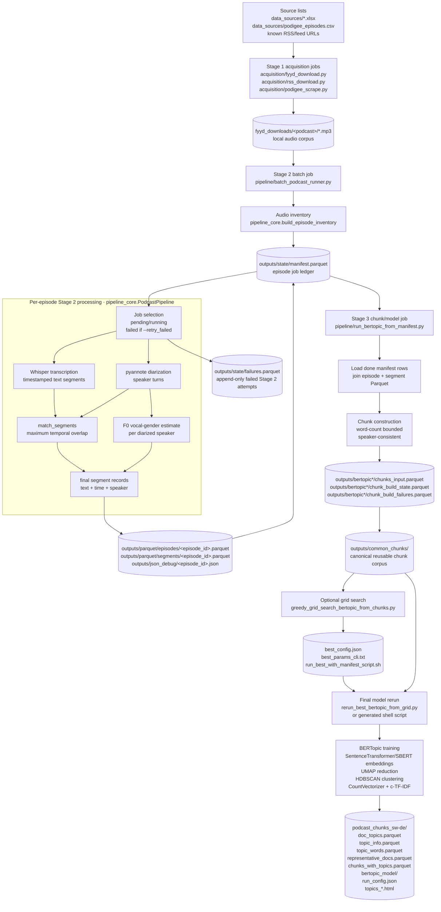

# Chapter: Data Pipeline and Corpus

> Methodological and operational documentation of the data-processing pipeline
> and the resulting corpus. This chapter deliberately separates **code**,
> **local/S3 directory structure**, and **downstream handoff files**, so that the
> pipeline can be reproduced and external consumers can pick up the correct
> artefacts without re-processing audio.

## 1. Overview

The empirical material of this thesis is a corpus of German-language podcasts.
Raw audio is transformed into structured, analysable data by a three-stage
pipeline:

1. **Stage 1 acquisition** downloads or registers podcast audio.
2. **Stage 2 processing** transcribes each episode, diarizes speakers, matches
   transcript segments to speakers, and optionally estimates perceived vocal
   gender from F0.
3. **Stage 3 chunking and topic modelling** merges transcript segments into
   stable text chunks and trains BERTopic models on those chunks.

Each stage is implemented as a resumable command-line job and writes persistent
files to disk. Later stages consume the persisted output of earlier stages
rather than re-running expensive audio processing.



The corpus as processed for this thesis comprises **84 podcasts** and **4,530
episodes** registered in the job ledger, of which **4,416 (97.5 %)** were
processed successfully and **114 (2.5 %)** failed, for example because of corrupt
or truncated audio. Stage 2 consumed approximately **272.5 GPU/CPU compute-hours**
(mean 222 s per episode). The transcripts contain **2,039,935 transcript
segments** in total (mean 462 per episode). For topic modelling these segments
were merged into **191,183 chunks** drawn from 4,400 episodes.

## 2. Directory and output layout

The repository versions code, acquisition source lists, dependency manifests,
and documentation. Audio, Parquet outputs, trained models, logs, and exports are
intentionally untracked. The working layout is:

```text
podcast_projekt/
├── acquisition/                            # Stage 1 download and discovery utilities
├── data_sources/                           # tracked acquisition spreadsheets and CSV files
├── tools/                                  # audit and directory-report utilities
├── docs/thesis/                            # methodology, figures, and export helpers
├── requirements.base.txt                   # direct Stage 1-2 dependencies
├── requirements.venv*.txt                  # full environment snapshots
├── fyyd_downloads/<podcast_name>/*.mp3      # ignored Stage 1 audio
├── pipeline/                                # canonical pipeline code
│   ├── pipeline_core.py                     #   per-episode Whisper + diarization + F0 pipeline
│   ├── batch_podcast_runner.py              #   Stage 2 resumable batch driver
│   ├── run_bertopic_from_manifest.py        #   Stage 3 chunk builder + BERTopic trainer
│   ├── bertopic_typisierung.py              #   shared BERTopic model/stopword helpers
│   ├── greedy_grid_search_bertopic.py        #   original CSV/text grid-search variant
│   ├── greedy_grid_search_bertopic_from_chunks.py # grid search over existing chunk corpus
│   ├── rerun_best_bertopic_from_grid.py      # bridge from grid search to final runner
│   ├── reassign_bertopic_outliers.py         # optional topic -1 reassignment
│   ├── reassign_bertopic_outliers_embeddings.py
│   └── compare_bertopic_runs.py
├── outputs/                                 # ignored generated analysis data
│   ├── parquet/                             # Stage 2 transcript corpus
│   │   ├── episodes/<episode_id>.parquet     # one row per episode
│   │   └── segments/<episode_id>.parquet     # one row per transcript segment
│   ├── json_debug/<episode_id>.json          # raw model/debug payload per episode
│   ├── state/                               # Stage 2 ledgers
│   │   ├── manifest.parquet                  # current episode job state and output paths
│   │   ├── failures.parquet                  # append-only Stage 2 failed-attempt log
│   │   └── audit_missing_speaker_gender.parquet
│   ├── common_chunks/                       # canonical reusable Stage 3 chunk corpus
│   │   ├── chunks_input.parquet              # universal chunked documents
│   │   ├── chunks_input.csv                  # CSV copy of the same corpus
│   │   ├── chunks_input_clean.parquet        # optional filtered corpus variant
│   │   ├── chunks_excluded_noise.parquet     # chunks excluded by later filtering
│   │   ├── chunks_cleaning_stats.csv         # reasons/counts for filtered chunks
│   │   ├── COMMON_CHUNKS_MANIFEST.json       # provenance for copied common chunks
│   │   └── embedding_cache/                  # reusable embedding matrices for experiments
│   └── bertopic*/                            # per-model/per-parameter experiment runs
│       ├── chunks_input.parquet              # runner-local copy/link of the chunk corpus
│       ├── chunks_input.csv
│       ├── chunk_build_state.parquet         # Stage 3 chunk resumability ledger
│       ├── chunk_build_failures.parquet      # Stage 3 chunking failed-attempt log
│       └── podcast_chunks_sw-de/
│           ├── doc_topics.parquet/.csv
│           ├── topic_info.parquet/.csv
│           ├── topic_words.parquet/.csv
│           ├── representative_docs.parquet/.csv
│           ├── chunks_with_topics.parquet/.csv
│           ├── doc_topic_probs.parquet       # optional; only when --save-probs
│           ├── doc_topics_reassigned*.parquet # optional outlier reassignment outputs
│           ├── bertopic_model/
│           ├── run_config.json
│           ├── _TRAINING_COMPLETE.json
│           └── topics_*.html
├── logs/                                    # ignored batch and audit logs
├── artifacts/                               # ignored acquisition results and binaries
└── dist/                                    # ignored PDF and ZIP exports
```

The `outputs/bertopic*` directories are **parallel experiments**. Their suffixes
encode the embedding model and parameter choices, for example
`bertopic_e5_mcs50_ms1` for an e5-large embedding with HDBSCAN
`min_cluster_size = 50` and `min_samples = 1`. The unsuffixed
`outputs/bertopic/` directory is the reference baseline run used in the topic
modelling chapter.

The top-level `chunks_input.parquet` files inside `outputs/bertopic*/` are
runner-local compatibility copies. They should be treated as copies of the
canonical corpus unless the run explicitly documents a different chunking,
filtering, or cleaning variant. The exchange location for other tooling is
`outputs/common_chunks/`.

### 2.1 Identity and resumability

Every episode is keyed by a stable identifier:

```text
episode_id = SHA-1(absolute audio path)
```

Because the id is derived from the audio path, re-running the pipeline over the
same files is idempotent: outputs overwrite deterministically and the manifest
can be merged across runs without duplicating episodes. Chunks follow the same
principle:

```text
chunk_id = SHA-1(episode_id | start | end | chunk_index | text[:200])
```

This lets `doc_topics.parquet`, `chunks_input.parquet`, and the original segment
Parquet files be joined without relying on fragile row order.

### 2.2 Operational IO map

The following table is the compact contract between code, local directories, and
external consumers. “Job” means the command-line script that is run; all paths
are relative to the project root unless stated otherwise.

| Stage | Job / code path | Reads | Writes | Downstream consumer |
|---|---|---|---|---|
| Source selection | manual list maintenance | `data_sources/list.xlsx`, `data_sources/redownload_list.xlsx`, known feed URLs | tracked source lists | Stage 1 acquisition jobs |
| Stage 1 acquisition | `acquisition/fyyd_download.py`, `acquisition/rss_download.py`, `acquisition/podigee_scrape.py` | source lists, fyyd/RSS/Podigee metadata | `fyyd_downloads/<podcast>/*.mp3`, acquisition logs/snapshots under `artifacts/acquisition/` | Stage 2 inventory scan |
| Stage 2 inventory | `batch_podcast_runner.py` → `build_episode_inventory()` | `fyyd_downloads/<podcast>/*.{mp3,wav,m4a,flac,ogg,aac}` | merged `outputs/state/manifest.parquet` rows with `pending` status for new audio | Stage 2 job selector |
| Stage 2 episode processing | `PodcastPipeline.process_episode()` | one audio file plus its manifest row | `outputs/parquet/episodes/<id>.parquet`, `outputs/parquet/segments/<id>.parquet`, `outputs/json_debug/<id>.json` | transcript analysis, chunk building, debugging |
| Stage 2 state update | `StateStore.save_manifest()` / `StateStore.append_failure()` | current manifest, per-episode success/failure | updated `outputs/state/manifest.parquet`; append-only `outputs/state/failures.parquet` on failure | resumability, audit, retry decisions |
| Stage 3 chunk build | `run_bertopic_from_manifest.py` → `build_chunks_resumable()` | `manifest.parquet` rows with `status == done`, each row's episode/segment Parquet paths | `chunks_input.parquet/.csv`, `chunk_build_state.parquet`, `chunk_build_failures.parquet` | BERTopic and external app/document consumers |
| Common chunk corpus | `greedy_grid_search_bertopic_from_chunks.py` / manual copy | a finished run's `chunks_input.parquet` | `outputs/common_chunks/chunks_input.parquet`, optional clean/filter outputs and embedding cache | grid search, final model runs, S3 handoff |
| Grid search | `greedy_grid_search_bertopic_from_chunks.py` | `outputs/common_chunks/chunks_input.parquet`, optional cached embeddings | per-parameter run folders, `grid_search_results.csv`, `best_config.json`, `best_params_cli.txt`, `run_best_with_manifest_script.sh` | final model rerun and thesis parameter reporting |
| Final BERTopic model run | `run_bertopic_from_manifest.py` or `rerun_best_bertopic_from_grid.py` | `chunks_input.parquet`, stopword files, embedding model, selected parameters | `doc_topics`, `topic_info`, `topic_words`, `representative_docs`, `chunks_with_topics`, saved model, run config, HTML diagrams | thesis results, application topic browsing, run comparison |
| Optional reassignment | `reassign_bertopic_outliers*.py` | a trained run's `doc_topics.parquet`, model, chunk text | `doc_topics_reassigned*.parquet`, diagnostics | coverage/purity sensitivity checks; original topics remain unchanged |

## 3. Stage 1 — Acquisition

Audio is acquired into `fyyd_downloads/<podcast_name>/` from tracked
spreadsheet/CSV source lists. The fyyd and RSS utilities download audio
enclosures; the Podigee utility creates an enclosure-URL inventory for
subsequent retrieval.

| Script | Source | Main input | Main output | Description |
|---|---|---|---|---|
| `acquisition/fyyd_download.py` | fyyd API | podcast names in `data_sources/list.xlsx` | `fyyd_downloads/<podcast>/*.mp3`; fyyd metadata snapshots | Searches podcasts by name, fetches episode lists, and stream-downloads audio enclosures. |
| `acquisition/rss_download.py` | RSS / fyyd / iTunes | known feed URLs or redownload list | `fyyd_downloads/<podcast>/*.mp3`; download log | Resolves feeds and stream-downloads audio enclosures with bounded retries. |
| `acquisition/podigee_scrape.py` | Podigee | Podigee pages | `data_sources/podigee_episodes.csv` | Collects episode/enclosure metadata; it does not itself process audio. |

Generated acquisition logs and result snapshots are written under the ignored
`artifacts/acquisition/` directory. Audio is stored under
`fyyd_downloads/<podcast_name>/`, primarily as MP3. Stage 2 does not depend on
where the audio originally came from; it only requires the local directory tree
containing podcast folders and audio files.

## 4. Stage 2 — Transcription, diarization, and vocal gender

Stage 2 is implemented in `pipeline/pipeline_core.py` and driven over the corpus
by `pipeline/batch_podcast_runner.py`. The batch runner handles inventory,
resumability, and failure logging. `PodcastPipeline` handles the per-episode
audio and transcript processing.

A typical command has the following shape:

```bash
python pipeline/batch_podcast_runner.py \
  --downloads /home/fdai7991/podcast_projekt/fyyd_downloads \
  --out_root /home/fdai7991/podcast_projekt/outputs \
  --state_dir /home/fdai7991/podcast_projekt/outputs/state \
  --whisper_model small \
  --limit 500 \
  --gender
```

The Hugging Face token for pyannote is read from `PYANNOTE_TOKEN`, `HF_TOKEN`,
or `HUGGINGFACE_TOKEN`.

### 4.1 Stage 2 processing contract

Every selected episode passes through the following operational steps.

| Step | Code path | Input | Main action | Output |
|---|---|---|---|---|
| Inventory scan | `build_episode_inventory()` | `fyyd_downloads/<podcast>/*.{mp3,wav,m4a,flac,ogg,aac}` | Recursively discovers audio files and computes stable `episode_id` values. | inventory rows with `episode_id`, `podcast_folder`, `episode_path`, file size, mtime |
| Manifest merge | `merge_inventory_with_manifest()` | inventory rows + existing `outputs/state/manifest.parquet` | Adds new audio as `pending` and preserves previous status for known episodes. | updated manifest dataframe |
| Job selection | `select_jobs()` | manifest rows | Selects `pending`, stale `running`, and optionally `failed` rows up to `--limit`. | manifest subset for current run |
| Mark running | `StateStore.save_manifest()` | selected manifest row | Sets `status = running`, increments `attempt_count`, stores `last_run_started_at`. | updated `outputs/state/manifest.parquet` |
| Transcription | `PodcastPipeline.transcribe()` | one audio file | Whisper creates timestamped transcript segments and a language code. | raw Whisper segments, `whisper_language`, `whisper_text_full`, `n_whisper_segments` |
| Audio loading | `load_audio_mono_16k()` | same audio file | Loads mono 16 kHz waveform for diarization and F0 analysis. | waveform used internally; not persisted separately |
| Diarization | `PodcastPipeline.diarize()` | mono waveform and sample rate | pyannote `speaker-diarization-3.1` returns diarized speaker turns. | raw diarized turns, `n_diarized_segments`, `n_speakers`, `speakers_json` |
| Segment-speaker matching | `match_segments()` | Whisper segments + diarized turns | Assigns each transcript segment to the diarized speaker with maximum time overlap. | segment records with `segment_idx`, `start`, `end`, `speaker`, `text` |
| Vocal-gender estimate | `estimate_speaker_gender()` | diarized turns + waveform | Concatenates up to 90 seconds per speaker and estimates median F0 with `librosa.pyin`. | per-speaker JSON and per-segment `gender`, `gender_confidence`, `f0_median_hz`, `voiced_ratio`, `f0_iqr_hz` |
| Write success | `write_artifacts()` | `EpisodeArtifacts` | Persists episode record, segment records, and debug payload. | `outputs/parquet/episodes/<id>.parquet`, `outputs/parquet/segments/<id>.parquet`, `outputs/json_debug/<id>.json`; manifest row set to `done` |
| Write failure | `StateStore.append_failure()` | caught exception | Stores the failed attempt without stopping the full batch. | manifest row set to `failed`; row appended to `outputs/state/failures.parquet` |

### 4.2 Interpretation of the F0 gender estimate

The gender label is a measure of **perceived vocal pitch**, not self-identified
or social gender. It is derived from a single acoustic feature, median F0, using
fixed thresholds: **< 155 Hz → male**, **> 185 Hz → female**, **155–185 Hz →
borderline**, and speakers with too little voiced audio → **unknown**. The
pipeline deliberately stores the underlying measurement (`f0_median_hz`,
`voiced_ratio`, `f0_iqr_hz`) together with the label, so the estimate remains
auditable and can be reinterpreted later.

### 4.3 Stage 2 output layout

Stage 2 writes four persistent artefact groups:

```text
outputs/
├── state/
│   ├── manifest.parquet          # current episode job ledger
│   └── failures.parquet          # append-only failed-attempt log
├── parquet/
│   ├── episodes/<episode_id>.parquet
│   └── segments/<episode_id>.parquet
└── json_debug/<episode_id>.json
```

The manifest is the authoritative index. It points to the episode, segment, and
debug outputs through `output_episode_parquet`, `output_segments_parquet`, and
`output_debug_json`.

### 4.4 Data dictionary — manifest (`outputs/state/manifest.parquet`)

The manifest contains one row per discovered audio file. It is both an inventory
and a job ledger.

| Column | Type | Definition |
|---|---|---|
| `episode_id` | str | SHA-1 of the absolute audio path; primary key. |
| `podcast_folder` | str | Name of the source podcast folder. |
| `podcast_dir` | str | Absolute path to the podcast folder. |
| `episode_path` | str | Absolute path to the source audio file. |
| `episode_name` | str | Audio file stem. |
| `audio_ext` | str | File extension. |
| `file_size_bytes` | int | Audio file size at inventory time. |
| `mtime_ns` | int | Audio file modification timestamp in nanoseconds. |
| `status` | str | `pending` / `running` / `done` / `failed`. |
| `attempt_count` | int | Number of Stage 2 processing attempts. |
| `last_error` | str \| null | Last exception text if processing failed. |
| `last_run_started_at`, `last_run_finished_at` | str (ISO) | Timestamps of the last attempt. |
| `runtime_sec` | float \| null | Processing time of the successful run. |
| `output_episode_parquet` | str \| null | Path to `outputs/parquet/episodes/<episode_id>.parquet`. |
| `output_segments_parquet` | str \| null | Path to `outputs/parquet/segments/<episode_id>.parquet`. |
| `output_debug_json` | str \| null | Path to `outputs/json_debug/<episode_id>.json`. |

### 4.5 Data dictionary — failure log (`outputs/state/failures.parquet`)

`failures.parquet` is append-only and historical. An episode can appear in this
file and later be `done` in the manifest after a successful retry.

| Column | Type | Definition |
|---|---|---|
| `episode_id` | str | Episode identifier of the failed attempt. |
| `episode_path` | str | Source audio path attempted. |
| `podcast_folder` | str | Source podcast folder. |
| `attempt_count` | int | Attempt number at which the failure was logged. |
| `error` | str | Exception class and message. |
| `logged_at` | str (ISO) | Timestamp at which the failure was appended. |

### 4.6 Data dictionary — episode record (`outputs/parquet/episodes/<id>.parquet`)

Each file contains one row for one episode.

| Column | Type | Definition |
|---|---|---|
| `episode_id` | str | Foreign key to the manifest. |
| `podcast_folder` | str | Source podcast folder. |
| `episode_path` | str | Absolute source audio path. |
| `episode_name` | str | Audio file stem. |
| `whisper_language` | str | Language code detected by Whisper. |
| `whisper_text_full` | str | Full transcript, all Whisper segment texts concatenated. |
| `runtime_sec` | float | Wall-clock processing time for the episode. |
| `n_whisper_segments` | int | Number of raw Whisper segments. |
| `n_diarized_segments` | int | Number of pyannote speaker turns. |
| `n_segments` | int | Number of final matched transcript segments. |
| `n_speakers` | int | Number of distinct diarized speakers. |
| `speakers_json` | str (JSON) | Sorted list of speaker labels. |
| `speaker_gender_json` | str (JSON) | Per-speaker F0 result: `{label, confidence, f0_median_hz, voiced_ratio, f0_iqr_hz, seconds_used}`. |

### 4.7 Data dictionary — segment record (`outputs/parquet/segments/<id>.parquet`)

Each file contains the transcript segments for one episode. These are the
pre-chunk transcript units.

| Column | Type | Definition |
|---|---|---|
| `episode_id` | str | Foreign key to the manifest and episode record. |
| `podcast_folder`, `episode_path`, `episode_name` | str | Episode provenance, denormalised for standalone use. |
| `whisper_language` | str | Detected language of the episode. |
| `segment_idx` | int | Zero-based segment index within the episode. |
| `start`, `end` | float | Segment start/end time in seconds. |
| `speaker` | str | Diarized speaker label, or `Unknown` if no diarization overlap. |
| `gender` | str | `male` / `female` / `borderline` / `unknown`. |
| `gender_confidence` | float | Distance-from-threshold confidence of the F0 label. |
| `f0_median_hz` | float \| null | Median F0 for the segment's speaker. |
| `voiced_ratio` | float \| null | Fraction of pitch-detectable frames. |
| `f0_iqr_hz` | float \| null | Interquartile range of voiced F0. |
| `text` | str | Transcribed text of the segment. |

The debug JSON additionally stores raw Whisper segments, raw diarized turns, the
matched segments, the full transcript text, and the per-speaker F0 output. It is
intended for auditing and debugging, not for normal downstream modelling.

## 5. Stage 3 — Chunking and BERTopic artefacts

Stage 3 is implemented by `pipeline/run_bertopic_from_manifest.py`. This file is
the project-specific runner that connects the manifest-based podcast corpus to
BERTopic. It was added for this corpus because the raw Stage 2 outputs are
organised as per-episode Parquet files, while topic modelling and external
application use require stable document-level rows.

Stage 3 has two separable responsibilities:

1. **Chunk construction:** convert transcript segments into speaker-consistent,
   word-count-bounded document rows.
2. **BERTopic training:** train a topic model on those chunk rows and write model
   outputs.

The distinction is important: **chunking is corpus-level and should be reused
across models**, while BERTopic outputs are model/parameter-specific.

A typical chunk-build-only command is:

```bash
python pipeline/run_bertopic_from_manifest.py \
  --manifest /home/fdai7991/podcast_projekt/outputs/state/manifest.parquet \
  --output-dir /home/fdai7991/podcast_projekt/outputs/bertopic \
  --chunk-episode-limit 600 \
  --no-train
```

A full train command is:

```bash
python pipeline/run_bertopic_from_manifest.py \
  --manifest /home/fdai7991/podcast_projekt/outputs/state/manifest.parquet \
  --output-dir /home/fdai7991/podcast_projekt/outputs/bertopic \
  --chunk-episode-limit 0 \
  --train \
  --force-train
```

### 5.1 Chunk construction

The runner reads manifest rows whose `status` matches `--status` (default:
`done`) and whose `output_episode_parquet` and `output_segments_parquet` paths
are present. For each episode, it loads the segment Parquet, joins useful
episode-level metadata, sorts segments by time, removes near-empty text segments,
and merges consecutive segments into chunks.

Default chunking parameters are:

| Parameter | Default | Meaning |
|---|---:|---|
| `--chunk-target-words` | 220 | Preferred chunk size before flushing. |
| `--chunk-min-words` | 80 | Retained for compatibility; the current builder enforces `--min-doc-words` after construction. |
| `--chunk-max-words` | 320 | Hard upper bound before a chunk is flushed. |
| `--min-segment-words` | 2 | Very short segments are dropped before chunking. |
| `--min-doc-words` | 20 | Chunks below this word count are dropped. |
| `--speaker-consistent` | true | A speaker change forces a chunk boundary where possible. |

### 5.2 Chunk output schema (`chunks_input.parquet`)

`chunks_input.parquet` is the main document table for downstream processing.
It is the correct handoff file for search, embeddings, external app ingestion,
and topic modelling.

| Column | Type | Definition |
|---|---|---|
| `chunk_id` | str | Stable chunk identifier. |
| `episode_id` | str | Source episode identifier. |
| `podcast_folder` | str | Source podcast folder. |
| `episode_path` | str | Source audio path. |
| `speaker` | str | Single speaker label or `mixed`. |
| `gender` | str | Single F0 label or `mixed`. |
| `start`, `end` | float | Chunk start/end time in seconds. |
| `chunk_text` | str | Text that will be embedded and clustered. |
| `word_count` | int | Number of words in the chunk text. |
| `source_segment_count` | int | Number of transcript segments merged into the chunk. |

The canonical exchange location is:

```text
outputs/common_chunks/chunks_input.parquet
```

Model run folders can also contain their own `chunks_input.parquet`, but these
should normally be treated as runner-local copies of the same corpus. If a run
uses a filtered or cleaned variant, the file name and manifest should say so,
e.g. `chunks_input_clean.parquet` plus `chunks_cleaning_stats.csv`.

### 5.3 Chunk-build ledgers

`chunk_build_state.parquet` is the Stage 3 equivalent of the Stage 2 manifest,
scoped to chunk construction rather than audio processing.

| Column | Type | Definition |
|---|---|---|
| `episode_id` | str | Episode processed for chunking. |
| `status` | str | `done` or `failed` for chunk construction. |
| `n_chunks` | int | Number of chunks emitted for the episode. |
| `n_segments` | int | Number of transcript segments read before chunking filters. |
| `error` | str \| null | Failure text if chunking failed. |
| `processed_at` | str (ISO) | Timestamp of the chunking attempt. |
| `runtime_sec` | float | Chunking runtime for the episode. |
| `output_episode_parquet`, `output_segments_parquet` | str | Source Stage 2 artefact paths used. |

`chunk_build_failures.parquet` is append-only and records failed chunking
attempts.

| Column | Type | Definition |
|---|---|---|
| `episode_id` | str | Episode whose Stage 3 chunk build failed. |
| `error` | str | Exception class and message. |
| `logged_at` | str (ISO) | Time at which the failure was appended. |
| `output_episode_parquet`, `output_segments_parquet` | str | Source paths attempted. |

### 5.4 What runs inside BERTopic / SBERT

The BERTopic stage is not a single black-box step. It is a fixed sequence of
operations configured by CLI parameters:

| Step | Component | Description | Main parameters |
|---|---|---|---|
| Document input | `chunks_input.parquet` | Uses `chunk_text` as the document and keeps metadata for joins. | `--min-doc-words`, chunk file path |
| Embedding | `SentenceTransformer` / SBERT | Converts each chunk into a dense semantic vector. | `--embedding-model`, `--embedding-device`, `--embedding-revision` |
| Dimensionality reduction | UMAP | Reduces embeddings before density clustering. | `--umap-n-neighbors`, `--umap-n-components`, `--umap-min-dist`, `--umap-metric` |
| Clustering | HDBSCAN | Finds dense groups and marks ambiguous chunks as topic `-1`. | `--hdbscan-min-cluster-size`, `--hdbscan-min-samples`, `--hdbscan-cluster-selection-method` |
| Topic representation | CountVectorizer + c-TF-IDF | Extracts distinctive topic words from the clustered documents. | `--vectorizer-ngram-min/max`, `--vectorizer-min-df`, `--vectorizer-max-df`, stopwords |
| Optional topic reduction | BERTopic reduction | Merges topics to a target count if requested. | `--nr-topics` |
| Optional probabilities | BERTopic probabilities | Saves dense document-topic probabilities only when requested. | `--calculate-probabilities`, `--save-probs` |

The shared helper `bertopic_typisierung.py` constructs the UMAP, HDBSCAN,
CountVectorizer, and BERTopic objects. `run_bertopic_from_manifest.py` supplies
the chunk text and metadata, calls `fit_transform()`, and saves all persistent
outputs.

### 5.5 BERTopic run output layout

Each trained run writes into:

```text
<output-dir>/podcast_chunks_sw-de/
```

when German stopwords are active. The suffix `sw-de` is part of the run identity
because it records the vectorizer stopword regime.

| Artefact | Contents | Main consumer |
|---|---|---|
| `doc_topics.parquet/.csv` | One row per chunk/document with assigned topic and handoff metadata. | Samuel/application topic browsing; thesis analyses. |
| `chunks_with_topics.parquet/.csv` | Full chunk table plus `doc_id` and `topic`. | Debugging, app ingestion, model comparison. |
| `topic_info.parquet/.csv` | BERTopic topic summary: topic id, size, name, representation, representative docs. | Topic labelling and run summaries. |
| `topic_words.parquet/.csv` | Topic id, comma-separated top words, and JSON word-score list. | Human-readable topic descriptions. |
| `representative_docs.parquet/.csv` | Example chunks per topic with rank. | Manual topic validation. |
| `doc_topic_probs.parquet` | Optional dense topic-probability matrix when `--save-probs` is used. | Probability/confidence workflows; omitted by default because it can be large. |
| `bertopic_model/` | Saved BERTopic model and topic embeddings/config. | Reloading the trained model. |
| `run_config.json` | Exact parameters, runtime, chunk count, topic count, outlier count, and output paths. | Reproducibility and thesis reporting. |
| `_TRAINING_COMPLETE.json` | Completion marker mirroring the final run config. | Resumability; prevents accidental retraining unless `--force-train`. |
| `topics_overview.html` | Intertopic-distance visualisation. | Manual inspection. |
| `topics_barchart.html` | Topic-word bar chart. | Manual inspection and reporting. |
| `topics_hierarchy.html` | Hierarchical topic similarity view. | Manual inspection and reporting. |
| `doc_topics_reassigned*.parquet` | Optional post-hoc outlier reassignment outputs. | Coverage/purity sensitivity checks; original topics remain unchanged. |

### 5.6 Data dictionary — document topics (`doc_topics.parquet`)

`doc_topics.parquet` is the compact model result most external consumers need.

| Column | Type | Definition |
|---|---|---|
| `doc_id` | int | Row number assigned at model time. |
| `chunk_id` | str | Stable chunk identifier; joins back to `chunks_input.parquet`. |
| `episode_id`, `podcast_folder`, `episode_path` | str | Chunk provenance. |
| `speaker` | str | Single speaker label or `mixed`. |
| `gender` | str | `male` / `female` / `borderline` / `unknown` / `mixed`. |
| `start`, `end` | float | Chunk time span in seconds. |
| `word_count` | int | Words in the chunk text. |
| `source_segment_count` | int | Number of transcript segments merged into the chunk. |
| `topic` | int | BERTopic assignment; `-1` is HDBSCAN outlier/noise. |
| `chunk_text` | str | Text that was embedded and clustered. |

## 6. Grid search and Samuel-style BERTopic adaptation

The file `pipeline/greedy_grid_search_bertopic_from_chunks.py` is the adapted
Samuel-style grid-search workflow for this pipeline. It deliberately runs **after
chunk creation**. It does not download, transcribe, diarize, or re-chunk. It
reads an existing chunk file, normally
`outputs/common_chunks/chunks_input.parquet`, computes or reuses embeddings, and
searches over UMAP `n_neighbors` and HDBSCAN `min_cluster_size`.

Main inputs:

```text
outputs/common_chunks/chunks_input.parquet
pipeline/bertopic_extra_stopwords.txt
optional: outputs/common_chunks/embedding_cache/embeddings_<hash>.npy
```

Main outputs:

```text
outputs/bertopic_gridsearch/<timestamp>_gridsearch_chunks/
├── runs/nn<m>_mcs<n>/
│   ├── topic_info_*.parquet/.csv
│   ├── topic_words_*.parquet/.csv
│   ├── topic_distribution_*.csv
│   ├── metrics_*.json/.csv
│   └── optional doc_topics/chunks_with_topics/model files
├── best_nn<m>_mcs<n>/
├── grid_search_results.csv
├── best_config.json
├── best_params_cli.txt
└── run_best_with_manifest_script.sh
```

`best_config.json` stores the selected parameters in the argument names used by
`run_bertopic_from_manifest.py`. `rerun_best_bertopic_from_grid.py` is the bridge
back into the official Stage 3 runner: it copies or symlinks the common chunk
file into the final output directory and calls `run_bertopic_from_manifest.py`
with `--chunk-episode-limit 0 --train --force-train`.

Operationally, this means:

```text
Samuel-style grid search = parameter selection over an existing chunk corpus
run_bertopic_from_manifest.py = canonical chunk builder and final model trainer
outputs/common_chunks/chunks_input.parquet = shared application/model input
```

## 7. Downstream handoff: which files should Samuel consume?

There are three valid handoff levels. They serve different purposes and should
not be mixed.

| Handoff level | Files | Use when | Notes |
|---|---|---|---|
| Stage 2 raw transcript handoff | `outputs/state/manifest.parquet`, `outputs/parquet/episodes/*.parquet`, `outputs/parquet/segments/*.parquet` | The downstream application wants raw transcript segments, speaker labels, timings, or wants to implement its own chunking. | This is pre-chunk data. Segments vary strongly in length and are not ideal as BERTopic documents. |
| Universal chunk handoff | `outputs/common_chunks/chunks_input.parquet` plus optional `chunks_input.csv` | The downstream application wants stable document units for search, embeddings, or independent topic modelling. | This is the recommended default handoff before modelling. Chunking should not be repeated per model. |
| Model-output handoff | `doc_topics.parquet`, `topic_info.parquet`, `topic_words.parquet`, `representative_docs.parquet`, `chunks_with_topics.parquet` | The downstream application wants already assigned topics and topic metadata. | Join on `topic` and `chunk_id`; `topic = -1` marks HDBSCAN outliers. |

Therefore Samuel can consume `segments/<id>.parquet` directly only if the
application needs raw speaker-attributed transcript segments. For topic modelling
or topic browsing, the preferred input is `chunks_input.parquet`; for already
modelled topics, the preferred output bundle is the `podcast_chunks_sw-de/`
directory.

## 8. S3 handoff layout

The S3 structure should mirror the local output structure but make the handoff
layers explicit. The recommended layout is:

```text
s3://<bucket>/podcast_project/
├── stage2_transcripts/
│   ├── state/
│   │   ├── manifest.parquet
│   │   └── failures.parquet
│   ├── parquet/
│   │   ├── episodes/<episode_id>.parquet
│   │   └── segments/<episode_id>.parquet
│   ├── json_debug/<episode_id>.json
│   └── README_STAGE2_SCHEMA.md
│
├── common_chunks/
│   ├── chunks_input.parquet
│   ├── chunks_input.csv
│   ├── chunks_input_clean.parquet              # optional filtered variant
│   ├── chunks_excluded_noise.parquet           # optional filtering audit
│   ├── chunks_cleaning_stats.csv               # optional filtering audit counts
│   ├── COMMON_CHUNKS_MANIFEST.json
│   └── embedding_cache/
│       ├── embeddings_<hash>.npy
│       └── embeddings_<hash>.json
│
└── bertopic_runs/
    └── <run_id>/
        ├── chunk_source_manifest.json
        ├── run_config.json
        ├── best_config.json                    # if selected from grid search
        ├── grid_search_results.csv             # if this is a grid-search export
        ├── chunks_input.parquet                 # optional copy; otherwise pointer only
        └── podcast_chunks_sw-de/
            ├── doc_topics.parquet
            ├── topic_info.parquet
            ├── topic_words.parquet
            ├── representative_docs.parquet
            ├── chunks_with_topics.parquet
            ├── doc_topic_probs.parquet          # optional
            ├── bertopic_model/
            ├── topics_overview.html
            ├── topics_barchart.html
            └── topics_hierarchy.html
```

Each model run should include a small `chunk_source_manifest.json`, even if the
file is created manually, so that consumers know whether two model runs used the
same chunk corpus. Recommended fields:

```json
{
  "chunks_path": "s3://<bucket>/podcast_project/common_chunks/chunks_input.parquet",
  "chunks_sha256": "<sha256>",
  "n_chunks": 191183,
  "cleaning_variant": "raw|min_doc_words_50|clean",
  "created_from_stage2_manifest": "s3://<bucket>/podcast_project/stage2_transcripts/state/manifest.parquet",
  "notes": "Canonical chunk corpus reused across model runs."
}
```

This resolves the ambiguity caused by `chunks_input.parquet` appearing inside
many model folders. The canonical chunk file is universal; model folders should
store either a copy for reproducibility or a pointer/checksum to the canonical
file.

## 9. Corpus characteristics

**Language.** Whisper's language detection identifies **4,312 episodes (97.6 %)
as German**, with a long tail of Polish (67), English (19), and a handful of
other codes. The latter typically reflect music-heavy, multilingual, or ASR-noisy
introductions rather than a corpus that is broadly non-German. The corpus is
therefore treated as German for stopword handling and embedding-model selection,
while noisy or out-of-scope chunks can be filtered into
`chunks_input_clean.parquet` when required.


**Speakers.** Episodes contain a mean of **3.16 diarized speakers** (median 2),
consistent with an interview/conversation format dominating the corpus.


**Vocal gender.** At the chunk level the F0 estimate yields **50.2 % male,
38.1 % female, 10.0 % borderline, and 1.7 % unknown**. The sizeable borderline
band is expected given the deliberately wide 155–185 Hz overlap region and is a
feature, not a defect, of the conservative thresholding.


These corpus-level descriptors define the population that the topic model in the
next chapter is estimated over.
