# Chapter: Data Pipeline and Corpus Construction

## 1. Purpose of this chapter

This chapter explains how the research corpus is created from podcast audio. It follows the order in which a new reader encounters the data and makes the location and role of every important file explicit.

The pipeline has three stages:

1. **Acquisition:** obtain podcast audio and preserve a record of download success and failure.
2. **Audio processing:** transcribe each episode, identify speaker turns, match text to speakers, and optionally estimate perceived vocal pitch categories.
3. **Document construction:** merge short transcript segments into stable chunks that can be embedded and clustered by BERTopic.

The topic model itself is explained in the next chapter. This chapter ends with the exact table that becomes its input.

## 2. Repository files and runtime files

The repository contains two different kinds of material.

### 2.1 Versioned material

The following directories are committed to GitHub:

```text
acquisition/        download and source-discovery code
pipeline/           transcription, diarization, chunking, and modelling code
data_sources/       podcast lists and acquisition inputs
docs/thesis/        methodological documentation
tools/              audit and reporting utilities
requirements.*      environment definitions
```

These files describe how the corpus is produced.

### 2.2 Generated material

The following directories are created when the code runs and are ignored by Git:

```text
fyyd_downloads/     downloaded audio
outputs/            manifests, transcripts, chunks, embeddings, and models
logs/               execution logs
artifacts/           acquisition reports and generated support files
dist/               generated document exports
```

This explains why paths under `outputs/` are documented but are not visible in the GitHub directory hierarchy. The files exist on the processing machine, mounted project storage, or another explicitly configured output location.

The current scripts write to the filesystem. They do not upload to S3 automatically. Any S3 structure described later is a proposed shared-storage copy of the local output.

## 3. End-to-end data flow

```mermaid
flowchart TD
    A[Tracked podcast lists] --> B[Acquisition scripts]
    B --> C[fyyd_downloads/podcast/audio files]
    C --> D[batch_podcast_runner.py]
    D --> E[manifest.parquet]
    D --> F[Whisper transcript segments]
    D --> G[pyannote speaker turns]
    F --> H[matched segment rows]
    G --> H
    H --> I[episode and segment Parquet files]
    I --> J[run_bertopic_from_manifest.py]
    E --> J
    J --> K[chunks_input.parquet]
    K --> L[SentenceTransformer and BERTopic]
```



The important handoff boundaries are:

| Boundary | File | Meaning |
|---|---|---|
| Acquisition to Stage 2 | `fyyd_downloads/<podcast>/*` | Local audio corpus |
| Stage 2 inventory and state | `outputs/state/manifest.parquet` | Authoritative episode ledger and pointers to generated files |
| Stage 2 transcript handoff | `outputs/parquet/segments/<episode_id>.parquet` | Timestamped speaker-attributed transcript units |
| Stage 3 modelling handoff | `outputs/common_chunks/chunks_input.parquet` | Canonical document corpus; `chunk_text` is embedded and clustered |
| Model-result handoff | `doc_topics.parquet`, `topic_info.parquet`, `topic_words.parquet` | Topic assignments and interpretable topic metadata |

## 4. Stage 1: podcast acquisition

### 4.1 Why several acquisition routes are used

Podcast audio is distributed across many hosting providers. A single source does not cover the complete selected corpus. The repository therefore contains three acquisition routes:

- fyyd API search and download;
- RSS feed resolution and download;
- Podigee metadata collection.

Using several routes is not duplication. It is a recovery strategy for podcasts or episodes that are unavailable through the first source.

### 4.2 `acquisition/fyyd_download.py`

The fyyd downloader was used because fyyd provides a public API for podcast search and episode retrieval. For the original source list, many podcasts could be found there without writing provider-specific scraping code.

The script reads:

```text
data_sources/list.xlsx
```

It writes audio to:

```text
fyyd_downloads/<podcast name>/
```

It writes its audit result to:

```text
artifacts/acquisition/fyyd_results.json
```

These output directories are generated and ignored by Git.

#### Processing sequence

For each spreadsheet row, the script:

1. Converts the row to an audit record.
2. Reads the podcast name from `Podcast Name`, with `name` as a fallback.
3. Calls `fyyd_search_podcast(name)`.
4. Returns the first object in the API result array.
5. Reads the selected object's `id`.
6. Calls `fyyd_get_episodes(podcast_id)` with a maximum request count of 1,000.
7. Iterates over the returned episodes.
8. Reads the audio URL from the episode's `enclosure` field.
9. Builds a filename from the episode title and episode number.
10. Calls `download_with_retries()`.
11. Records the episode under `downloaded` or `failed_ep`.
12. Writes the complete podcast-level result list to JSON.

#### Why the first search result is selected

The current implementation assumes that a full-name search ranks the intended podcast first. This reduced implementation complexity during acquisition, but it can produce a false match when names are similar or duplicated.

The JSON audit output is therefore necessary. It makes the selected fyyd identifier, number of returned episodes, successful downloads, failures, and top-level error visible for later review.

A more robust future implementation should:

- normalise punctuation and case;
- compare the requested title with every result title;
- consider publisher or feed-domain information;
- reject candidates below a similarity threshold;
- record the similarity score and selected candidate.

#### Why downloads are streamed

`requests.get(..., stream=True)` prevents an entire audio episode from being held in memory. The response is written to disk in 256 KiB blocks.

The block size is a project engineering choice. It balances two concerns:

- small memory usage;
- fewer disk-write operations than very small blocks.

It is not a podcast-format requirement and should not be presented as a universal standard.

#### Why retries are used

Audio hosts can temporarily time out, close a connection, or respond slowly. A single failed HTTP attempt would otherwise classify a valid episode as permanently missing.

`download_with_retries()` therefore performs up to three attempts and waits two seconds after a failed attempt. After the final failure, the episode is preserved in `failed_ep` rather than silently omitted.

This distinction supports later recovery through `rss_download.py`, Podigee metadata, or manual retrieval.

### 4.3 RSS and Podigee routes

`acquisition/rss_download.py` reads feed information or a redownload spreadsheet and writes episode audio to the same `fyyd_downloads/<podcast>/` structure.

`acquisition/podigee_scrape.py` writes episode and enclosure metadata to:

```text
data_sources/podigee_episodes.csv
```

It creates an inventory. It does not transcribe audio and does not itself replace the Stage 2 runner.

## 5. Stage 2: transcription, diarization, and speaker attribution

Stage 2 is divided between two modules:

- `pipeline/batch_podcast_runner.py` manages the corpus, state, retries, and output paths;
- `pipeline/pipeline_core.py` processes one audio episode.

### 5.1 Stage 2 input

The batch runner receives a download root through `--downloads`. The root must contain podcast subdirectories.

```text
fyyd_downloads/
├── Podcast A/
│   ├── first.mp3
│   └── second.mp3
└── Podcast B/
    └── interview.wav
```

Audio files placed directly at the root are not discovered by the expected layout.

### 5.2 Episode identity

Each discovered episode receives:

```text
episode_id = SHA-1(resolved absolute audio path)
```

This makes repeated processing of the same path idempotent. It also has a limitation: moving the audio tree changes the identifier even when the audio bytes are unchanged.

### 5.3 Manifest construction

`build_episode_inventory()` scans the audio tree. `merge_inventory_with_manifest()` combines the scan with an existing manifest.

New files are added with `status = pending`. Existing rows retain their previous status and output paths.

The generated manifest is:

```text
outputs/state/manifest.parquet
```

It is both an inventory and a processing ledger.

### 5.4 Per-episode processing sequence

For each eligible episode, the pipeline performs the following operations.

| Step | Code responsibility | Input | Output |
|---|---|---|---|
| Inventory | batch runner | audio path | manifest row |
| Transcription | Whisper | audio | text segments, timestamps, language |
| Audio loading | pipeline core | audio | mono 16 kHz waveform used internally |
| Diarization | pyannote | waveform | anonymous speaker turns |
| Segment matching | `match_segments()` | Whisper segments and diarized turns | one speaker label per transcript segment |
| F0 analysis | `estimate_speaker_gender()` | waveform and diarized turns | per-speaker pitch statistics and label |
| Persistence | artifact writer | processed episode object | episode Parquet, segment Parquet, debug JSON |
| State update | batch runner | success or exception | manifest update and optional failure-log row |

### 5.5 Why maximum temporal overlap is used

Whisper and pyannote produce independent time intervals. Their boundaries are not expected to be identical.

For each Whisper segment, `match_segments()` calculates the overlap with every diarized speaker turn and selects the speaker turn with the largest overlap duration.

This rule is deterministic and uses the timing information already produced by both models. It is preferable to selecting the nearest boundary because it uses the duration of shared audio rather than only the distance between timestamps.

The method still has limitations:

- overlapping speech can be reduced to one selected speaker;
- a long Whisper segment can contain a speaker transition;
- diarization errors propagate into the segment record;
- speaker labels identify anonymous voices only within an episode.

### 5.6 Interpretation of vocal-pitch categories

The optional `--gender` path estimates a perceived vocal-pitch category from median F0. It does not determine a person's identity or self-described gender.

The stored labels are:

```text
median F0 < 155 Hz       male
median F0 > 185 Hz       female
155 Hz to 185 Hz         borderline
insufficient voiced data unknown
```

The underlying `f0_median_hz`, `voiced_ratio`, and `f0_iqr_hz` values are retained so that later analysis does not depend only on the simplified label.

### 5.7 Stage 2 output layout

```text
outputs/
├── state/
│   ├── manifest.parquet
│   └── failures.parquet
├── parquet/
│   ├── episodes/<episode_id>.parquet
│   └── segments/<episode_id>.parquet
└── json_debug/<episode_id>.json
```

All paths are generated. They are not part of the GitHub hierarchy.

### 5.8 Manifest data dictionary

| Column | Meaning |
|---|---|
| `episode_id` | Stable identifier derived from the resolved audio path |
| `podcast_folder` | Name of the source podcast directory |
| `podcast_dir` | Absolute path to the podcast directory |
| `episode_path` | Absolute path to the audio file |
| `episode_name` | Audio filename stem |
| `audio_ext` | Audio extension |
| `file_size_bytes` | File size at inventory time |
| `mtime_ns` | File modification time at inventory time |
| `status` | `pending`, `running`, `done`, or `failed` |
| `attempt_count` | Number of Stage 2 processing attempts |
| `last_error` | Most recent exception text |
| `last_run_started_at` | Timestamp when the latest attempt began |
| `last_run_finished_at` | Timestamp when the latest attempt ended |
| `runtime_sec` | Runtime of the successful attempt |
| `output_episode_parquet` | Path to the episode-level Parquet file |
| `output_segments_parquet` | Path to the segment-level Parquet file |
| `output_debug_json` | Path to the debug JSON file |

The manifest is the only Stage 3 starting point. Stage 3 does not scan `outputs/parquet/segments/` independently. It reads the paths stored in eligible manifest rows.

### 5.9 Segment data dictionary

Each file under `outputs/parquet/segments/` contains the matched transcript segments for one episode.

| Column | Meaning |
|---|---|
| `episode_id` | Foreign key to the manifest and episode file |
| `podcast_folder` | Source podcast directory name |
| `episode_path` | Source audio path |
| `episode_name` | Source audio filename stem |
| `whisper_language` | Language code detected by Whisper |
| `segment_idx` | Zero-based transcript-segment index |
| `start`, `end` | Segment timestamps in seconds |
| `speaker` | Anonymous diarized speaker label |
| `gender` | F0-derived category or `unknown` |
| `gender_confidence` | Distance-based confidence measure used by the pipeline |
| `f0_median_hz` | Median F0 for the assigned speaker |
| `voiced_ratio` | Proportion of pitch-detectable frames |
| `f0_iqr_hz` | Interquartile range of voiced F0 |
| `text` | Whisper transcript text for the segment |

A segment is an ASR timing unit. It is not guaranteed to be a sentence, paragraph, complete speaker turn, or suitable BERTopic document.

## 6. Stage 3: chunk construction

### 6.1 Why Stage 3 exists

BERTopic clusters documents. The Stage 2 segment rows are often too short and incomplete to serve as useful documents. Whole episodes have the opposite problem: they can contain several themes, speakers, introductions, advertisements, and transitions.

Stage 3 constructs an intermediate document unit called a **chunk**.

A chunk is:

- limited to one episode;
- composed of consecutive transcript segments;
- kept speaker-consistent where possible;
- bounded by word-count rules;
- traceable to timestamps and a stable identifier.

### 6.2 Exact Stage 3 input

`pipeline/run_bertopic_from_manifest.py` receives:

```text
--manifest <path to manifest.parquet>
--output-dir <directory for chunk and model artefacts>
```

By default, `load_manifest()` keeps rows where:

- `status == done`;
- `output_episode_parquet` is present;
- `output_segments_parquet` is present.

For each selected row, the runner follows those stored paths. This is why the manifest is the contract between Stage 2 and Stage 3.

### 6.3 Joining episode and segment data

`join_episode_and_segments()`:

1. loads the segment Parquet;
2. loads the episode Parquet when available;
3. inserts missing provenance columns from the manifest row;
4. joins episode-level columns not already present in the segment table;
5. creates default `speaker` or `gender` values when missing;
6. requires a `text` column;
7. normalises whitespace and removes empty text.

The episode table is not the main text source. The segment table supplies the ordered text rows used for construction.

### 6.4 Chunk-construction algorithm

`build_chunks_for_episode()` performs the following steps:

1. Sort by available episode, start, end, and segment-index columns.
2. Normalise every segment's text.
3. Calculate `segment_word_count`.
4. Remove segments shorter than `--min-segment-words`.
5. Start an empty chunk buffer.
6. Read segments in chronological order.
7. Before adding the next segment, close the existing chunk when any of these conditions is true:
   - the speaker changes and `--speaker-consistent` is enabled;
   - the current chunk has already reached `--chunk-target-words`;
   - adding the next segment would exceed `--chunk-max-words`.
8. Append the current segment to the new or existing buffer.
9. Flush the final buffer at the end of the episode.
10. Remove completed chunks shorter than `--min-doc-words`.

Default values:

| Parameter | Default | Operational meaning |
|---|---:|---|
| `--chunk-target-words` | 220 | Preferred point after which the next segment begins a new chunk |
| `--chunk-max-words` | 320 | Maximum allowed size before adding another segment |
| `--min-segment-words` | 2 | Minimum size of a source segment |
| `--min-doc-words` | 20 | Minimum size of a completed chunk |
| `--speaker-consistent` | true | A change in diarized speaker closes the chunk |

`--chunk-min-words` is accepted by the current argument parser but is not used by the implementation. `--min-doc-words` is the active minimum document control.

### 6.5 Why chunks can be shorter than 220 words

The target is not a guaranteed final size. A speaker change can close the buffer before it reaches 220 words. The maximum rule can also close the buffer before the target when the next complete segment would make the chunk too long.

The algorithm does not split a Whisper segment internally. Preserving complete segment text avoids creating artificial cuts inside one ASR segment, but it also means chunk lengths vary.

### 6.6 Chunk identity

Every chunk receives:

```text
chunk_id = SHA-1(episode_id | start | end | chunk_index | text[:200])
```

The identifier allows model outputs to join back to the canonical chunk table without relying on row order.

### 6.7 Chunk output schema

The runner writes `chunks_input.parquet` and a CSV copy.

| Column | Meaning |
|---|---|
| `chunk_id` | Stable chunk identifier |
| `episode_id` | Source episode identifier |
| `podcast_folder` | Source podcast directory |
| `episode_path` | Source audio path |
| `speaker` | Single speaker label or `mixed` |
| `gender` | Single F0 category or `mixed` |
| `start`, `end` | First and last source timestamps |
| `chunk_text` | Merged and whitespace-normalised document text |
| `word_count` | Number of words in `chunk_text` |
| `source_segment_count` | Number of Stage 2 segments used |

The exact input to the embedding model is:

```text
chunks_input.parquet -> chunk_text
```

The name `chunks_input` means input to embedding and topic modelling. It does not mean input to acquisition or transcription.

### 6.8 Where chunk files are written

The main runner writes directly into the path supplied as `--output-dir`.

Example:

```bash
python pipeline/run_bertopic_from_manifest.py \
  --manifest outputs/state/manifest.parquet \
  --output-dir outputs/bertopic_chunk_build \
  --chunk-episode-limit 600 \
  --no-train
```

Generated result:

```text
outputs/bertopic_chunk_build/
├── chunks_input.parquet
├── chunks_input.csv
├── chunk_build_state.parquet
└── chunk_build_failures.parquet
```

This output directory is local and ignored by Git.

### 6.9 Stage 3 resumability

`chunk_build_state.parquet` records one row per attempted episode.

| Column | Meaning |
|---|---|
| `episode_id` | Episode submitted to chunk construction |
| `status` | `done` or `failed` |
| `n_chunks` | Number of emitted chunks |
| `n_segments` | Number of readable source segments before chunk filters |
| `error` | Exception text for a failed attempt |
| `processed_at` | Processing timestamp |
| `runtime_sec` | Episode chunking runtime |
| `output_episode_parquet` | Stage 2 episode path used |
| `output_segments_parquet` | Stage 2 segment path used |

Rows marked `done` are skipped on later runs. Existing chunks are loaded and combined with new chunks. Duplicate `chunk_id` values are removed before saving.

The runner checkpoints state and chunk files periodically so that a long chunk build can resume after interruption.

### 6.10 Why `chunks_input.parquet` appears in several directories

The same filename serves two storage roles.

#### Runner-local file

```text
outputs/bertopic_<run-name>/chunks_input.parquet
```

This is created inside the output directory of `run_bertopic_from_manifest.py`. It is required because that script can build chunks and train a model in one workflow.

#### Canonical shared file

```text
outputs/common_chunks/chunks_input.parquet
```

This is the agreed corpus-level handoff used by grid search, final model runs, embeddings, search, and external applications.

The canonical file prevents each model experiment from constructing a slightly different document corpus without explicit documentation.

`greedy_grid_search_bertopic_from_chunks.py` can seed `outputs/common_chunks/` from a previous runner directory. When it copies the file, it also creates `COMMON_CHUNKS_MANIFEST.json` with provenance and checksum information.

The correct interpretation is therefore:

```text
runner-local chunks_input.parquet = file produced during one Stage 3 run
common_chunks/chunks_input.parquet = canonical reusable copy selected for consumers
```

## 7. Downstream handoff levels

A consumer should choose the level that matches its task.

| Level | Files | Consumer need |
|---|---|---|
| Stage 2 transcript level | `manifest.parquet`, `episodes/*.parquet`, `segments/*.parquet` | Raw transcript text, timestamps, speaker labels, or custom chunking |
| Stage 3 document level | `outputs/common_chunks/chunks_input.parquet` | Stable documents for embeddings, retrieval, search, or independent topic modelling |
| Topic-result level | `doc_topics.parquet`, `topic_info.parquet`, `topic_words.parquet`, `representative_docs.parquet` | Existing topic assignments and interpretable topic metadata |

The Stage 3 document-level file is the recommended input for another BERTopic workflow.

The topic-result files are the recommended input for an application that should display or analyse already modelled topics.

## 8. Optional S3 handoff

S3 is not written by the current code. It should be described as an optional copy, not as an automatic downstream step.

Recommended structure:

```text
s3://<bucket>/podcast_project/
├── stage2_transcripts/
│   ├── state/manifest.parquet
│   └── parquet/
│       ├── episodes/
│       └── segments/
├── common_chunks/
│   ├── chunks_input.parquet
│   └── COMMON_CHUNKS_MANIFEST.json
└── bertopic_runs/
    └── <run_id>/
        ├── run_config.json
        └── podcast_chunks_sw-de/
```

A transfer record should state:

- the local source path;
- the exact S3 destination;
- the file checksum;
- the row count;
- the cleaning variant;
- the transfer date;
- the responsible person or process.

Without this record, documentation should not imply that the S3 file exists.

## 9. Corpus snapshot

The current persisted corpus snapshot contains:

- 84 podcasts registered in the Stage 2 manifest;
- 4,530 registered episodes;
- 4,416 successfully processed episodes;
- 114 failed episodes;
- 2,039,935 transcript segments;
- 191,183 chunks from 4,400 episodes;
- 97.6% of processed episodes detected as German.

The difference between 4,416 processed episodes and 4,400 chunked episodes arises because some successfully transcribed episodes did not produce a chunk meeting the minimum document-length requirement.

These values describe a particular manifest and chunk corpus. Future updates must record the new manifest state and canonical chunk checksum rather than presenting the numbers as permanent properties of the codebase.
