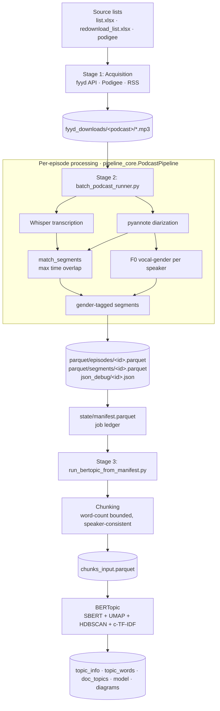

# Chapter: Data Pipeline and Corpus

> Methodological documentation of the data-processing pipeline and the resulting
> corpus. All figures and counts in this chapter are reproducible from the
> committed pipeline outputs via `docs/thesis/_make_stats_and_figures.py`; the
> exact numbers are persisted in `docs/thesis/corpus_stats.json`.

## 1. Overview

The empirical material of this thesis is a corpus of German-language podcasts.
Raw audio is transformed into structured, analysable data by a three-stage
pipeline: (i) **acquisition** of episode audio, (ii) **transcription,
speaker diarization, and vocal-gender estimation**, and (iii) **topic modelling**
of the resulting transcripts. Each stage is implemented as a resumable
command-line batch job and writes its output to disk as columnar Parquet files,
so that later stages consume the persisted output of earlier ones rather than
re-processing audio.



The corpus as processed for this thesis comprises **84 podcasts** and **4,530
episodes** registered in the job ledger, of which **4,416 (97.5 %)** were
processed successfully and **114 (2.5 %)** failed (e.g. corrupt or truncated
audio). Stage 2 consumed approximately **272.5 GPU/CPU compute-hours**
(mean 222 s per episode). The transcripts contain **2,039,935 transcript
segments** in total (mean 462 per episode). For topic modelling these segments
were merged into **191,183 chunks** drawn from 4,400 episodes.

## 2. Directory and output layout

The repository versions only code; audio, Parquet, model artefacts, and logs are
intentionally untracked. The on-disk layout produced by the pipeline is:

```
podcast_projekt/
├── fyyd_downloads/<podcast_name>/*.mp3      # Stage 1 — raw episode audio (one folder per podcast)
├── pipeline/                                # canonical pipeline code
│   ├── pipeline_core.py                     #   PodcastPipeline: transcribe + diarize + gender
│   ├── batch_podcast_runner.py              #   Stage 2 resumable batch driver
│   ├── run_bertopic_from_manifest.py        #   Stage 3 resumable chunk build + BERTopic
│   ├── bertopic_typisierung.py              #   shared BERTopic helpers (model + stopwords)
│   ├── reassign_bertopic_outliers.py        #   outlier reassignment (c-TF-IDF / probabilities)
│   ├── reassign_bertopic_outliers_embeddings.py   # outlier reassignment (embeddings)
│   └── compare_bertopic_runs.py             #   cross-run comparison
└── outputs/                                 # all generated data
    ├── parquet/
    │   ├── episodes/<episode_id>.parquet     # Stage 2 — one row per episode
    │   └── segments/<episode_id>.parquet     # Stage 2 — one row per transcript segment
    ├── json_debug/<episode_id>.json          # Stage 2 — full raw debug payload per episode
    ├── state/
    │   ├── manifest.parquet                  # the job ledger (one row per episode)
    │   └── failures.parquet                  # append-only failure log
    └── bertopic*/                            # Stage 3 — one directory per modelling experiment
        ├── chunks_input.parquet              #   accumulated chunk corpus (model input)
        ├── chunk_build_state.parquet         #   per-episode chunking ledger (resumability)
        └── podcast_chunks_sw-de/             #   a trained run (sw-de = German stopwords)
            ├── doc_topics.parquet/.csv       #     chunk → topic assignment
            ├── topic_info.parquet/.csv       #     per-topic size + representation
            ├── topic_words.parquet/.csv      #     top words per topic
            ├── representative_docs.parquet   #     representative chunks per topic
            ├── chunks_with_topics.parquet    #     chunks joined with their topic
            ├── bertopic_model/               #     serialized BERTopic model (safetensors)
            ├── run_config.json               #     full parameter record of the run
            ├── _TRAINING_COMPLETE.json        #     completion marker (gates re-training)
            └── topics_*.html                 #     interactive Plotly diagrams
```

The `outputs/bertopic*` directories are **parallel experiments**: the suffix of
each folder encodes the embedding model and the parameters that distinguish it
from the others (e.g. `bertopic_e5_mcs50_ms1` = the *e5-large* embedding with
HDBSCAN `min_cluster_size = 50`, `min_samples = 1`). The unsuffixed
`outputs/bertopic/` directory is the reference (baseline) run used throughout
Chapter "Topic Modelling".

### Identity and resumability

Every episode is keyed by a content-stable identifier
`episode_id = SHA-1(absolute audio path)`. Because the id is derived from the
path, re-running the pipeline over the same files is idempotent: outputs
overwrite deterministically and the manifest can be merged across runs without
duplicating episodes. The same principle keys chunks:
`chunk_id = SHA-1(episode_id | start | end | index | text[:200])`.

## 3. Stage 1 — Acquisition

Episodes are downloaded into `fyyd_downloads/<podcast_name>/` from three
sources, each driven by a spreadsheet/CSV list of podcast names or feeds:

| Script | Source | Discovery mechanism |
|---|---|---|
| `download.py` | fyyd API | search podcast by name → fetch episode list → stream-download each enclosure |
| `podigee_podcasts/download_podigee_episodes.py` | Podigee | resolve episode audio URLs from a Podigee CSV |
| `pending_podcasts/download_podcasts.py` | RSS / PodcastIndex / iTunes | auto-discover the RSS feed for podcasts without a known one, then download |
| `pending_podcasts/redownload.py` | RSS | re-download episodes that failed the first pass |

All downloaders stream to disk in fixed-size chunks with connect/read timeouts
and bounded retries to tolerate slow or stalling servers, and pause briefly
between requests to respect the source APIs. Download outcomes are recorded in
JSON result files (`fyyd_results.json`, `podigee.json`) and text logs. Audio is
stored as MP3 (the corpus is 100 % `.mp3`).

## 4. Stage 2 — Transcription, diarization, and vocal gender

Stage 2 is implemented in `pipeline/pipeline_core.py` (class `PodcastPipeline`)
and driven over the corpus by `pipeline/batch_podcast_runner.py`. For each
episode the pipeline performs four steps.

**(a) Transcription.** OpenAI **Whisper** (default model size `small`)
transcribes the episode into time-stamped text segments and detects the spoken
language. Decoding runs with `fp16=False` for numerical stability. Audio for
downstream steps is loaded as mono 16 kHz via librosa.

**(b) Speaker diarization.** **pyannote** (`pyannote/speaker-diarization-3.1`)
partitions the audio into speaker turns (`SPEAKER_00`, `SPEAKER_01`, …).
Diarization runs on CPU by default and on GPU when `--diar_gpu` is passed.

**(c) Segment–speaker matching.** `match_segments()` assigns each Whisper
segment to the diarized speaker with the **maximum temporal overlap**, yielding
a transcript where every text segment carries a speaker label.

**(d) Vocal-gender estimation.** For each speaker, up to 90 s of that speaker's
turns are concatenated and the **median fundamental frequency (F0)** is
estimated with `librosa.pyin`. A label is assigned by threshold on the median
F0: **< 155 Hz → male**, **> 185 Hz → female**, and the 155–185 Hz overlap band
→ **borderline**; speakers with too little voiced audio → **unknown**.

> **Methodological note (important for interpretation).** The gender label is a
> measure of **perceived vocal pitch**, not self-identified or social gender.
> It is derived from a single acoustic feature (median F0) with fixed
> thresholds, not from a trained classifier. An earlier prototype
> (`script_with_genderanalysis.py`) wired up a neural wav2vec age/gender model,
> but the production pipeline deliberately uses the transparent, inspectable F0
> method. Each label is stored together with its `f0_median_hz`, `voiced_ratio`,
> and an interquartile range, so the underlying measurement is auditable and the
> thresholds can be revisited. The `borderline` and `unknown` categories
> (≈ 10 % and ≈ 2 % of chunks respectively) are retained rather than forced into
> a binary, which is the honest representation of an inherently uncertain
> acoustic estimate.

The pipeline returns an `EpisodeArtifacts` object (episode record + segment
records + a debug payload), which the batch runner writes to the three output
files described below.

### 4.1 Resumability via the manifest

`batch_podcast_runner.py` is designed to be interrupted and re-run safely. It
maintains `state/manifest.parquet`, a ledger with one row per episode and a
`status` that transitions `pending → running → done` (or `failed`). On each run
it (i) rescans `fyyd_downloads/` into an inventory and merges it with the
existing manifest, preserving prior status by `episode_id`; (ii) optionally
marks episodes `done` if their Parquet outputs already exist
(`--skip_existing_outputs`); (iii) selects `pending` episodes (plus `failed`
with `--retry_failed`) up to `--limit`; and (iv) **saves the manifest after
every episode**, so an interruption loses at most one episode. Failures are also
appended to `state/failures.parquet` with the exception text and attempt count.

### 4.2 Data dictionary — episode record (`parquet/episodes/<id>.parquet`)

One row per episode.

| Column | Type | Definition |
|---|---|---|
| `episode_id` | str | SHA-1 of the absolute audio path; primary key. |
| `podcast_folder` | str | Name of the source podcast folder. |
| `episode_path` | str | Absolute path to the source audio file. |
| `episode_name` | str | Audio file stem (filename without extension). |
| `whisper_language` | str | ISO language code detected by Whisper (`de`, `en`, …). |
| `whisper_text_full` | str | Full transcript (all segment texts concatenated). |
| `runtime_sec` | float | Wall-clock processing time for the episode. |
| `n_whisper_segments` | int | Number of raw Whisper segments. |
| `n_diarized_segments` | int | Number of pyannote speaker turns. |
| `n_segments` | int | Number of final matched segments. |
| `n_speakers` | int | Number of distinct diarized speakers. |
| `speakers_json` | str (JSON) | Sorted list of speaker labels. |
| `speaker_gender_json` | str (JSON) | Per-speaker gender result: `{label, confidence, f0_median_hz, voiced_ratio, f0_iqr_hz, seconds_used}`. |

### 4.3 Data dictionary — segment record (`parquet/segments/<id>.parquet`)

One row per transcript segment (the analytical unit before chunking).

| Column | Type | Definition |
|---|---|---|
| `episode_id` | str | Foreign key to the episode record. |
| `podcast_folder`, `episode_path`, `episode_name` | str | Episode provenance (denormalised for standalone use). |
| `whisper_language` | str | Detected language of the episode. |
| `segment_idx` | int | Zero-based segment index within the episode (preserves order). |
| `start`, `end` | float | Segment start/end time in seconds. |
| `speaker` | str | Diarized speaker label, or `Unknown` if no overlap. |
| `gender` | str | `male` / `female` / `borderline` / `unknown` for the segment's speaker. |
| `gender_confidence` | float | Distance-from-threshold confidence of the gender label. |
| `f0_median_hz` | float \| null | Median fundamental frequency used for the label. |
| `voiced_ratio` | float \| null | Fraction of frames with detectable pitch. |
| `f0_iqr_hz` | float \| null | Interquartile range of voiced F0. |
| `text` | str | Transcribed text of the segment. |

The `json_debug/<id>.json` file additionally stores the raw Whisper segments,
the raw diarized turns, and the matched segments, for auditing and re-analysis
without re-running the models.

### 4.4 Data dictionary — manifest (`state/manifest.parquet`)

The job ledger. Beyond the inventory columns (`episode_id`, `podcast_folder`,
`podcast_dir`, `episode_path`, `episode_name`, `audio_ext`, `file_size_bytes`,
`mtime_ns`) it tracks execution state:

| Column | Type | Definition |
|---|---|---|
| `status` | str | `pending` / `running` / `done` / `failed`. |
| `attempt_count` | int | Number of processing attempts. |
| `last_error` | str \| null | Last exception (`Type: message`) if failed. |
| `last_run_started_at`, `last_run_finished_at` | str (ISO) | Timestamps of the last attempt. |
| `runtime_sec` | float \| null | Processing time of the successful run. |
| `output_episode_parquet`, `output_segments_parquet`, `output_debug_json` | str \| null | Paths to the written artefacts. |

## 5. Corpus characteristics

**Language.** Whisper's language detection identifies **4,312 episodes (97.6 %)
as German**, with a long tail of Polish (67), English (19), and a handful of
other codes — the latter typically reflecting music-heavy or multilingual
intros rather than genuinely non-German episodes. The corpus is therefore
treated as German for stopword handling and embedding-model selection.


**Speakers.** Episodes contain a mean of **3.16 diarized speakers** (median 2),
consistent with an interview/conversation format dominating the corpus.


**Vocal gender.** At the chunk level the F0 estimate yields **50.2 % male,
38.1 % female, 10.0 % borderline, and 1.7 % unknown**. The sizeable borderline
band is expected given the deliberately wide 155–185 Hz overlap region and is a
feature, not a defect, of the conservative thresholding.


These corpus-level descriptors define the population that the topic model in the
next chapter is estimated over.
