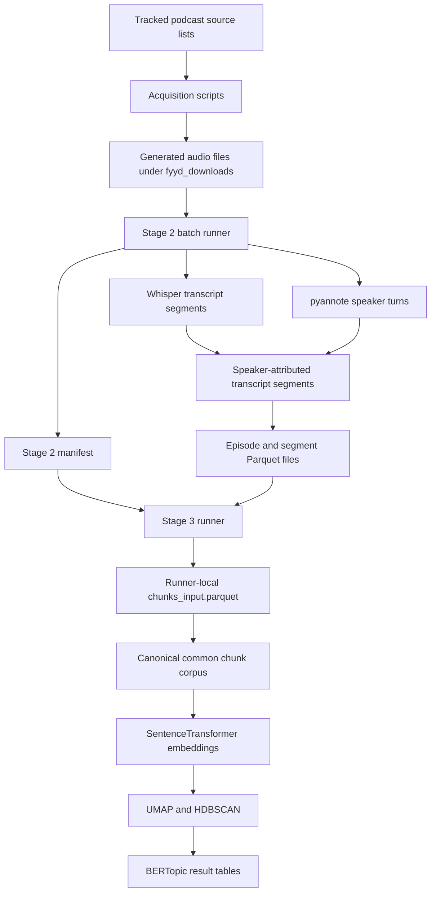

# Chapter: Data Pipeline and Corpus Construction

## 1. Purpose of this chapter

This chapter explains how the research corpus is created from podcast audio. It follows the order in which a new reader encounters the data and makes the location, purpose, and ownership of every important file explicit.

The pipeline has three stages:

1. **Acquisition:** obtain podcast audio and preserve a record of download success and failure.
2. **Audio processing:** transcribe each episode, identify speaker turns, match text to speakers, and optionally estimate perceived vocal-pitch categories.
3. **Document construction:** merge short transcript segments into stable chunks that can be embedded and clustered by BERTopic.

The topic-modelling procedure itself is explained in the next chapter. This chapter ends with the exact document table that becomes its input.

## 2. Repository files and generated runtime files

The project contains two different kinds of material. They must not be confused when navigating the repository.

### 2.1 Files committed to GitHub

The following directories contain versioned source material:

```text
acquisition/        podcast discovery and download code
pipeline/           transcription, diarization, chunking, and modelling code
data_sources/       podcast lists and acquisition inputs
docs/thesis/        methodological documentation
tools/              audit and reporting utilities
requirements.*      environment definitions
```

These files describe how the corpus is produced. They can be inspected directly in GitHub.

### 2.2 Files generated when the pipeline runs

The following directories are created on the processing machine and are ignored by Git:

```text
fyyd_downloads/     downloaded podcast audio
outputs/            manifests, transcripts, chunks, embeddings, and models
logs/               execution logs
artifacts/           acquisition reports and generated support files
dist/               generated document exports
```

This explains why paths such as `outputs/state/`, `outputs/parquet/`, `outputs/common_chunks/`, and `outputs/bertopic*/` are documented but are not visible in the GitHub directory hierarchy. They are generated research artefacts, not missing repository folders.

The current Python scripts write to a local or mounted filesystem. They do not upload to S3 automatically. An S3 location exists only after a separate transfer or synchronisation step has been performed.

## 3. End-to-end data flow



The main handoff boundaries are:

| Boundary | File or directory | Meaning |
|---|---|---|
| Acquisition to Stage 2 | `fyyd_downloads/<podcast>/*` | Local audio corpus |
| Stage 2 inventory and state | `outputs/state/manifest.parquet` | Authoritative episode ledger and pointers to generated files |
| Stage 2 transcript handoff | `outputs/parquet/segments/<episode_id>.parquet` | Timestamped, speaker-attributed transcript units |
| Stage 3 document handoff | `outputs/common_chunks/chunks_input.parquet` | Canonical document corpus; the `chunk_text` column is embedded and clustered |
| Topic-result handoff | `doc_topics.parquet`, `topic_info.parquet`, `topic_words.parquet` | Topic assignments and interpretable topic metadata |

## 4. Stage 1: podcast acquisition

### 4.1 Why several acquisition routes are used

Podcast audio is distributed across many hosting providers. No single source covered the complete selected corpus. The repository therefore contains several acquisition routes:

- fyyd API search and download;
- RSS feed resolution and download;
- Podigee metadata collection.

Using several routes is a recovery strategy. An episode that cannot be downloaded from one source can later be retrieved through another source without changing the downstream processing stages.

### 4.2 `acquisition/fyyd_download.py`

The fyyd downloader was used because fyyd provides a public API for podcast search and episode retrieval. For the original source list, a substantial share of the selected podcasts could be found there without writing provider-specific scraping logic.

The script reads:

```text
data_sources/list.xlsx
```

It writes downloaded audio to:

```text
fyyd_downloads/<podcast name>/
```

It writes its audit result to:

```text
artifacts/acquisition/fyyd_results.json
```

The audio and audit directories are generated and are not committed to GitHub.

#### Processing sequence

For each spreadsheet row, the script:

1. converts the row to an audit record;
2. reads the podcast name from `Podcast Name`, with `name` as a fallback;
3. calls `fyyd_search_podcast(name)`;
4. selects the first object in the returned API array;
5. reads the selected podcast identifier;
6. calls `fyyd_get_episodes(podcast_id)`;
7. iterates over the returned episodes;
8. reads the audio URL from the episode's `enclosure` field;
9. constructs a local filename from the episode title and episode number;
10. calls `download_with_retries()`;
11. records the episode under `downloaded` or `failed_ep`;
12. writes the complete podcast-level result list to JSON.

#### Why the first search result is selected

The current implementation assumes that a full-name search ranks the intended podcast first. This reduced implementation complexity during acquisition, but it does not guarantee identity when podcast names are similar or duplicated.

The JSON audit output is therefore required. It makes the selected fyyd identifier, number of episodes, successful downloads, failed downloads, and top-level errors available for later checking.

A more robust future implementation should normalise titles, compare every returned candidate, incorporate publisher or feed-domain information, reject low-similarity matches, and record the final similarity score.

#### Why downloads are streamed

`requests.get(..., stream=True)` prevents an entire audio episode from being held in memory. The response body is written to disk in 256 KiB blocks.

The block size is a project engineering choice. It keeps memory consumption small while avoiding the large number of disk writes that would result from very small blocks. It is not a podcast-format requirement or universal standard.

#### Why retries are used

Podcast hosting servers can temporarily time out, close a connection, or respond slowly. A single HTTP failure would otherwise classify a valid episode as permanently unavailable.

`download_with_retries()` therefore performs up to three attempts and waits two seconds after a failed attempt. After the final failure, the episode is retained in `failed_ep` rather than being silently omitted. This record supports later recovery through RSS, Podigee metadata, or manual retrieval.

### 4.3 RSS and Podigee routes

`acquisition/rss_download.py` reads feed information or a redownload spreadsheet and writes episode audio to the same `fyyd_downloads/<podcast>/` structure.

`acquisition/podigee_scrape.py` writes episode and enclosure metadata to:

```text
data_sources/podigee_episodes.csv
```

The Podigee script creates an inventory. It does not transcribe the audio and does not replace the Stage 2 processing runner.

## 5. Stage 2: transcription, diarization, and speaker attribution

Stage 2 is divided between two modules:

- `pipeline/batch_podcast_runner.py` manages corpus inventory, state, retries, and output paths;
- `pipeline/pipeline_core.py` processes one audio episode.

### 5.1 Stage 2 input

The batch runner receives a download root through `--downloads`. The root must contain one subdirectory per podcast:

```text
fyyd_downloads/
├── Podcast A/
│   ├── first.mp3
│   └── second.mp3
└── Podcast B/
    └── interview.wav
```

The expected structure separates podcast identity from episode files and allows the inventory function to preserve the podcast folder name in all downstream records.

### 5.2 Episode identity

Each discovered episode receives:

```text
episode_id = SHA-1(resolved absolute audio path)
```

This makes repeated processing of the same path idempotent. It also introduces an important limitation: moving the audio tree changes the identifier even when the audio bytes remain unchanged.

### 5.3 Manifest construction

`build_episode_inventory()` scans the audio tree. `merge_inventory_with_manifest()` combines the current scan with an existing manifest.

New files are added with `status = pending`. Existing rows retain their previous status, attempt information, and output paths.

The generated manifest is:

```text
outputs/state/manifest.parquet
```

It is both an inventory and a processing ledger.

### 5.4 Per-episode processing sequence

For every selected episode, Stage 2 performs the following operations:

| Step | Code responsibility | Input | Output |
|---|---|---|---|
| Inventory | batch runner | audio path | manifest row |
| Transcription | Whisper | audio | text segments, timestamps, language |
| Audio loading | pipeline core | audio | mono 16 kHz waveform used internally |
| Diarization | pyannote | waveform | anonymous speaker turns |
| Segment matching | `match_segments()` | Whisper segments and diarized turns | one speaker label per transcript segment |
| F0 analysis | `estimate_speaker_gender()` | waveform and diarized turns | per-speaker pitch statistics and category |
| Persistence | artefact writer | processed episode object | episode Parquet, segment Parquet, debug JSON |
| State update | batch runner | success or exception | manifest update and optional failure-log row |

### 5.5 Why maximum temporal overlap is used

Whisper and pyannote produce independent time intervals. Their boundaries are not expected to be identical.

For each Whisper segment, `match_segments()` calculates the overlap with every diarized speaker turn and selects the speaker turn with the largest overlap duration. This rule uses the duration of shared audio rather than only the distance between timestamps.

The approach remains an approximation. Overlapping speech can be reduced to one selected speaker, a long Whisper segment can contain a speaker transition, and diarization errors propagate into the final segment record.

Speaker labels such as `SPEAKER_00` are local to one episode. They are not persistent identities across the corpus.

### 5.6 Interpretation of vocal-pitch categories

The optional `--gender` path estimates a perceived vocal-pitch category from median F0. It does not determine a person's identity or self-described gender.

The stored categories are:

```text
median F0 < 155 Hz       male
median F0 > 185 Hz       female
155 Hz to 185 Hz         borderline
insufficient voiced data unknown
```

The underlying `f0_median_hz`, `voiced_ratio`, and `f0_iqr_hz` values are retained so that later analysis does not depend only on the simplified category.

### 5.7 Stage 2 output layout

On the processing machine, Stage 2 creates:

```text
outputs/
├── state/
│   ├── manifest.parquet
│   └── failures.parquet
├── parquet/
│   ├── episodes/<episode_id>.parquet
│   └── segments/<episode_id>.parquet
└── json_debug/<episode_id>.json
```

These paths are generated. They are not part of the GitHub hierarchy.

### 5.8 Manifest data dictionary

| Column | Meaning |
|---|---|
| `episode_id` | Identifier derived from the resolved audio path |
| `podcast_folder` | Name of the source podcast directory |
| `podcast_dir` | Absolute path to the podcast directory |
| `episode_path` | Absolute path to the audio file |
| `episode_name` | Audio filename stem |
| `audio_ext` | Audio extension |
| `file_size_bytes` | File size at inventory time |
| `mtime_ns` | File modification time at inventory time |
| `status` | `pending`, `running`, `done`, or `failed` |
| `attempt_count` | Number of Stage 2 processing attempts |
| `last_error` | Most recent exception text |
| `last_run_started_at` | Timestamp when the latest attempt began |
| `last_run_finished_at` | Timestamp when the latest attempt ended |
| `runtime_sec` | Runtime of the successful attempt |
| `output_episode_parquet` | Path to the episode-level Parquet file |
| `output_segments_parquet` | Path to the segment-level Parquet file |
| `output_debug_json` | Path to the debug JSON file |

The manifest is the Stage 3 starting index. Stage 3 does not independently scan the complete segment directory and guess which files should be processed. It reads the paths stored in eligible manifest rows.

### 5.9 Segment data dictionary

Each file under `outputs/parquet/segments/` contains the matched transcript segments for one episode.

| Column | Meaning |
|---|---|
| `episode_id` | Foreign key to the manifest and episode file |
| `podcast_folder` | Source podcast directory name |
| `episode_path` | Source audio path |
| `episode_name` | Source audio filename stem |
| `whisper_language` | Language code detected by Whisper |
| `segment_idx` | Zero-based transcript-segment index |
| `start`, `end` | Segment timestamps in seconds |
| `speaker` | Anonymous diarized speaker label |
| `gender` | F0-derived category or `unknown` |
| `gender_confidence` | Distance-based confidence measure used by the pipeline |
| `f0_median_hz` | Median F0 for the assigned speaker |
| `voiced_ratio` | Proportion of pitch-detectable frames |
| `f0_iqr_hz` | Interquartile range of voiced F0 |
| `text` | Whisper transcript text for the segment |

A segment is an automatic speech-recognition timing unit. It is not guaranteed to be a sentence, paragraph, complete speaker turn, or suitable BERTopic document.

## 6. Stage 3: exact input, chunk construction, and output

Stage 3 is implemented in:

```text
pipeline/run_bertopic_from_manifest.py
```

The script is present in the GitHub repository. The Parquet files processed by the script are generated runtime data and are therefore stored outside GitHub.

### 6.1 Where the Stage 3 input files are located

On the processing machine, the generated Stage 2 files are stored under the output root:

```text
<project-root>/outputs/
```

For the processing environment used during the project, the corresponding root is:

```text
/home/fdai7991/podcast_projekt/outputs/
```

The relevant structure is:

```text
outputs/
├── state/
│   └── manifest.parquet
└── parquet/
    ├── episodes/
    │   └── <episode_id>.parquet
    └── segments/
        └── <episode_id>.parquet
```

The distinction between code and data is therefore:

```text
GitHub repository:
pipeline/run_bertopic_from_manifest.py
```

```text
Processing machine or mounted project storage:
outputs/state/manifest.parquet
outputs/parquet/episodes/<episode_id>.parquet
outputs/parquet/segments/<episode_id>.parquet
```

The current code does not upload these files to S3. If the files have been copied to S3 for exchange with another application, the documentation must state the real bucket and prefix rather than a placeholder.

### 6.2 The manifest as the Stage 3 starting index

The direct Stage 3 starting file is:

```text
outputs/state/manifest.parquet
```

It is created and maintained by `pipeline/batch_podcast_runner.py`.

One manifest row corresponds to one discovered audio episode. A simplified example is:

| Column | Example value |
|---|---|
| `episode_id` | `37e65a12...` |
| `podcast_folder` | `Example Podcast` |
| `episode_path` | `/home/fdai7991/podcast_projekt/fyyd_downloads/Example Podcast/Episode-12.mp3` |
| `status` | `done` |
| `output_episode_parquet` | `/home/fdai7991/podcast_projekt/outputs/parquet/episodes/37e65a12....parquet` |
| `output_segments_parquet` | `/home/fdai7991/podcast_projekt/outputs/parquet/segments/37e65a12....parquet` |
| `output_debug_json` | `/home/fdai7991/podcast_projekt/outputs/json_debug/37e65a12....json` |

The values are illustrative. The actual identifier and filename differ for every episode.

### 6.3 Which manifest rows are selected

The function `load_manifest()` loads the manifest. By default, it keeps rows where:

```text
status == done
```

The status is a column value in `manifest.parquet`; it is not a directory name.

| Status | Meaning |
|---|---|
| `pending` | The audio file was discovered but has not been processed. |
| `running` | Processing was started and may still be active or may have been interrupted. |
| `failed` | Stage 2 processing ended with an error. |
| `done` | Episode and segment outputs were written successfully. |

The loader also requires the following manifest columns to contain paths:

```text
output_episode_parquet
output_segments_parquet
```

Rows without these paths cannot be processed because Stage 3 would not know which generated files belong to the episode.

### 6.4 What the referenced episode Parquet contains

A selected manifest row points to an episode-level file such as:

```text
outputs/parquet/episodes/37e65a12....parquet
```

This file contains one row for the complete episode. Typical columns include:

```text
episode_id
podcast_folder
episode_path
episode_name
whisper_language
whisper_text_full
runtime_sec
n_whisper_segments
n_diarized_segments
n_segments
n_speakers
speakers_json
speaker_gender_json
```

The episode table provides episode-level metadata. It is not the main text source for chunk construction.

### 6.5 What the referenced segment Parquet contains

The same manifest row points to a segment-level file such as:

```text
outputs/parquet/segments/37e65a12....parquet
```

This file contains several rows for one episode. Each row is a timestamped transcript segment produced by Stage 2.

A simplified example is:

| `segment_idx` | `start` | `end` | `speaker` | `text` |
|---:|---:|---:|---|---|
| 0 | 0.00 | 6.42 | `SPEAKER_00` | `Herzlich willkommen zu einer neuen Folge.` |
| 1 | 6.42 | 14.18 | `SPEAKER_00` | `Heute sprechen wir über die Arbeit mit Jugendlichen.` |
| 2 | 14.18 | 19.70 | `SPEAKER_01` | `Vielen Dank für die Einladung.` |

The segment table supplies the ordered text rows that Stage 3 merges into chunks.

### 6.6 Complete Stage 3 input relationship

```text
outputs/state/manifest.parquet
        |
        | select rows where status == done
        |
        ├── output_episode_parquet
        |       └── outputs/parquet/episodes/<episode_id>.parquet
        |
        └── output_segments_parquet
                └── outputs/parquet/segments/<episode_id>.parquet
```

The manifest is therefore an index and contract between Stage 2 and Stage 3.

### 6.7 Why chunk construction is required

BERTopic clusters documents. Raw Whisper segments are often short, incomplete, and dependent on surrounding speech. Whole episodes have the opposite problem: they can contain several themes, speakers, introductions, advertisements, and transitions.

Stage 3 constructs an intermediate document unit called a **chunk**.

A chunk is:

- limited to one episode;
- composed of consecutive transcript segments;
- kept speaker-consistent where possible;
- bounded by word-count rules;
- traceable to source timestamps and a stable identifier.

In this project, the word **document** means one textual observation supplied to the topic model. It does not mean a PDF, Word file, or complete podcast episode.

```text
one row in chunks_input.parquet = one chunk = one BERTopic document
```

### 6.8 Functions involved in chunk construction

| Function | Responsibility |
|---|---|
| `load_manifest()` | Loads eligible Stage 2 manifest rows. |
| `join_episode_and_segments()` | Loads one episode's Stage 2 files and prepares the segment table. |
| `build_chunks_for_episode()` | Groups consecutive transcript segments into chunks. |
| `flush_chunk()` | Converts the current segment buffer into one chunk row. |
| `build_chunks_resumable()` | Repeats the process across episodes and records progress. |
| `save_chunks()` | Writes `chunks_input.parquet` and `chunks_input.csv`. |

### 6.9 Loading and joining one episode

For each selected manifest row, `build_chunks_resumable()` calls `join_episode_and_segments()`.

The function first reads the path stored in `output_segments_parquet`. If the file is missing, unreadable, or empty, chunk construction for that episode fails and the error is recorded.

The function also reads `output_episode_parquet` when available. Episode-level columns not already present in the segment table are joined by `episode_id`.

Conceptually:

```text
segment rows
    LEFT JOIN
episode metadata
    ON episode_id
```

A left join is used because the segment rows are the required observations. Episode metadata supplements them but should not remove them.

If `episode_id`, `podcast_folder`, or `episode_path` is missing from the segment table, the value is filled from the manifest row. If `speaker` or `gender` is absent, the value `unknown` is inserted so that the missing information remains explicit.

### 6.10 Sorting and text normalisation

The segment rows are sorted using available columns from:

```text
episode_id
start
end
segment_idx
```

Explicit sorting is required because chronological order is part of the meaning of the final document and must not depend on file-read order.

The function `clean_text()` then normalises whitespace. It replaces carriage returns, line breaks, and tabs with spaces, collapses repeated whitespace, and removes leading and trailing spaces.

For example:

```text
"  Heute\n sprechen\twir   über Jugendhilfe. "
```

becomes:

```text
"Heute sprechen wir über Jugendhilfe."
```

This stage does not lemmatise, stem, translate, or automatically correct transcription errors.

### 6.11 Removing very short source segments

After cleaning, the code calculates a word count for each source segment. Segments shorter than `--min-segment-words` are excluded.

The default is:

```text
--min-segment-words 2
```

This normally removes one-word backchannels such as `ja`, `mhm`, `okay`, or `genau`, which contribute little independent topical meaning. The choice also has a limitation: a meaningful one-word answer can be removed. The threshold must therefore be treated as a documented corpus-cleaning decision.

### 6.12 The chunk buffer

`build_chunks_for_episode()` maintains:

```text
current_rows
current_words
current_speaker
```

`current_rows` contains the source segments assigned to the unfinished chunk. `current_words` stores the accumulated word count. `current_speaker` records the speaker of the first segment in the buffer.

Segments are processed one by one in chronological order.

### 6.13 Conditions that close a chunk

Before adding the next segment, the builder closes the existing chunk when at least one of the following conditions is true.

#### Speaker change

When `--speaker-consistent` is enabled, a change from one diarized speaker to another closes the current chunk.

This preserves one speaker per document where possible and prevents a question from one speaker and a response from another speaker from being merged into an indistinguishable document.

#### Target size reached

The default target is:

```text
--chunk-target-words 220
```

Once the current chunk has reached at least 220 words, it is closed before the following segment is added.

The target is not a requirement that every chunk contain exactly 220 words. It is a preferred boundary. A speaker change can close a chunk earlier, and the segment that causes the target to be reached is retained as a complete segment.

#### Maximum size would be exceeded

The default maximum is:

```text
--chunk-max-words 320
```

Before a segment is added, the code checks whether:

```text
current_words + next_segment_words > 320
```

If the condition is true, the existing chunk is closed and the next segment begins a new chunk.

The implementation does not split an individual Whisper segment internally. This preserves source-segment integrity but means an unusually long source segment can create an unusually long chunk.

### 6.14 Creating one chunk row

When the buffer is closed, `flush_chunk()` joins the buffered texts in chronological order with spaces.

The resulting row contains:

```text
chunk_id
episode_id
podcast_folder
episode_path
speaker
gender
start
end
chunk_text
word_count
source_segment_count
```

The start time comes from the first source segment. The end time comes from the final source segment. `source_segment_count` records how many Stage 2 rows were merged.

When exactly one speaker or gender value is present, that value is stored. When several values are present, the value becomes `mixed`.

### 6.15 Chunk identity

Each chunk receives a SHA-1 identifier based on:

```text
chunk_id = SHA-1(
    episode_id |
    start |
    end |
    chunk_index |
    chunk_text[:200]
)
```

This identifier allows `chunks_input.parquet`, `doc_topics.parquet`, and other result tables to be joined without relying on row position.

### 6.16 Removing short completed chunks

After chunk construction, completed chunks shorter than `--min-doc-words` are removed.

The default is:

```text
--min-doc-words 20
```

This differs from `--min-segment-words`:

| Parameter | Applied to | Default |
|---|---|---:|
| `--min-segment-words` | Individual Stage 2 transcript segment | 2 |
| `--min-doc-words` | Completed Stage 3 chunk | 20 |

`--chunk-min-words` is accepted by the current argument parser but is not used by the chunk-building implementation. `--min-doc-words` is the active completed-document threshold.

### 6.17 Complete construction sequence

```text
manifest row with status == done
        |
        v
load output_segments_parquet
        |
        v
optionally load output_episode_parquet
        |
        v
join episode metadata by episode_id
        |
        v
fill missing provenance columns
        |
        v
sort segments chronologically
        |
        v
normalise whitespace
        |
        v
remove source segments below min_segment_words
        |
        v
add consecutive segments to a chunk buffer
        |
        ├── close on speaker change
        ├── close after target word count
        └── close before maximum word count is exceeded
        |
        v
combine segment texts and metadata
        |
        v
create chunk_id
        |
        v
remove completed chunks below min_doc_words
        |
        v
append rows to chunks_input.parquet
```

The data relationship is:

```text
several Stage 2 segment rows
        ↓
one Stage 3 chunk row
        ↓
one BERTopic document
```

### 6.18 What comes out of chunk construction

The main result is:

```text
chunks_input.parquet
```

The filename means **input to the embedding and topic-modelling process**. It is not the input to the complete podcast pipeline.

A clearer conceptual description is:

```text
canonical BERTopic document corpus
```

The physical filename remains unchanged because it is used by the existing scripts.

### 6.19 Chunk output schema

| Column | Meaning |
|---|---|
| `chunk_id` | Stable chunk identifier |
| `episode_id` | Source episode identifier |
| `podcast_folder` | Source podcast directory |
| `episode_path` | Source audio path |
| `speaker` | Single speaker label or `mixed` |
| `gender` | Single F0 category or `mixed` |
| `start`, `end` | First and last source timestamps |
| `chunk_text` | Merged and whitespace-normalised document text |
| `word_count` | Number of words in `chunk_text` |
| `source_segment_count` | Number of Stage 2 segments used |

A simplified row is:

| Column | Example |
|---|---|
| `chunk_id` | `b8ac9a7e...` |
| `episode_id` | `37e65a12...` |
| `podcast_folder` | `Example Podcast` |
| `speaker` | `SPEAKER_00` |
| `gender` | `female` |
| `start` | `120.54` |
| `end` | `188.70` |
| `chunk_text` | `In der Jugendhilfe stellt sich zunächst die Frage ...` |
| `word_count` | `146` |
| `source_segment_count` | `9` |

### 6.20 What is passed to SentenceTransformer

Only the text in:

```text
chunk_text
```

is converted into a semantic embedding.

The other columns are retained for provenance, speaker analysis, time alignment, joins, and quality checks. They are not automatically concatenated into the text.

```text
outputs/common_chunks/chunks_input.parquet
                    |
                    └── chunk_text column
                              |
                              v
                    SentenceTransformer
                              |
                              v
                         BERTopic
```

### 6.21 Where the runner writes its chunk files

The main runner writes directly into the path supplied through `--output-dir`.

Example:

```bash
python pipeline/run_bertopic_from_manifest.py \
  --manifest /home/fdai7991/podcast_projekt/outputs/state/manifest.parquet \
  --output-dir /home/fdai7991/podcast_projekt/outputs/bertopic_chunk_build \
  --chunk-episode-limit 600 \
  --no-train
```

This creates:

```text
/home/fdai7991/podcast_projekt/outputs/bertopic_chunk_build/
├── chunks_input.parquet
├── chunks_input.csv
├── chunk_build_state.parquet
└── chunk_build_failures.parquet
```

This directory exists on the processing machine or mounted project storage. It is ignored by Git.

### 6.22 Runner-local chunk file and canonical shared chunk file

The same filename can appear in two storage roles.

#### Runner-local file

```text
outputs/bertopic_<run-name>/chunks_input.parquet
```

This file is created inside the output directory of one Stage 3 execution.

#### Canonical shared file

```text
outputs/common_chunks/chunks_input.parquet
```

This is the shared copy selected for grid search, final model runs, embedding generation, search, retrieval, and external application development.

The relationship is:

```text
Stage 3 runner output
outputs/bertopic_chunk_build/chunks_input.parquet
                |
                | copied or registered as the reusable corpus
                v
outputs/common_chunks/chunks_input.parquet
```

The main Stage 3 runner does not automatically write to both locations. The common corpus is created through an explicit copy or through the input-seeding logic in `greedy_grid_search_bertopic_from_chunks.py`.

That grid-search script can also create `COMMON_CHUNKS_MANIFEST.json`, which records source-path and checksum information for the shared copy.

### 6.23 Stage 3 resumability

`chunk_build_state.parquet` records one row per attempted episode.

| Column | Meaning |
|---|---|
| `episode_id` | Episode submitted to chunk construction |
| `status` | `done` or `failed` |
| `n_chunks` | Number of emitted chunks |
| `n_segments` | Number of readable source segments before chunk filters |
| `error` | Exception text for a failed attempt |
| `processed_at` | Processing timestamp |
| `runtime_sec` | Episode chunking runtime |
| `output_episode_parquet` | Stage 2 episode path used |
| `output_segments_parquet` | Stage 2 segment path used |

Rows marked `done` are skipped on later runs. Existing chunks are loaded and combined with new chunks. Duplicate `chunk_id` values are removed before saving.

`chunk_build_failures.parquet` is an append-only failure log. The runner also checkpoints state and chunk data periodically so a long construction run can continue after interruption.

## 7. Downstream handoff levels

A consumer should select the handoff level that matches its task.

| Level | Files | Use when |
|---|---|---|
| Stage 2 transcript level | `outputs/state/manifest.parquet`, `outputs/parquet/episodes/*.parquet`, `outputs/parquet/segments/*.parquet` | Raw transcript text, timings, speaker labels, or custom chunking are required |
| Stage 3 document level | `outputs/common_chunks/chunks_input.parquet` | Stable documents are required for embeddings, retrieval, search, or independent topic modelling |
| Topic-result level | `doc_topics.parquet`, `topic_info.parquet`, `topic_words.parquet`, `representative_docs.parquet` | Existing topic assignments and topic metadata are required |

The Stage 3 document-level file is the recommended input for another BERTopic workflow. The topic-result files are the recommended input for an application that should display or analyse already modelled topics.

## 8. Optional S3 handoff

S3 is not written by the current code. It must be described as an optional copy, not as an automatic pipeline stage.

A recommended shared structure is:

```text
s3://<actual-bucket-name>/podcast_project/
├── stage2_transcripts/
│   ├── state/manifest.parquet
│   └── parquet/
│       ├── episodes/
│       └── segments/
├── common_chunks/
│   ├── chunks_input.parquet
│   └── COMMON_CHUNKS_MANIFEST.json
└── bertopic_runs/
    └── <run_id>/
        ├── run_config.json
        └── podcast_chunks_sw-de/
```

The placeholder `<actual-bucket-name>` must be replaced by the real bucket name before this is presented as an implemented location.

Every transfer record should state:

- the local source path;
- the exact S3 destination;
- the file checksum;
- the row count;
- the cleaning variant;
- the transfer date;
- the responsible person or process.

Without this record, the documentation must not imply that the S3 file exists.

## 9. Corpus snapshot

The current persisted corpus snapshot contains:

- 84 podcasts registered in the Stage 2 manifest;
- 4,530 registered episodes;
- 4,416 successfully processed episodes;
- 114 failed episodes;
- 2,039,935 transcript segments;
- 191,183 chunks from 4,400 episodes;
- 97.6% of processed episodes detected as German.

The difference between 4,416 processed episodes and 4,400 chunked episodes arises because some successfully transcribed episodes did not produce a chunk meeting the minimum completed-document length.

These values describe a particular manifest and canonical chunk corpus. Future updates must record the new manifest state and chunk checksum rather than presenting the numbers as permanent properties of the codebase.
