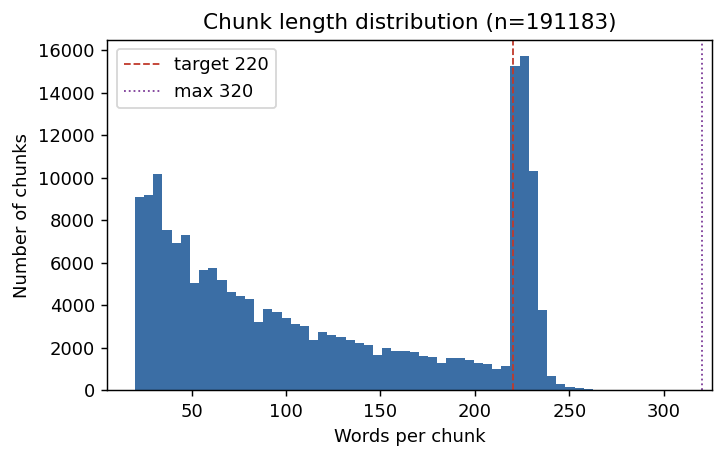

# Chapter: Topic Modelling

> How the topic models were built and run: the chunking that turns transcripts
> into documents, the BERTopic pipeline and its parameters with justifications,
> how the diagnostic diagrams are produced and read, and the outlier-reassignment
> step. Parameter values are taken verbatim from the persisted
> `run_config.json` of each run.

## 1. From transcript segments to documents (chunking)

BERTopic is a *document*-clustering method, so the unit of analysis must be
chosen before modelling. Whisper segments are far too short and syntactically
incomplete to embed meaningfully (often a single clause), while whole episodes
are too long and topically heterogeneous to belong to one topic. The pipeline
therefore merges consecutive segments into **chunks** of roughly paragraph
length.

`run_bertopic_from_manifest.py` builds chunks with the following rules
(defaults shown):

| Parameter | Value | Rationale |
|---|---|---|
| `--chunk-target-words` | 220 | A chunk is flushed once it reaches ~220 words — long enough to carry stable topical signal, short enough to stay on one theme. |
| `--chunk-max-words` | 320 | Hard cap; a segment that would exceed it starts a new chunk. |
| `--min-segment-words` | 2 | Drop near-empty segments (backchannels, "mhm") before chunking. |
| `--min-doc-words` | 20 | Discard chunks below 20 words as too sparse to cluster. |
| `--speaker-consistent` | true | A chunk is flushed on speaker change, so each chunk belongs to one speaker (and one gender) wherever possible. |

When a chunk nonetheless spans more than one speaker or gender (e.g. tightly
interleaved turns) it is labelled `mixed`. This design means **every chunk
carries a speaker and a gender label**, which is what makes gendered topic
analysis possible downstream. Chunk building is itself resumable: processed
episodes are recorded in `chunk_build_state.parquet` and skipped on re-runs, and
chunks accumulate in `chunks_input.parquet`.

For this corpus the procedure produced **191,183 chunks** from 4,400 episodes,
with a mean length of **118.5 words** (median 97, 95th percentile 231). The
distribution is right-skewed: most chunks reach paragraph length, with a tail
flushed early by speaker changes.

### Data dictionary — chunk corpus (`chunks_input.parquet`)

| Column | Type | Definition |
|---|---|---|
| `chunk_id` | str | SHA-1 of `(episode_id, start, end, index, text[:200])`; primary key. |
| `episode_id`, `podcast_folder`, `episode_path` | str | Provenance of the chunk. |
| `speaker` | str | Single speaker label, or `mixed`. |
| `gender` | str | `male` / `female` / `borderline` / `unknown` / `mixed`. |
| `start`, `end` | float | Start of the first and end of the last source segment (seconds). |
| `chunk_text` | str | Merged, whitespace-normalised text — the document fed to BERTopic. |
| `word_count` | int | Words in `chunk_text`. |
| `source_segment_count` | int | Number of transcript segments merged into the chunk. |

## 2. The BERTopic pipeline

BERTopic (Grootendorst, 2022) is a modular topic model that clusters documents
in embedding space and then derives interpretable topic descriptions from the
clusters. The pipeline has four exchangeable components, each chosen here for a
German conversational corpus:

1. **Embedding** — a multilingual Sentence-BERT model (Reimers & Gurevych,
   2019) maps each chunk to a dense semantic vector. The baseline uses
   `paraphrase-multilingual-MiniLM-L12-v2`; alternatives (`mpnet`, `e5-large`)
   were evaluated (see Chapter "Results").
2. **Dimensionality reduction** — **UMAP** (McInnes et al., 2018) reduces the
   embeddings to a low-dimensional space in which density-based clustering is
   well-behaved.
3. **Clustering** — **HDBSCAN** (Campello et al., 2013) finds variable-density
   clusters and, crucially, **does not force every document into a topic**:
   documents in low-density regions are labelled as outliers (topic `-1`).
4. **Topic representation** — a `CountVectorizer` plus **class-based TF-IDF
   (c-TF-IDF)** extracts the words that are characteristic of each cluster,
   producing the human-readable topic labels.

### 2.1 Baseline parameters and justification

The reference run is `outputs/bertopic/` (folder `podcast_chunks_sw-de`). Its
parameters, taken from `run_config.json`, and the reasoning behind them:

| Component | Parameter | Baseline value | Justification |
|---|---|---|---|
| Embedding | model | `paraphrase-multilingual-MiniLM-L12-v2` | Strong multilingual sentence embeddings with good German coverage at low cost; fast enough to embed ~191 k chunks repeatedly during experimentation. |
| UMAP | `n_neighbors` | 30 | Balances local vs. global structure; higher than the BERTopic default (15) to favour broader, more stable topics over micro-clusters in a large corpus. |
| UMAP | `n_components` | 5 | Standard BERTopic working dimensionality — enough to preserve cluster structure while keeping HDBSCAN tractable. |
| UMAP | `min_dist` | 0.0 | Packs points tightly, which sharpens the density contrast HDBSCAN relies on. |
| UMAP | `metric` | cosine | Cosine is the natural geometry of sentence embeddings. |
| UMAP | `random_state` | 42 | Fixed seed for reproducibility. |
| HDBSCAN | `min_cluster_size` | 50 | A topic must contain ≥ 50 chunks to be reported — filters noise and keeps topics interpretable at corpus scale. This is the single most influential knob (see §4). |
| HDBSCAN | `min_samples` | 1 | Low value makes clustering less conservative, assigning more borderline points to topics rather than to the outlier class. |
| HDBSCAN | `metric` / selection | euclidean / `eom` | Euclidean on the UMAP space; *excess of mass* selects the most stable clusters. |
| Vectorizer | `ngram_range` | (1, 3) | Unigrams to trigrams capture multi-word German concepts (e.g. *soziale Medien*). |
| Vectorizer | `min_df` | 10 | A term must occur in ≥ 10 chunks to enter a topic label — removes idiosyncratic tokens. |
| Vectorizer | `max_df` | 0.95 | Drops terms appearing in > 95 % of chunks (corpus-wide filler). |
| Topics | `nr_topics` | none | The baseline does **not** merge topics post-hoc; topic count is data-driven. |

### 2.2 German stopwords and name suppression

Because the corpus is conversational German, topic labels are easily dominated
by function words and — importantly — by **speakers' personal names**. The
vectorizer's stopword list (`build_stopwords`) is therefore assembled from three
sources:

1. the `stopwords-iso` German list;
2. manual podcast/address terms (`herr`, `frau`, `hr`, `fr`, control-character
   artefacts, etc.) plus a small set of recurring host surnames;
3. **person-name stopwords** from the `names-dataset` library — the top-N
   (default 20,000) first and last names per country for
   `DE, AT, CH, TR, PL, RO, RU, UA, FR, IT, ES, PT, NL, BE, GB, US`.

Suppressing names prevents the model from "discovering" topics that are really
just one recurring guest, and reflects the corpus's German/Turkish/Eastern-
European naming profile. (`--names-dataset-mode all` exists but can generate
hundreds of thousands of stopwords and is avoided for speed.) The `sw-de` tag in
the run-directory name records that German stopwords were active.

## 3. How the diagnostic diagrams work

Each run saves three interactive **Plotly** HTML diagrams. They are interactive
by design (hover, zoom); to include them in the thesis, open the HTML in a
browser and export a static image, or use the camera icon in the Plotly
toolbar. Each is read as follows.

**`topics_overview.html` — Intertopic Distance Map.** BERTopic projects the
per-topic c-TF-IDF vectors into 2-D and draws each topic as a circle.
*Position* encodes topic similarity (nearby circles are semantically related),
and *circle area* encodes topic size (number of chunks). It is read to judge
whether topics are well separated or overlapping, and which themes dominate.

**`topics_barchart.html` — Topic word scores.** A small-multiples grid of
horizontal bar charts, one panel per topic, showing the top c-TF-IDF terms and
their scores. It is the primary tool for *labelling* and *validating* topics:
the bars are the evidence for what a topic "is".

**`topics_hierarchy.html` — Hierarchical dendrogram.** Topics are agglomerated by
the cosine distance between their c-TF-IDF vectors, producing a dendrogram.
Reading the merge heights shows which fine-grained topics are near-duplicates and
suggests a sensible level at which to merge them (informing the `nr_topics`
choice).

For reproducible, static reporting this thesis supplements the native diagrams
with matplotlib figures generated directly from the saved topic tables
(`docs/thesis/_make_stats_and_figures.py`); these are used in Chapter
"Results".

## 4. The outlier problem and reassignment

HDBSCAN's refusal to force-classify low-density documents is desirable for
purity but produces a large **outlier class** (topic `-1`) on this corpus. In
the baseline run, **109,942 of 191,183 chunks (57.5 %)** are outliers. This is
expected for spontaneous speech — much podcast talk is greetings, transitions,
and chit-chat with no stable topic — but it must be reported and, where useful,
mitigated.

Two scripts reassign outliers using BERTopic's `reduce_outliers`, taking a
trained model and re-labelling topic `-1` chunks:

- **`reassign_bertopic_outliers.py`** — strategies `c-tf-idf`, `probabilities`,
  or `distributions` (text/probability based).
- **`reassign_bertopic_outliers_embeddings.py`** — the `embeddings` strategy:
  re-embeds the outlier chunks (caching the embeddings to
  `embeddings_for_outlier_reassignment.npy`) and assigns each to the nearest
  topic centroid in embedding space.

Reassignment is a *trade-off between coverage and purity*. Applied to the
`minilm_n100_t200` run, the embeddings strategy could in principle eliminate the
outlier class entirely (51 % → 0 %), but unconditional reassignment forces
genuinely off-topic chunks into topics. A **confidence-filtered** variant is
therefore preferred: only reassignments above a similarity threshold are
accepted, which moved the outlier rate from **51 % to ≈ 40 %** (accepting
≈ 20,800 chunks into 67 topics that remained stable under reassignment) while
leaving the rest as honest outliers. The reassignment outputs are written as
separate `doc_topics_reassigned*.parquet` files, so the original assignment is
never overwritten and both can be compared.

The next chapter reports how the outlier rate, topic count, and topic structure
vary across the full grid of runs.
