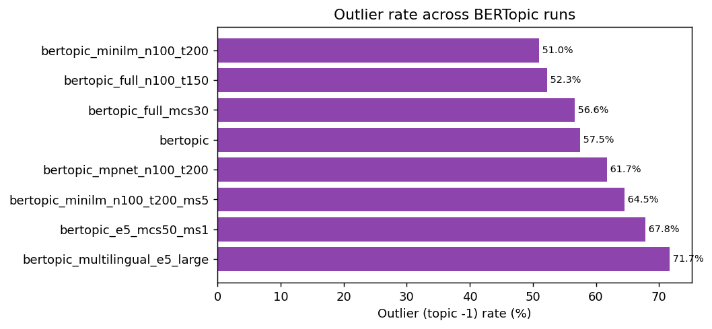
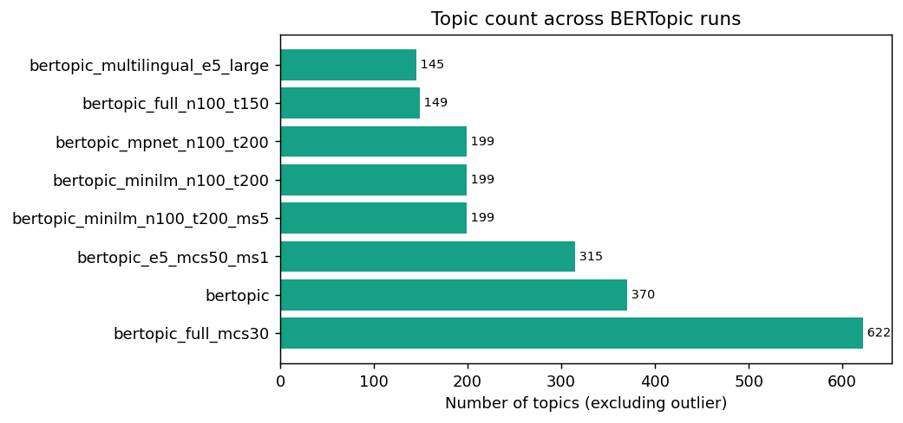
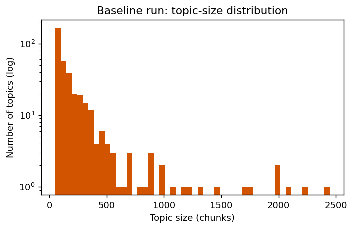
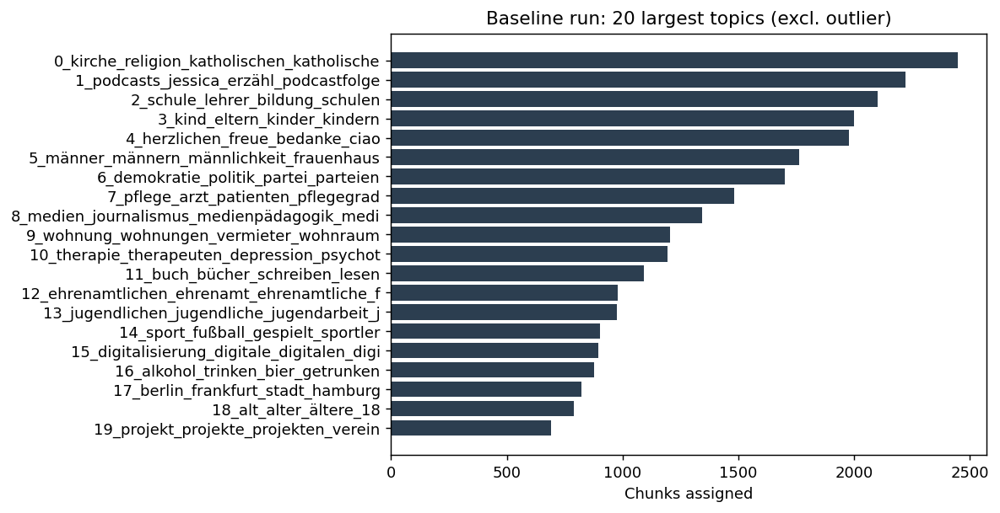

# Chapter: Results and Model Comparison

## 1. Purpose of the comparison

The topic-modelling experiments were not run to find a universally best BERTopic configuration. In an unsupervised corpus there is no complete reference table that says which topic every chunk should receive.

The comparison therefore asks a more practical question:

> Which configuration provides a defensible balance between topic coverage, thematic granularity, interpretability, stability, and computational cost for this corpus and research purpose?

This chapter explains which parts of the experiment were held constant, which parameters changed, what the reported metrics mean, and why model selection cannot be based on a single number.

## 2. Shared experiment input

The comparable full-corpus runs use the same document population:

```text
outputs/common_chunks/chunks_input.parquet
```

The corpus contains:

- 191,183 chunks;
- 4,400 source episodes;
- 83 podcasts represented in the chunk table.

The Stage 2 manifest contains 4,530 episodes across 84 podcasts. Of these, 4,416 episodes completed Stage 2 successfully. Sixteen successful episodes did not produce a chunk that met the minimum document-length rule, and one podcast contributed no successfully modelled episode. This explains the difference between the manifest population and the chunk population.

Holding the chunk rows constant is essential. It means that differences among the listed runs can be attributed to model configuration rather than to changing document boundaries.

A run should only be included in a direct comparison when its chunk source, filtering, sampling, and row count match the comparison contract.

## 3. Compared configurations

The documented comparison includes eight full-corpus runs.

| Run | Embedding | UMAP `n_neighbors` / dimensions | HDBSCAN `min_cluster_size` / `min_samples` | `max_df` | Topic reduction | Runtime |
|---|---|---|---|---:|---:|---:|
| `bertopic_minilm_n100_t200` | MiniLM | 100 / 5 | 50 / 1 | 0.95 | 200 | 24 min |
| `bertopic_full_n100_t150` | MiniLM | 100 / 5 | 50 / 1 | 0.95 | 150 | 91 min |
| `bertopic_full_mcs30` | MiniLM | 30 / 5 | 30 / 1 | 0.95 | none | 43 min |
| `bertopic` | MiniLM | 30 / 5 | 50 / 1 | 0.95 | none | 43 min |
| `bertopic_mpnet_n100_t200` | multilingual MPNet | 100 / 5 | 50 / 1 | 0.95 | 200 | 53 min |
| `bertopic_minilm_n100_t200_ms5` | MiniLM | 100 / 5 | 50 / 5 | 0.95 | 200 | 24 min |
| `bertopic_e5_mcs50_ms1` | multilingual E5 large | 50 / 10 | 50 / 1 | 0.95 | none | 134 min |
| `bertopic_multilingual_e5_large` | multilingual E5 large | 50 / 10 | 80 / 5 | 0.85 | none | 134 min |

The compact folder names encode only part of each configuration. The complete specification remains in the run's `run_config.json`.

## 4. Primary outcomes

| Run | Topics excluding outlier | Outlier rate | Chunks assigned to topics |
|---|---:|---:|---:|
| `bertopic_minilm_n100_t200` | 199 | 51.0% | 93,677 |
| `bertopic_full_n100_t150` | 149 | 52.3% | 91,192 |
| `bertopic_full_mcs30` | 622 | 56.6% | 82,964 |
| `bertopic` | 370 | 57.5% | 81,241 |
| `bertopic_mpnet_n100_t200` | 199 | 61.7% | 73,203 |
| `bertopic_minilm_n100_t200_ms5` | 199 | 64.5% | 67,844 |
| `bertopic_e5_mcs50_ms1` | 315 | 67.8% | 61,488 |
| `bertopic_multilingual_e5_large` | 145 | 71.7% | 54,185 |





These values are descriptive outputs of the specified runs. They do not, by themselves, establish model quality.

## 5. How the metrics should be read

### 5.1 Topic count

Topic count describes granularity.

A low count can mean that the model has recovered broad themes that are easy to report. It can also mean that substantively different discussions were merged.

A high count can reveal fine-grained themes. It can also indicate fragmentation, near-duplicate topics, or clusters that are difficult to distinguish reliably.

Topic count must therefore be assessed with topic words, representative chunks, and the hierarchical topic view.

### 5.2 Outlier rate

The outlier rate is the proportion of chunks assigned to topic `-1` by HDBSCAN.

A high rate can indicate that the clustering configuration is conservative or that the corpus contains many weakly repeated conversational fragments.

A low rate increases coverage, but it is not automatically desirable. Coverage can improve by forming broad clusters that absorb semantically weak documents. The assigned chunks must still support coherent topic descriptions.

### 5.3 Assigned chunks

The number of assigned chunks is the complement of the outlier count. It is useful for application coverage and subgroup analysis because only assigned documents contribute to named topics.

However, assigned count does not measure whether the assignments are substantively correct.

### 5.4 Runtime

Runtime matters because the full pipeline must be reproducible and extensible. A model that produces similar substantive quality at a fraction of the cost is preferable when repeated experiments, updated corpora, or sensitivity checks are required.

Runtime comparisons must still be treated cautiously when hardware, embedding caches, probability calculation, or output settings differ.

### 5.5 Topic coherence and representative documents

Automated coherence scores can support comparison, especially within a controlled grid search. They do not replace manual inspection.

For each candidate run, the researcher should inspect:

- top c-TF-IDF terms;
- representative chunks;
- topic size distribution;
- near-duplicate branches in the hierarchy;
- recurring transcript artefacts or personal names;
- whether major expected domains are represented;
- whether selected topics answer the research questions.

## 6. Interpretation of parameter effects

### 6.1 Embedding model

The documented runs show that the larger embedding models did not automatically produce lower outlier rates.

MiniLM produced the strongest coverage among the listed full-corpus runs and required less runtime than the larger E5 configuration.

This result should not be interpreted as a universal ranking of embedding models. It means that, under the tested UMAP and HDBSCAN settings, MiniLM's embedding geometry produced denser clusters for this chunk corpus.

A fair embedding comparison should keep the following constant where possible:

- chunk rows and order;
- text preprocessing;
- UMAP settings;
- HDBSCAN settings;
- vectorizer settings;
- stopwords;
- topic reduction;
- probability calculation.

### 6.2 UMAP `n_neighbors`

Increasing `n_neighbors` from the baseline value of 30 to 100 gives UMAP a broader neighbourhood when learning the reduced geometry.

In the documented MiniLM runs, the broader setting combined with topic reduction produced fewer, larger topics and improved assignment coverage.

The effect cannot be attributed to `n_neighbors` alone when other settings also differ. Controlled grid search is required to isolate the parameter.

### 6.3 HDBSCAN `min_cluster_size`

Reducing `min_cluster_size` from 50 to 30 allowed smaller dense regions to become topics. The topic count increased from 370 to 622.

This is the expected granularity trade-off:

- lower threshold: more small topics and greater fragmentation risk;
- higher threshold: fewer broad topics and a greater chance that small themes become outliers.

### 6.4 HDBSCAN `min_samples`

Increasing `min_samples` from 1 to 5 made clustering more conservative in the compared MiniLM configuration. The outlier rate increased from 51.0% to 64.5% while the final reduced topic count remained 199.

This provides corpus-specific evidence for retaining the less conservative value when coverage is an important objective.

### 6.5 Topic reduction

The 150-topic and 200-topic runs use post-hoc topic reduction.

Reduction makes the inventory easier to browse and report, but it introduces a target chosen by the researcher. It does not directly solve the outlier problem, because outlier documents remain outside the discovered topic clusters unless a separate reassignment method is applied.

The unreduced baseline remains useful for studying the data-driven topic structure before forced aggregation.

## 7. Why there is no single best run

The experiments reveal a three-way trade-off:

1. **Coverage:** how many chunks receive a topic;
2. **Granularity:** how many distinct themes are preserved;
3. **Purity and interpretability:** how coherent the resulting topics remain.

A model can improve one dimension while weakening another.

For example:

- `bertopic_minilm_n100_t200` provides the strongest documented coverage and a manageable topic count;
- the unreduced `bertopic` baseline preserves a more data-driven 370-topic structure;
- `bertopic_full_mcs30` reveals finer clusters but produces 622 topics that require more interpretation and duplicate checking.

The phrase “best performing” should therefore be qualified. A defensible statement is:

> Among the compared full-corpus configurations, the MiniLM run with broader UMAP neighbourhoods and reduction to approximately 200 topics provided the strongest coverage-runtime compromise. The unreduced baseline was retained for structural inspection because it preserved more data-driven granularity.

This statement identifies the selection criteria instead of presenting one metric as objective truth.

## 8. Baseline topic structure

The unreduced baseline contains 370 topics plus the outlier class.

Topic sizes are strongly right-skewed: a small number of large themes coexist with many smaller topics. The median reported topic contains 108 chunks, while the largest contains 2,447 chunks.



The largest topic representations include themes related to:

- religion and church;
- school and education;
- parenting and children;
- masculinity and gender;
- democracy and party politics;
- care and patients;
- media and journalism;
- housing;
- mental health and therapy.



These labels are initial interpretations based on c-TF-IDF terms. They should be confirmed through representative chunks before being used as final substantive categories.

## 9. Reading word forms in topic labels

German inflection can cause related forms to appear as separate vectorizer features. For example, singular, plural, and case-marked forms can each receive a separate c-TF-IDF score.

This does not necessarily indicate three different themes. It indicates that the current representation preserves surface word forms rather than mapping every token to one lemma.

The choice has two consequences:

- repeated related forms can strengthen confidence that a topic concerns the shared concept;
- the displayed label can contain redundant morphology and may need a concise human label.

Lemmatization could reduce this redundancy, but it would introduce another preprocessing model and potential errors. Any later lemmatized experiment should be compared against the current non-lemmatized corpus rather than silently replacing it.

## 10. Required manual validation

Before presenting a topic as a thesis result, inspect at least:

1. the top topic words and scores;
2. several representative chunks;
3. the largest source podcasts contributing to the topic;
4. the speaker and F0-category distribution when relevant;
5. neighbouring topics in the hierarchy;
6. possible ASR artefacts, names, advertisements, or repeated introductions;
7. the proportion of the corpus represented by the topic.

A human-readable label should summarise the common content of the representative material. It should not simply copy the first generated word.

## 11. Grid-search result interpretation

The grid-search workflow evaluates combinations of UMAP `n_neighbors` and HDBSCAN `min_cluster_size` over an existing chunk corpus.

A composite score can combine normalised coherence and coverage. The weight assigned to coherence is a research choice and must be reported.

The selected configuration should also pass manual checks. A numerically high score can still result from:

- generic high-frequency terms;
- closely duplicated topics;
- clusters dominated by one recurring podcast or speaker;
- transcript noise;
- very broad topics with limited analytical value.

`best_config.json` therefore means “best according to the declared grid-search scoring rule,” not “objectively correct topic model.”

## 12. Figures and reproducibility

The static figures are generated with:

```bash
.venv/bin/python docs/thesis/_make_stats_and_figures.py
```

The cross-run comparison table is generated with:

```bash
cd pipeline
../.venv_bertopic/bin/python compare_bertopic_runs.py
```

The comparison script reads persisted `run_config.json` and output tables from local generated model directories. Those directories are ignored by Git, so another researcher requires the corresponding output package or must rerun the documented configurations.

Every figure caption should identify:

- the source run or comparison file;
- the chunk population;
- whether topic `-1` is included;
- the relevant parameter setting;
- the unit shown on each axis;
- any filtering or ordering applied.

## 13. Reporting limitations

The model results depend on the complete upstream pipeline:

- podcast selection and source availability;
- download failures;
- Whisper transcription errors;
- language detection;
- diarization errors;
- F0 measurement limitations;
- segment-to-speaker matching;
- chunk boundaries;
- embedding geometry;
- UMAP projection;
- HDBSCAN density settings;
- stopwords and vectorizer choices;
- optional topic reduction and outlier reassignment.

The final topics should therefore be presented as an exploratory computational description of the processed corpus, not as a complete or error-free inventory of all discourse in the original podcasts.
